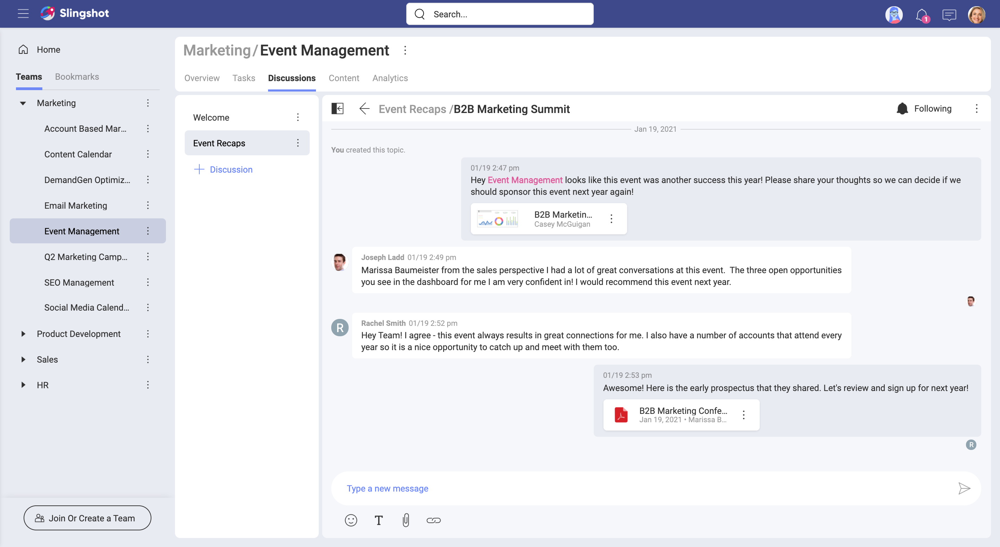
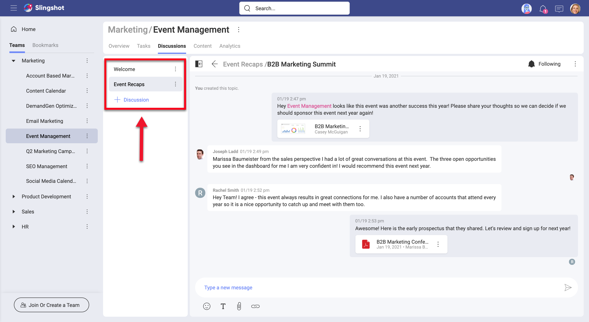
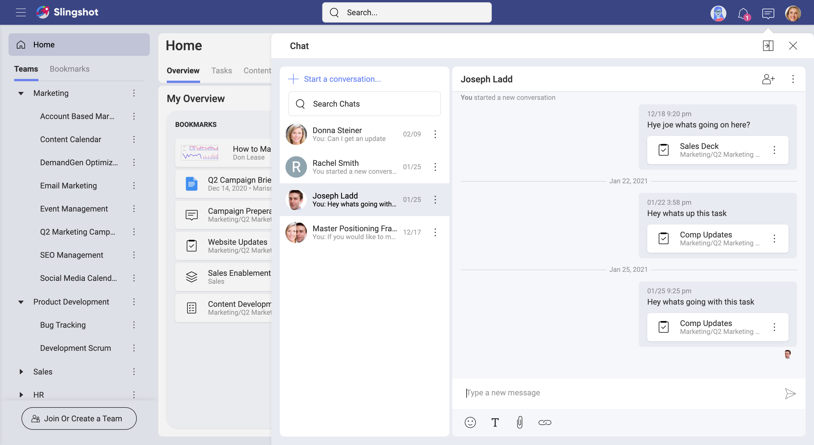

## Communication

Communication is simply the act of sending information from one place, person, or group to another. This is done by using mutually understood signs, symbols, and also semiotic rules that bind cultures and societies together. It sounds simple, but as you know communication is actually very complex. Like planning estimation and many other complex activities, communication can always be improved...

While collaborating in teams or projects, people from different teams or even from outside the organization work together. Communication here is crucial to get things done in a productive way. Slingshot's approach with discussions and private chats was designed with all this in mind.

### So, What's a Slingshot Discussion?

It's a way of communication used by members of an organization, team, or project. Being organized in different threads, discussions ensure all your communication, and collaboration tools are in one place, making remote teams stay productive no matter where they are.

[comment]: <> (NEW UI: replace with a similar screenshot) 

You can have multiple discussions going on at the same time while mixing in text formatting, attachments, emojis, and links. Plus you can react to conversations and even create tasks from messages.

### As many Discussions as Different Topics

Discussions are organized in different threads, ensuring side conversations are under control. The main discussion remains healthy and does not lose focus, as there is a place for every conversation.

[comment]: <> (NEW UI: replace with a similar screenshot)

Unlike lengthy email chains, members can follow or unfollow discussions. This is tied to notifications, as you get informed when someone sends a message to a discussion you follow.

### What's a Slingshot Private Chat? 

> Replace with a screenshot showing an example of a chat with more than one person writing messages

Your *Private Chat* is also a tool for communication, but unlike *Discussions* it's not tied to any project or team. This means you can use it to chat with any Slingshot user, and even with external users who are not part of your Organization.

### Chat with Any Slingshot User from Multiple Devices

Slingshot delivers a seamless, almost identical experience no matter what device you are on. You can use a web browser or get native applications on iOS, Android, and Desktop.

Chat with one or multiple members, removing or adding members on demand. When writing your messages, you can copy, edit, or delete any message. And you can also express yourself by using emoticons and reactions. Finally, your chats support basic text formatting (bold, italic, underline, and strikethrough) plus the inclusion of attachments from your cloud storage providers.

### Getting Notifications

With Slingshot notifications, you can get informed when someone sent a message to you or you are mentioned "@" in a discussion thread you're following. You can check the current Notification settings for messaging and tweak them as needed.  
Follow the links for further details about [notifications](notifications.md).
