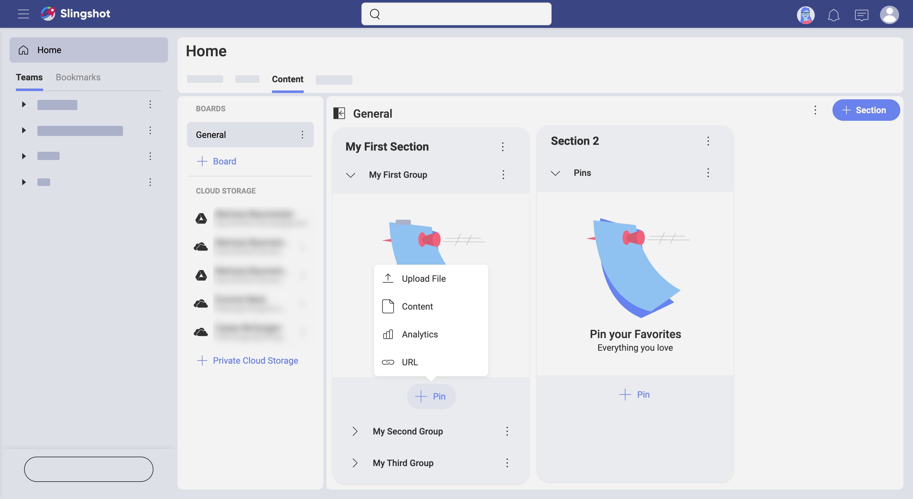
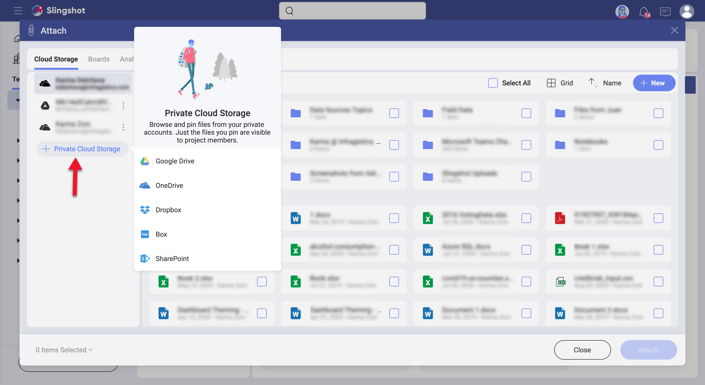
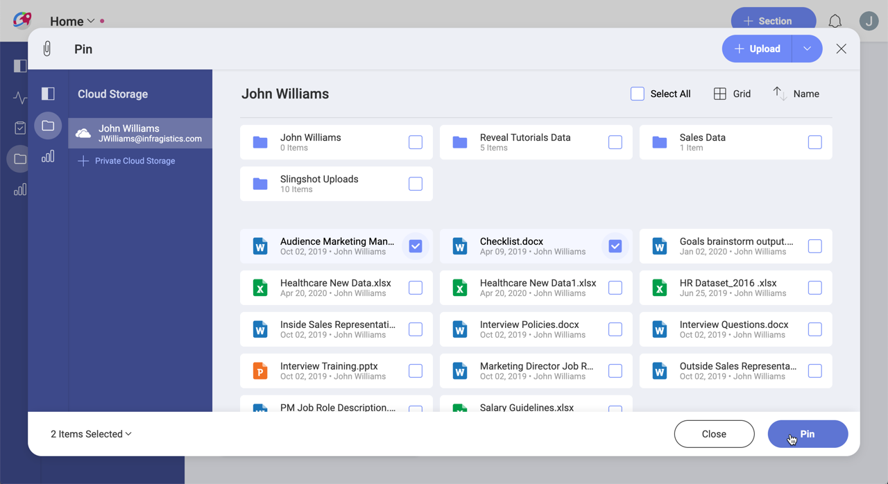
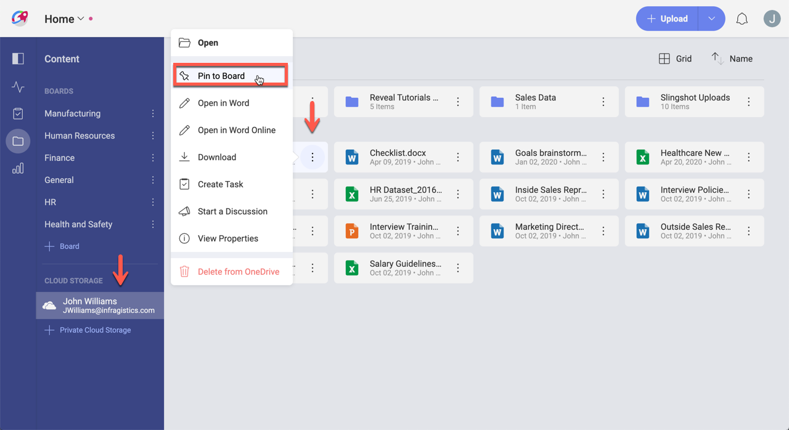
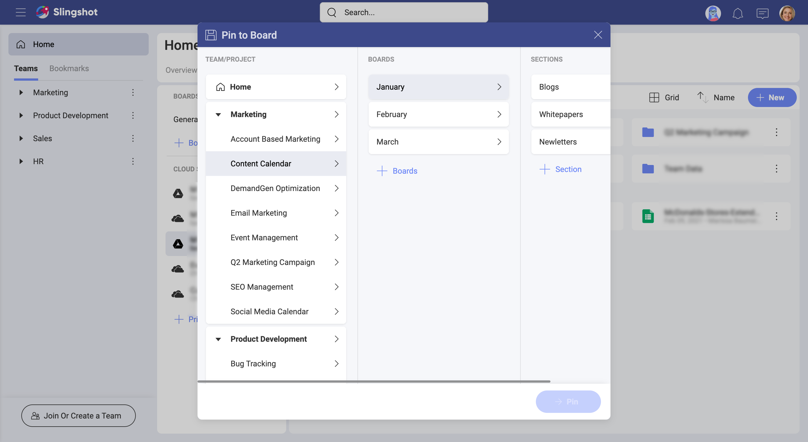

## Content & Boards

Content is really a broad term, but related to IT, is always about information made available by a digital or electronic medium.  The content that is relevant to you might be stored in different locations and, in today's digital world, probably in different cloud storages. Slingshot lets you access that content, share it, and organize it in boards.

Scrum boards and Kanban boards are well-known IT concepts that are are both related to project management. Going for a broader concept, boards can also be just containers that help organize and manage content. That is the case of Slingshot, boards were created so you can have a place to organize your content.

### So, What's Content and Boards within Slingshot?

Boards are basically containers, rich and flexible containers designed to organize, manage, and share your content. And content refers to information, more specifically files, that are made available to you through connections to cloud storages. So, when you need to organize or share content from your cloud storages, just pin that content to a board, and later organize or share that board.

### Working with Your Content in Slingshot

Pinning content to a board is one of the most common actions in Slingshot. This is how you make content from your cloud storages available for others. You'll go to a board and choose _Pin Content_ as shown below.

As you can see above, you actually pin content to groups (_Pins_ group in the image above). Groups are most basic element used to organize content in your boards. As said earlier, boards are just containers that rely on sections and groups to organize and divide content.

After choosing _Pin Content_, a dialog is shown where you can select an existing cloud storage or add a new one.

Then, just choose the file or folder you want to pin to the board. Yes, you can pin either files or folders, plus you can even upload files on the fly and pin them.  

Alternatively, you can go to an existing cloud storage and choose _Pin to Board_ as show below.

Note that you can also create a task or start a discussion on the fly. After choosing an option, you'll be prompted to select where the pin, task, or discussion will be created.

Finally, you often will be editing your files. Depending on the platform, you may use different applications as Slingshot relies on invoking 3rd party applications to do the job.  
In addition, you can always download the file to your computer or device.

### Want to Know More About Content & Boards?

Continue [here](content-starting.md)!
