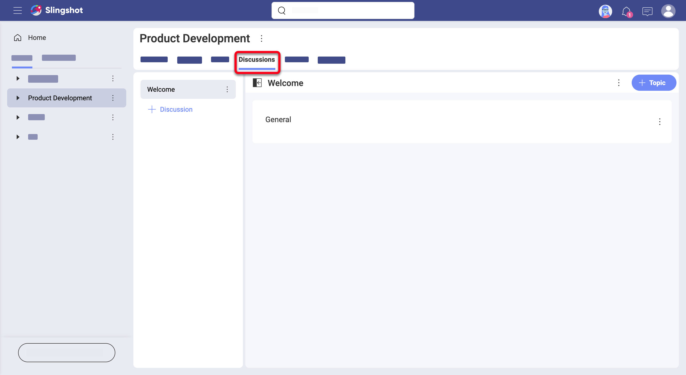
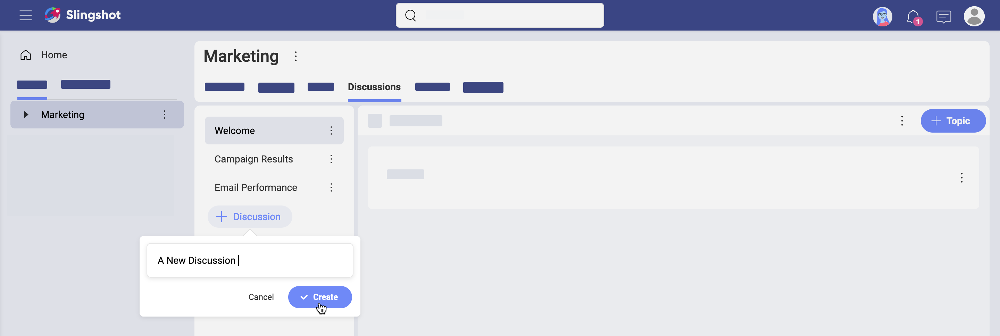
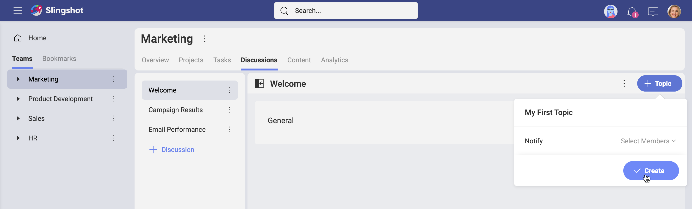
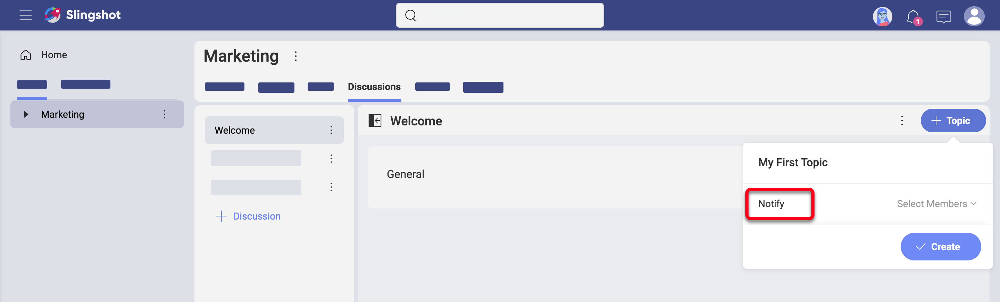
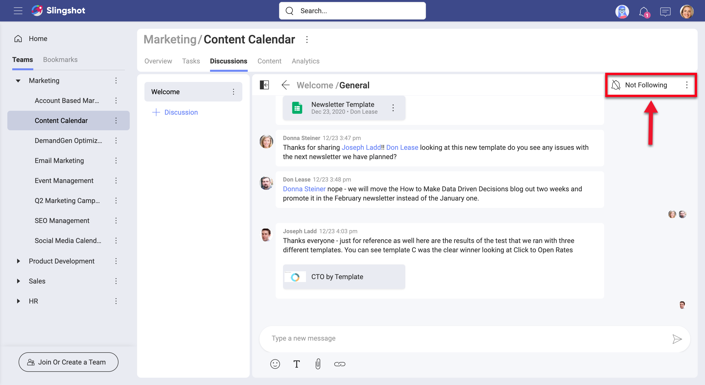
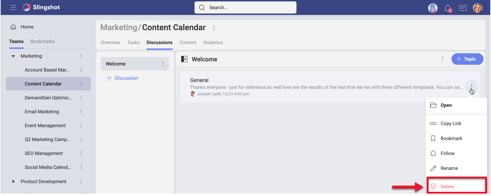

## Starting with Discussions

Welcome!  
Read on to get answers to most of your questions about discussions.

### Discussions vs Private Chat

### How Can I Access My Discussions?

To access your discussions, you need to go to a team or a project and select the **Discussions** navigation tab on top (see below).

> A SUI screenshot showing the Discussions tab of a team or a project (see More on Tasks topic)

You can bookmark a discussion, topic, or even a message in a topic to keep it at hand. They will appear in your bookmarks list and in your personal overview.
Follow the link for further details about [overviews](overviews.md).

### Who Can Access Discussions?

Depending on where you stand, you will find different discussions. To guarantee the privacy of teams and projects, Slingshot does not allow you to access all discussions. So read on to find out who can access what! 

Within a *Team*, you can have discussions about everything concerning your team and teammates. Only team members can access team discussions.

Within a *Project*, you can have discussions that are specific for this project. Every collaborator in the project, incl. external users, can join these discussions. Projects live inside teams. The members of these teams also have access to project discussions. 

Within the *Organization* team, you will find *Discussions* too. Organization discussions cannot be accessed by external users. This is the perfect place for announcements and other important organization related discussions. 

### How Can I Discover and Join Discussions?

Use the _Discussions_ tab in teams and projects to discover interesting discussions. You can read all discussions inside your teams or projects.  

A discussion is basically a section dedicated to a specific subject and organized by a limitless list of topics. Topics are where conversations happen. 

So you can't **join** discussions directly. You can do this by replying to a topic inside a discussion. Only Owners and Members of the team/project can reply to a topic. Viewers can only read it. 

To reply to a topic: 

1. Go to the **Discussions tab** in a selected team or project. 
2. **Choose a discussion** from the list on the left.
3. **Select a topic** on the right to open it. 

### How Can I Create a New Discussion or Topic?

Every Owner or Member of a Slingshot *Team* can create a new discussion. The same goes for the discussions inside the *Organization* team. When it comes to *Project* discussions, they can be created by both project and team owners and members. 

In general, project and team discussions are *read only* for viewers. Viewers in a team, however, can create and reply to a *Project* discussion, if they are an owner or a member of this project.

To **create a discussion**: 

1. Go to the **Discussions tab**. 
2. Select **+ Discussion** on the left (see screenshot below). 
3. Write a meaningful name for the discussion in the text box. This will be the subject of all future topics in this discussion.
4. Choose **Create**.

    

Your discussion will be added at the bottom of the discussions list.   

To **create a topic**: 

1. Select a relevant discussion.  
2. Click/tap the **+ Topic** button on the top right. 
3. Name the topic and, optionally, choose which members to be notified for its creation.   
4. Choose **Create**.

    

Now your topic is created. You can start typing your first message to give more details on the subject. This will also serve as a conversation starter.

### How Can I Ensure Someone is Notified of a New Message in a Discussion?

There are subjects where you need the attention of particular people. To make sure they receive notifications for each new message in a topic, you can use the *Notify* option upon creating a new topic. 

>[!NOTE] **Notifying limitations.** You can only notify users who are part of the team or project where the topic is created. You can't add the emails of users external to the team/project.  

When you want to make sure *you* are notified of new messages, you need to navigate to a chosen topic, open it and change the button on top to *Following*. You will start receiving notifications in the *Notification* center.

If you have missed the opportunity to keep others notified when creating the topic, you can always use the **@mention** (use the *@ sign* and start typing the username). The mentioned users or teams will be notified about your message, but will not receive any further notifications for new messages unless they opt to *follow* the topic.

>[!NOTE] **Auto following.** Each time you answer a topic, you will start automatically following it. This means you will receive notifications for all new answers until you explicitly unfollow the topic. 

### Deleting vs Unfollowing a Topic

Not all topics in a team or project would be interesting to you or need your participation. To prevent your Slingshot discussions feel overwhelming you can unfollow or delete topics. 

When you no longer care for a topic, you can **unfollow** it. This way you will stop receiving notifications for new replies in this topic in the *Notifications* center, which will make it easier for you to focus on more important stuff. 

To unfollow a topic, open it and use the button on top to *Unfollowing*. 

When a topic is no longer relevant to a discussion, you can **delete** it. Be careful, because deleting a topic will make it disappear for all users and it might still contain valuable information that's worth keeping. However, if the information in a topic is no longer valid, deleting it will do more good than harm. 

To delete a topic, navigate to it and select the overflow menu (as shown below). Select *Delete*. 

> replace with a SUI screenshot showing more than one topic in a discussion (see examples in the More on Tasks topic)

### Rearranging Discussions and Topics

Whenever you create a discussion it will be added at the end of the discussions list. There will be times when you won't be satisfied by the chronological order, for example when you accumulate a long list. Don't worry about this, because have an easy and quick way to rearrange discussions. Just drag them up and down the list!

