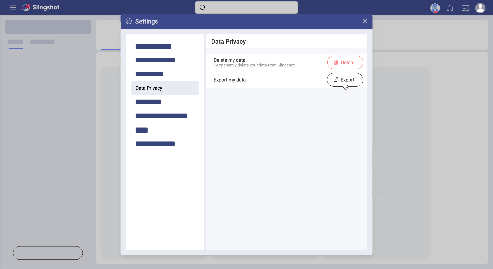

## Exporting Profile Data from Slingshot

Slingshot users may need or - be legally compelled - to export profile data. When providing data exports, Slingshot guarantees that data privacy is protected to the extent required by global data privacy laws, including the General Data Protection Regulation (GDPR).
   
Read below to learn who is authorized to export profile data from Slingshot and how, and what type of data can be exported. 

### What Is the Export Format?

Profile data is exported in JSON format. 

Upon request, you will receive an email from Slingshot. This email contains a link to download a zip file with one or more JSON files with profile data. 

### What Type of Data Does the Export Contain? 

The export contains:

- the email, name, id, and locale associated with the user profile; 
- industry, department, title - if provided by the user;
- information about tasks (incl. task groups and task filters);
- information about *Content* boards;
- information about pinned or shared files, but not the files themselves;
- discussions, topics, and the actual text of the messages of the user, but not the text of other users' messages;
- information about private chats, and the actual text of the messages of the user, but not the messages of other participants in the chat;
- analytics - information about personal dashboards, but not the actual dashboards; information about dashboards shared by other users is not exported. 
  
### Who Can Export Profile Data? 

You can make an export request to the Slingshot team if you are: 

- a user with a personal account in Slingshot, or 
- an Organization owner. 

If you are a member of an Organization in Slingshot, then the information in your profile is considered ownership of the Organization. In case you want to receive an export of the data retained about you after you left an organization, you have to contact an administrator of personal data in your organization and request the export from them.
  
### How to Export Profile Data? 

Below you will find two possible scenarios. The export procedure steps depend on your relation to an Organization in Slingshot.
#### For Organization Owners

If you are a user with [Owner](roles-permissions.html#teams-projects-roles) permissions in your Organization team and you need to export users' profile data, then read the steps below to learn how to proceed. 

1. Contact our team at **support@slingshot.io**
2. Note you want to export an Organization member's profile information.
3. You may be asked to provide more details about yourself. 
4. The Slingshot team will verify your right to request export first. Only then you will receive the exported data by email. 

#### For Users with Personal Accounts

If you have a [personal account](roles-permissions.md#personal-account-users) in Slingshot, this also means you do not belong to an Organization in Slingshot. You can be a member of Organization's teams and projects if invited. In this sense, your profile information does not belong to any Organization and you can request data export from the Slingshot team directly. To do this:  

Select your profile image > *Settings* > *Data Privacy* > *Delete my Data* (as shown in the screenshot below).

>[!NOTE] If you are an Organization member *Data Privacy* is not available in your *Settings* menu. 

Export may take up to 24 hours. 