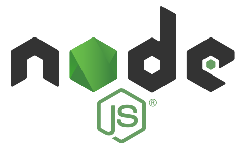
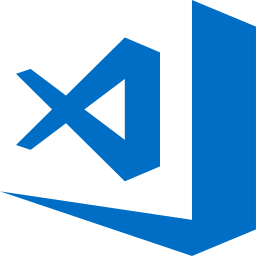
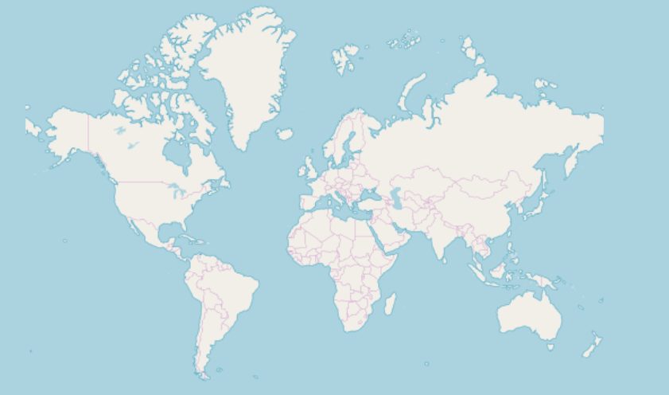

## Getting Started With $ProductName$

The $ProductName$ is a complete set of $PlatformShort$ components designed to enable developers to build the most modern, high-performance HTML5 & TypeScript apps for modern desktop browsers.

### Setting Up Computer

Before you can run $ProductName$, there are 2 steps to get everything on your machine set up to run any $PlatformShort$ app, including $ProductName$, and to build $PlatformShort$ apps. To get started, you must install both NodeJS and Visual Studio Code on your machine. Modern web development with $PlatformShort$ requires NodeJS, it’s sort of like an ASP.NET app running in the browser and requires ASP.NET runtime deployed on the server. For development, there is nothing better than Visual Studio Code to build $PlatformShort$ apps. Getting started is easy, just download and install both Node.js and Visual Studio Code.

<div style="display:block;width:100%;margin:50px;">
    <div style="display:inline-block;width:45%;text-align:center;">
      
      <a target="_blank" href="https://nodejs.org/en/download/"
         style="color:white;background-color:#09f;text-decoration:none;font-weight:700;font-size:16px;padding: 5px 15px 5px 15px;">
        DOWNLOAD NODE JS
      </a>
    </div>
    <div style="display:inline-block;width:45%;text-align:center;">
      
      <a target="_blank" href="https://code.visualstudio.com/download"
         style="color:white;background-color:#09f;text-decoration:none;font-weight:700;font-size:16px;padding: 5px 15px 5px 15px;">
        DOWNLOAD VS CODE
      </a>
    </div>
</div>

<!-- using a note because there is no other way to build flag content for specific platform. -->
> [!NOTE]
> For React:
> Now that we have everything we need, we can create a new React application.  <br>
> Open **VS Code**, select **Terminal** menu, **New Terminal** option and type this command in terminal window: <br>
> **npx create-react-app my-app-name --typescript**
> <br> or <br>
> **yarn create react-app my-app-name --typescript**
> <br> Refer to this <a href="https://facebook.github.io/create-react-app/docs/adding-typescript" target="_blank">website</a> for more information on above commands.


### Updating Existing App

If you want to use $ProductName$ in an existing $PlatformShort$ CLI project (one that you have from before). We have you covered! All you have to do is execute these commands:

- **npm install --save {PackageNameGauges} {PackageNameCore}**

Or

- **yarn add {PackageNameGauges} {PackageNameCore}**

This will automatically install packages for $ProductName$, along with all of their dependencies, font imports and styles references to the existing project.


### Starting App

You can build for production or start your application with these commands:

- **npm run-script build**
- **npm run-script start**

After executing those simple commands, your project will be built and served. It will automatically open in your default browser and you will be able to use $ProductName$ components in your project.

### Importing Modules

First we have to import the required modules of the components we want to use. We will go ahead and do this for the [**bullet-graph**](bullet-graph.md) component.

```ts
import { IgrGeographicMapModule } from "igniteui-react-maps/ES5/igr-geographic-map-module";
import { IgrGeographicMap } from "igniteui-react-maps/ES5/igr-geographic-map";
import { IgrDataChartInteractivityModule } from "igniteui-react-charts/ES5/igr-data-chart-interactivity-module";

IgrGeographicMapModule.register();
IgrDataChartInteractivityModule.register();
```

```ts
import { igsGeographicMapModule } from "slingshot-maps/ES5/igs-geographic-map-module";
import { igsGeographicMapComponent } from "slingshot-maps/ES5/igs-geographic-map-component";
import { igsDataChartInteractivityModule } from "slingshot-charts/ES5/igs-data-chart-interactivity-module";
import { ModuleManager } from 'slingshot-core/ES5/module-manager';

ModuleManager.register(
    igsGeographicMapModule,
    igsDataChartInteractivityModule
);

```

### Using Components

We are now ready to use the $ProductName$ map component in our markup! Let's go ahead and define it:

```tsx
// App.txs
render() {
    return (
        <div style={{height: "100%", width: "100%" }}>
            <IgrGeographicMap
            width="800px"
            height="500px"
            zoomable="true" />
        </div>
    );
}
```

```html
<div style="height: 100%, width: 100%">
    <igs-geographic-map
      width="800px"
      height="500px"
      zoomable="true">
    </igs-geographic-map>
</div>
```

### Running Application

Finally, we can run our new application by using one of the following commands:

- **npm run-script start**


The final result should look something like this screenshot:


