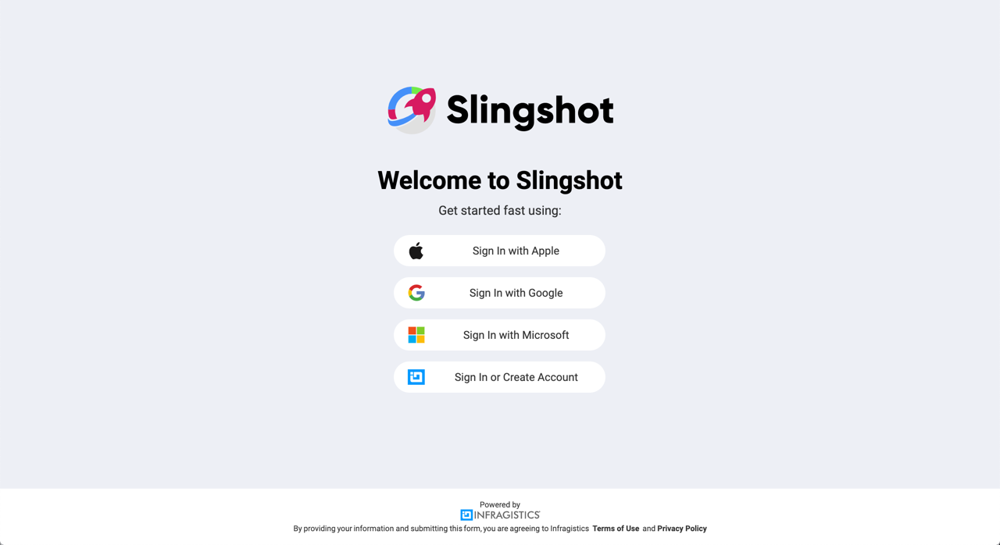
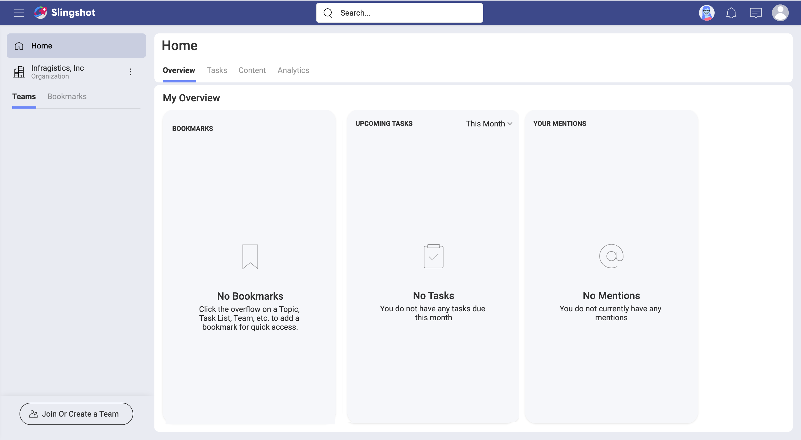
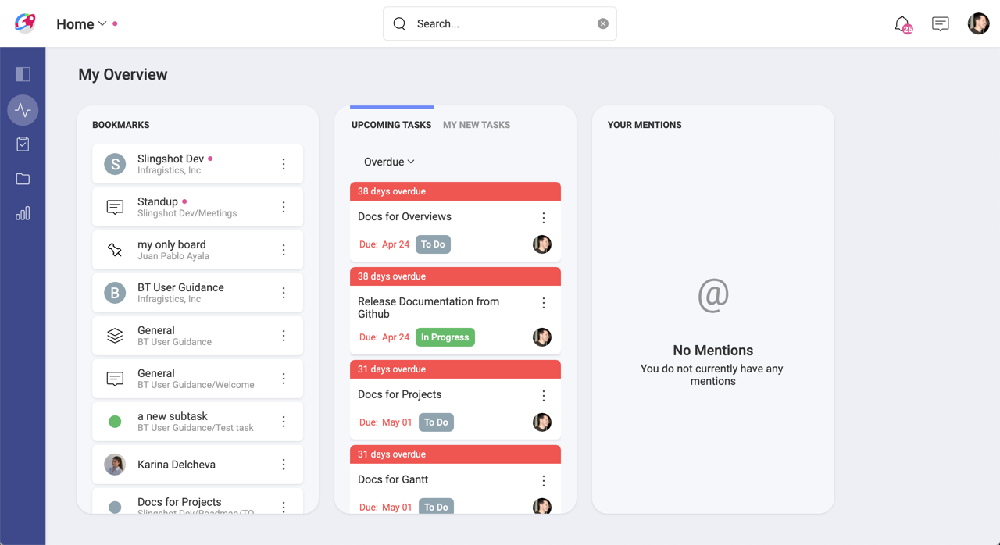
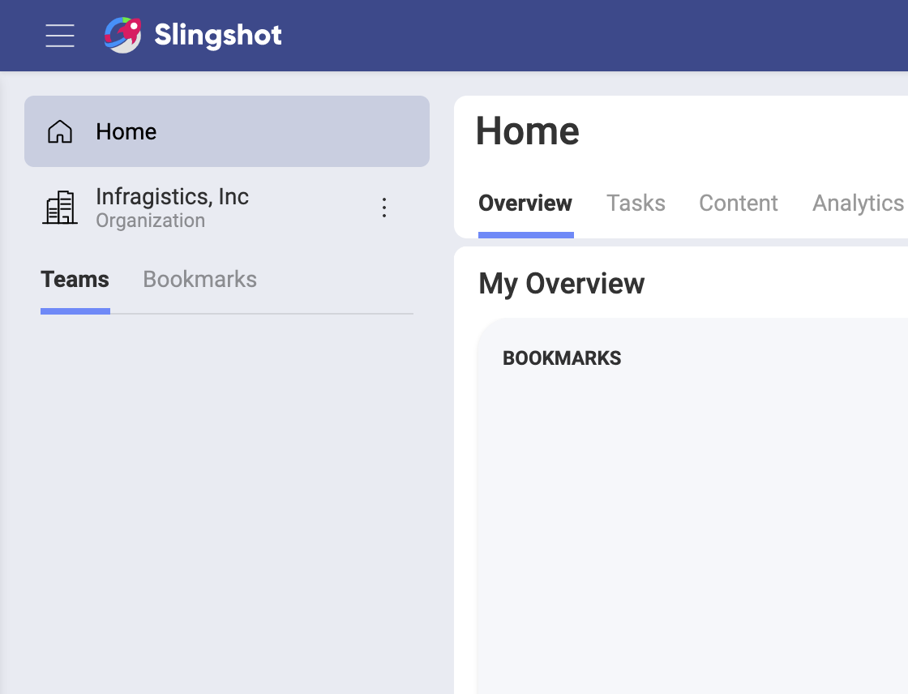
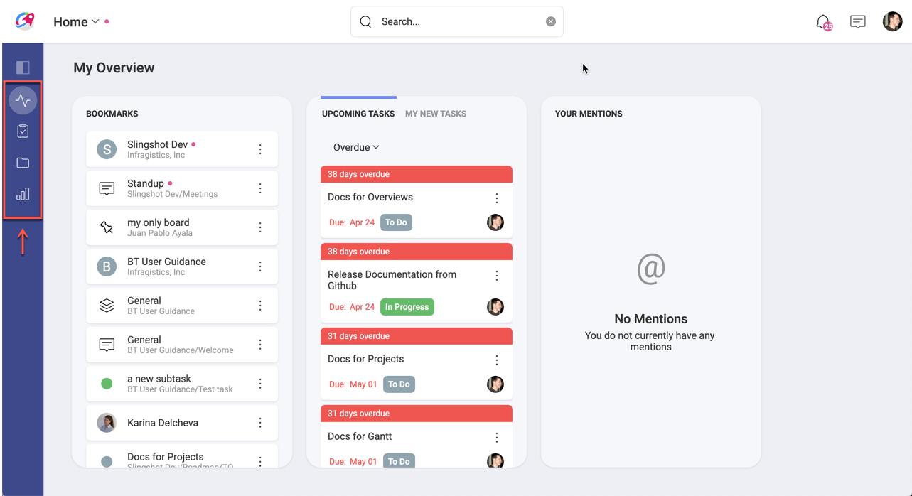
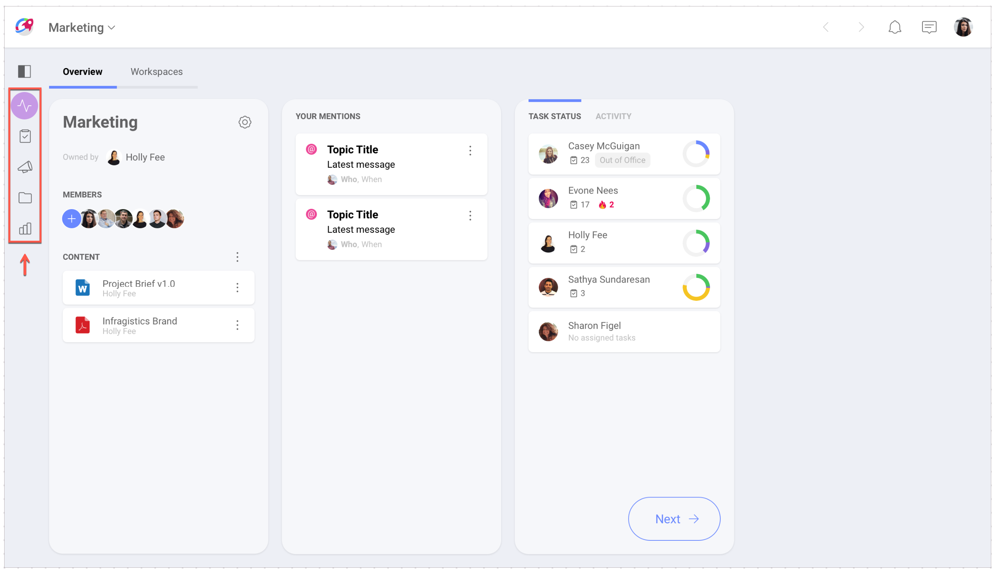
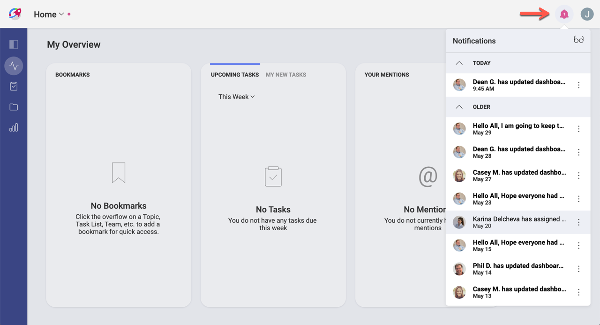
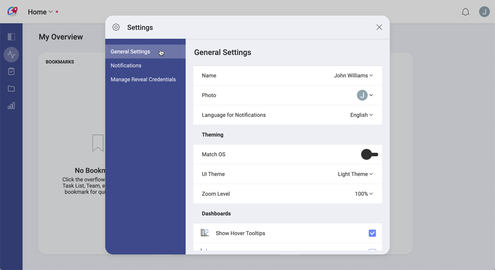
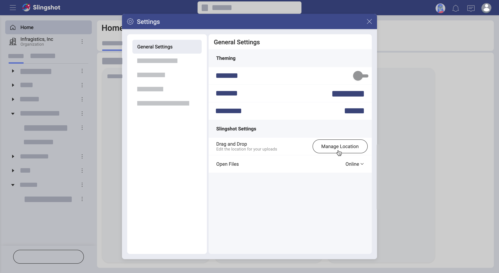
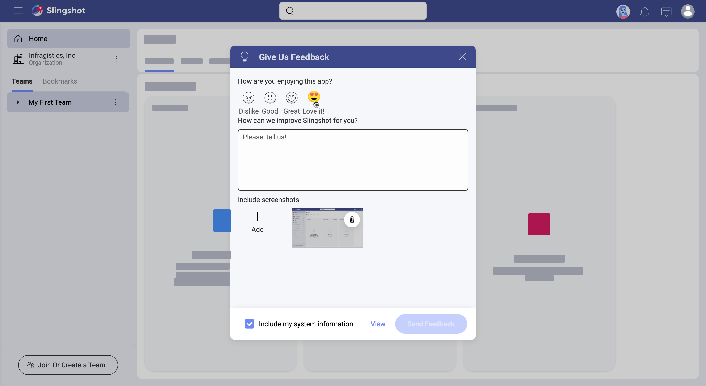

## Logging In for the First Time

Welcome to Slingshot!  
When opening the app you'll be met with different login options:

Before jumping in, take into account that in Slingshot you can join an **Organization**. If you are a member of an organization, you have to log in with your organization’s email. Choose Google (G Suite) or Microsoft (Office 365) as needed and you'll be associated with the Organization team.

> [!NOTE]
> The Organization team is useful for managers and leaders to communicate key goals, metrics, strategies, and important announcements throughout their organization. The Organization team is named after your organization (e.g. your company's name).  

When you log in with Google and Microsoft, you get a cloud storage automatically configured based on your credentials, Google Drive or OneDrive respectively. This means you get access to your files on the cloud storage and can share them with other users to collaborate over them.

### Your First Screen

Once you get in, you are greeted with your first screen:

You always start in your personal space, your **Home**. Specifically, in _My Overview_. This is the place where you can have a quick glance at your most important information, organize yourself, and visualize your work.

As you can see above, _My Overview_ can get very busy. Let's focus on getting you familiar with Slingshot first...

### Home, Organization, Teams, and Projects

Your personal space, **Home**, is great and useful, but Slingshot is about effective collaboration while running teams and projects. So, you're probably wondering how to switch between your personal space, teams, and projects? 

Check out the image below:

The navigation panel on the left includes: 

- your **Home** tab; 
- your **Organization** tab (if you have one), and 
- the **Teams** and **Bookmarks** tabs. 

You can switch between the content in your Home, Organization and teams. 

When the *Teams* tab is selected you will see a list of Teams and Projects. If you bookmarked a team or project to keep it at hand, you can select the *Bookmarks* tab to find it faster.

To navigate to any team or project, just click/tap over it.

Keep in mind that in Slingshot, people can be part of an organization, plus one or more teams, and also one or more projects. Projects live within teams, and you have overviews, tasks, discussions, content, and dashboards at both levels. For example, there are team tasks and project tasks as well.  
Follow the links for further details about [teams](teams.md) or [projects](projects.md).
### Overviews, Projects, Tasks, Discussions, Content, and Dashboards

Inside Slingshot teams, you will find the six main navigation bars on top: **Overview**, **Projects**, **Tasks**, **Discussions**, **Content**, **Dashboards**.

As already mentioned, the Organization team is not like other teams. So, inside it, there is a different number of navigation bars. That goes for your _Home_ space and _Projects_, which also have the navigation bars. 
But why is that? Let's answer this question quickly by explaining the idea behind each navigation bar.

**Overviews** give you a quick status of projects, teams, or your personal work, so you'll find them there. **Projects** are created inside teams, but cannot include other projects. **Tasks** represent work to be done by the team members in a team or in the scope of a project.  **Discussions** are used to chat among members of an organization, team or project. **Content** is about cloud storages and boards - basically you connect to cloud storages and then use boards to organize and share that content with others. Finally, **Dashboards** allow you to quickly create and share data visualizations so you can turn your data into insights.

The image above shows the navigation bars of a Slingshot team, the Organization team, a project, and Home. Only teams have all the main navigation bars. 
Follow the links for further details about [overviews](overviews.md), [projects](projects.md), [tasks](tasks.md), [discussions](communication.md), [content](content-boards.md), or [dashboards](analytics/index.md).

### Notifications and User Settings

**Notifications** are designed to keep you updated on any changes to teams, tasks, projects, messages, and dashboards. You can learn, among others, that a task was assigned to you, that you are removed from a team, or that someone sent a message in a discussion thread you're following.

There are three different types of notifications, in-app, push, and email. This means that you can get a message that pops up while using Slingshot (in-app notification), a message that pops up on a mobile device (push notification), or even an email notification.  
Follow the link for further details about [notifications](notifications.md).

In **User Settings** you can find _General Settings_, _Feedback_, and you can also _Sign Out_ of the application.

Then, in _Settings_ you can find five categories, including general and profile settings, notifications, data privacy and settings related to your dashboards. In _General Settings_ you can configure your app appearance and also how you work with content, whereas _Profile Information_ includes information about you and your organization. 

In _General Settings_ you will notice the **Drag and Drop** button. This setting allows you to manage the location of your uploads. But what does this mean?

All files you reference or share within Slingshot, are located in a cloud storage. When you drag and drop a file, which comes from outside Slingshot,  it's uploaded to the cloud storage configured here.

Use in-app **Feedback** to send us suggestions, comments, or requests about Slingshot. Here you can rate the app, add screenshots to the feedback you send, and also annotate the screenshots to provide even more detailed information.

### What About Roles & Permissions?

In Slingshot, people can join an organization, one or more teams, and also one or more projects. Roles and permissions apply only to organizations and teams.  
Roles represent a set of permissions assigned to a Slingshot user in relation to a team or an organization. This means every user is assigned a role when joining organizations or teams. There are three different roles (owner, member, viewer) with a clear set of permissions each.  
Follow the link for further details about [roles and permissions](roles-permissions.md).
