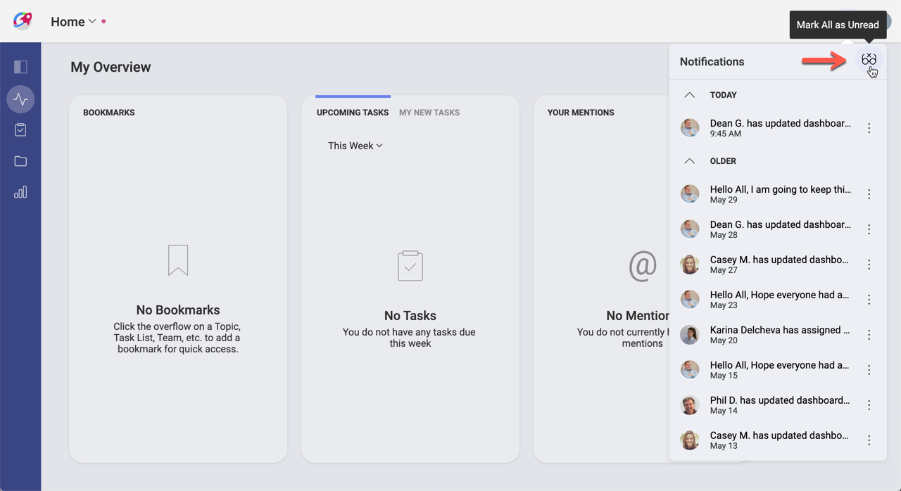
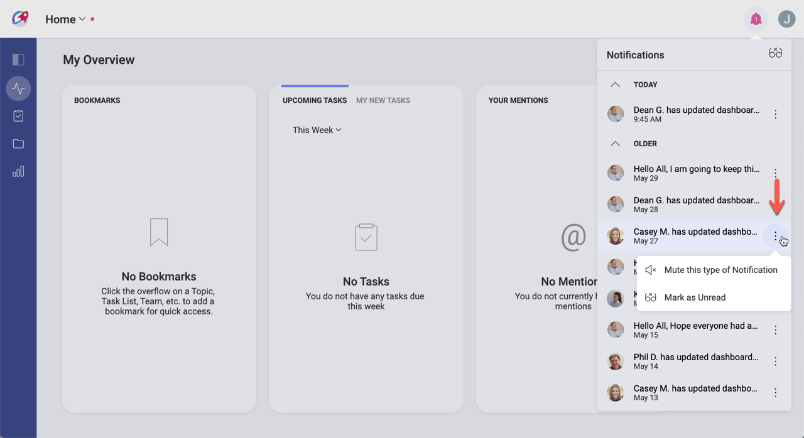
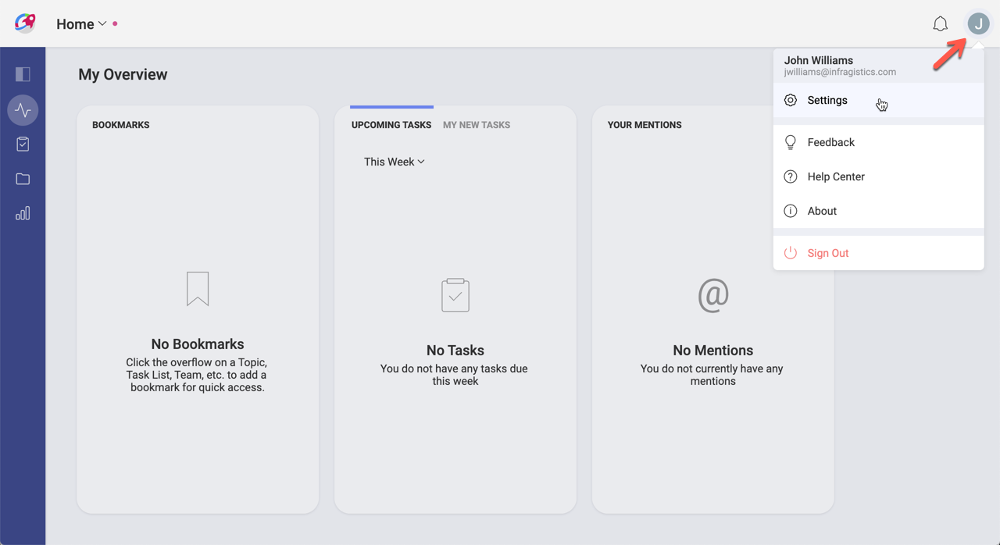
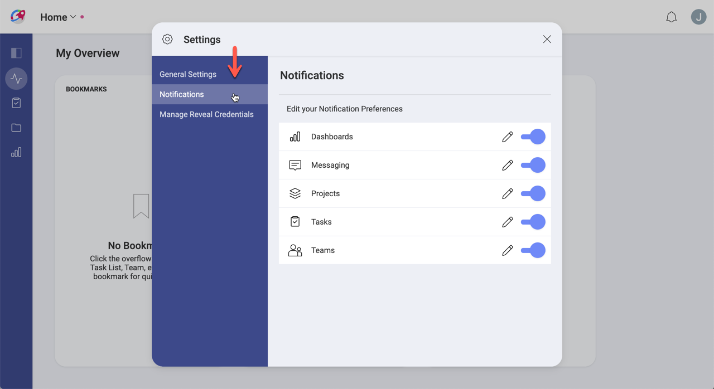
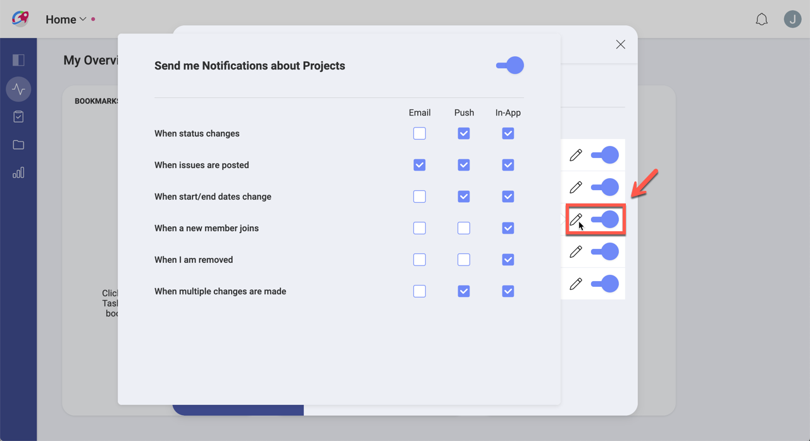

## Notifications

A notification can be defined as an indicator that a certain event has happened. This is a fairly common feature in smartphones, applications, and websites, they provide new information to the user.

Sometimes notifications can become overwhelming, as an application can consistently send you  notifications that are not worth of your attention. In Slingshot, we definitely want to avoid that feeling, so you start with cautious notifications settings. In any case, you can always modify the settings according to your preferences.

### So, What's a Slingshot Notification?

It's an auto-generated indicator that is sent to you to let you know a certain event has happened. There are three different types of notifications, in-app, push, and email. This means that you can get a message that pops up while using Slingshot (in-app notification), a message that pops up on a mobile device (push notification), or even an email. As you can get Slingshot on any platform, tweaking those settings is important to customize your experience.

### Stay informed with Notifications

Notifications are designed to keep you updated of any changes on teams, tasks, projects, messages, and dashboards. You can learn, among others, that a task was assigned to you, that you are removed from a team, or even that someone sent a message in a discussion thread you're following.

You can access *Notifications* on the top right of the screen as shown below.

Within the *Notifications* panel, you can mark all notifications as *Read* or *Unread* with the *glasses icon*:

Additionally, you can individually mark as *Read* or *Unread* or mute notifications by selecting the _Mute this type of notification_ option in the overflow menu.

### How can I change my Notification Settings?

There are three different types of notifications, in-app, push, and email. In-app notifications are displayed within the app in Notifications panel. Push notifications are displayed as texts near the notification icon. And emails are delivered to the e-mail address associated to your account.

To change your notification settings, go to *Settings*:

 And then navigate to *Notifications*:

Finally, for each category you can edit the settings as shown below or use the switch to turn them off entirely.

