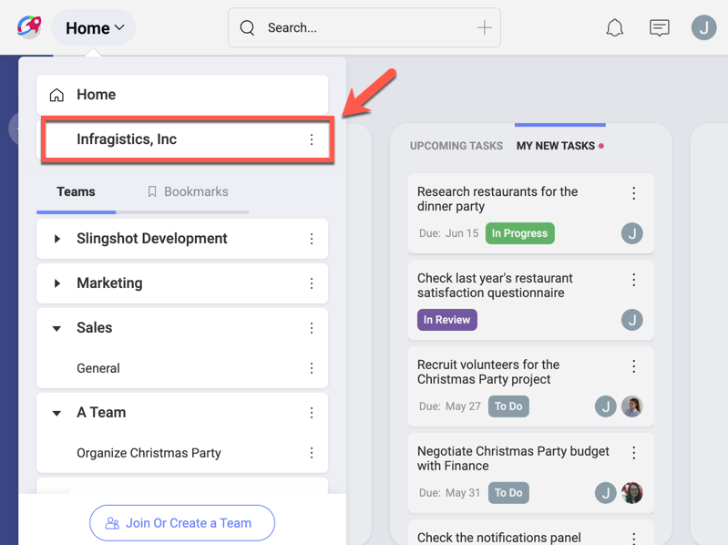
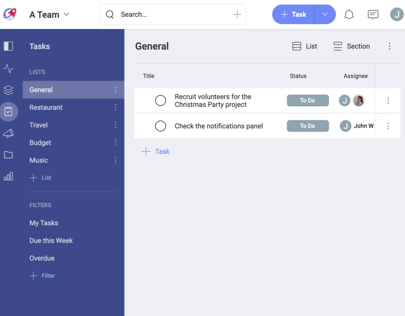
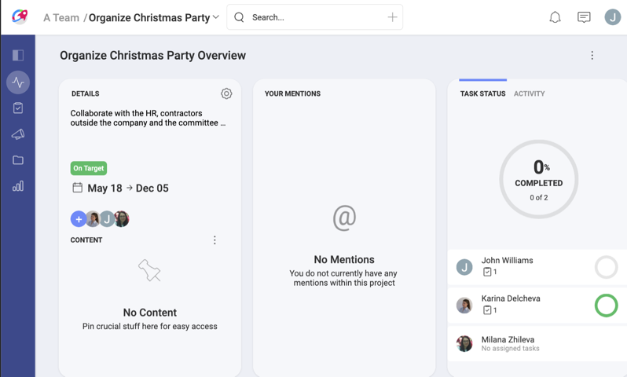
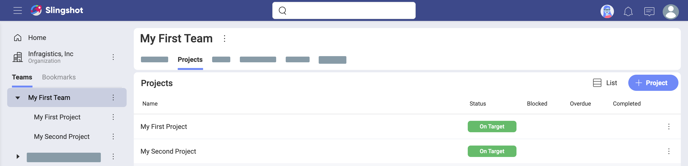
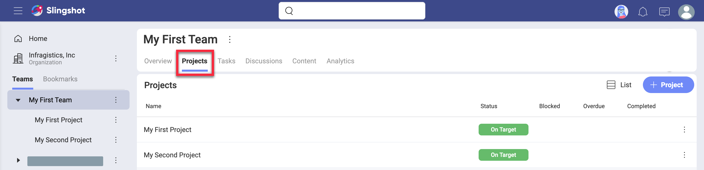
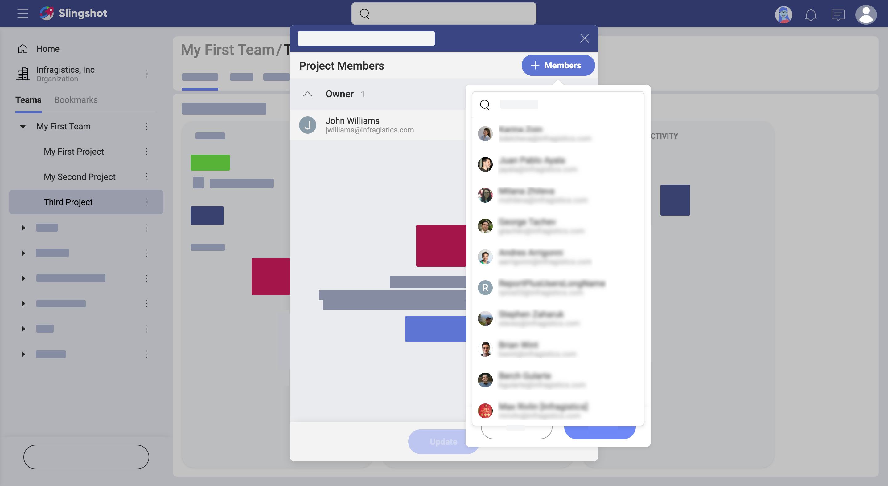
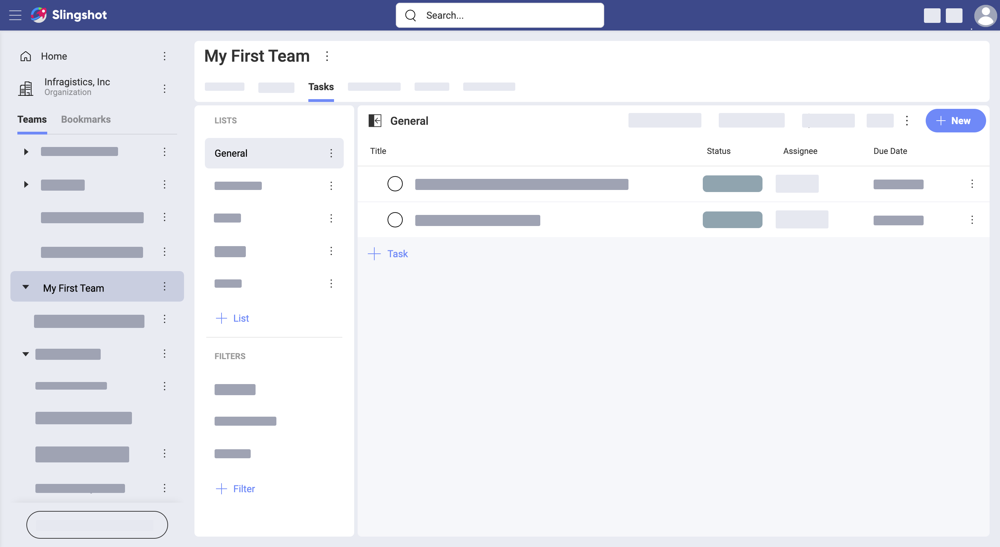
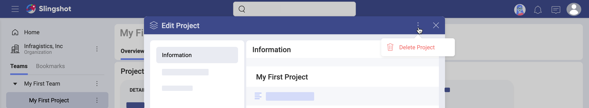

## Starting with Projects

Welcome!  
Read on to get answers to most of your questions about projects.

### Organization vs Team vs Project

In Slingshot, people can join an organization, one or more teams, and also one or more projects.

The purpose of having an organization team is for company leaders to have the ability to communicate key goals, metrics, strategies, and important announcements throughout their organization.   
The organization team is named after your organization (e.g. your company's name). Members need to log in with their organization’s email to be associated with the organization team.

The organization team has only three available tabs on the right: **Discussions**, **Content**, and **Dashboards**.

Teams can be associated with the organization team or not. They can include members from within and out of the main organization team. Team members share not only **Content**, **Analytics**, and **Discussions**, but also **Projects** and **Tasks**.

Projects live inside of a team, but are not limited to its members. You can invite people from other teams to every project. A project contains its own **Overview**, **Tasks**, **Discussions**, **Content**, and **Analytics**. You can also assign tasks within a project to people, who are not part of the project or the team.

> new UI: replace with a similar screenshot

### How Can I Access my Projects?

You can access the projects of a team by selecting the team and finding the **Projects** tab on top (shown below).

[comment]:<> (New UI: replace with a similar screenshot)

By scrolling down you are able to navigate all the projects. If you bookmark one of the projects to keep it at hand, you can also find it in your personal overview.  
Follow the links for further details about [overviews](overviews.md).

### How Can I Create a New Project?

Every owner or member of a Slingshot team can create a new project.

Access the project creation menu by selecting *Overview* or *Projects* (see screenshot below) and then *+ Project*.

In the new dialog you can give your project a meaningful name and, optionally, add a short description to provide further details about the project. You can also add start and end dates at this point or you can choose to add them later.

Click **Create** > **+ Members** and proceed to adding project members. Start typing their names or emails and you will receive a list of suggestions (see below):

You can assign one or more team members to the project, plus any external people that might belong to other teams or even from outside of the organization.

Proceed to invite external members by adding their emails to the list. Then, select _Send Invites_.

### How Can I Ensure the Project Is On Track?
By keeping everyone in the loop, leaders and project members can proactively identify that a project is not going well and needs attention

Projects can go wrong for multiple reasons and sometimes more than once. That's a fact. The actual challenge is to proactively identify a project has spiraled out of control and get it back on track as soon as possible. Project overviews help you identify those projects and the reasons, helping you ship projects consistently on time and on budget.

### How Can I Manage Project Members?

Any team member (with the owner or member role) that is assigned to a project can add or remove project members. External users must have the member role to do so. Viewers are never allowed to manage project members.

Access the project members' dialog by selecting the project's [Overview](../projects.html#overview) > Details widget (on the left) >  profile images icons (above _Content_).

To invite new members just select team members from the team or go to *External* to add members from outside of the team.

For external users , you can change each member's role or remove the member from the project by clicking on the role's dropdown.

### Can I Work with People from Outside of a Team or Organization?

Sometimes you may need to work on a particular task or project with people outside of your team. In this case, it doesn't make sense to add them as members to your team.

You can assign project tasks to members outside of a team in the project's _Tasks_ on the left.

Users will receive a notification about the task they were assigned. For them, the task will appear in *Home > Tasks*.  

Besides existing team members, you can also add external members to projects. To do this:
1. Navigate to _your team_ > _Projects_ > _Selected Project_ > _Project Overview_ (in the tab bar on the left).
2. Click/tap on the profile images icons (left widget in *Overview*) to open _Who is working on this?_ dialog:

3. Choose _External_ > _+ Members_ blue button to add members who are not part of the team to this project.

You can also go directly to a project's *Tasks* tab and assign a task to an external member.

>[!NOTE]
>**External members** don't need to be part of the same main organization as you.

External members, who are added to a project, will receive notifications about the project and its state. They will also be notified when the project is mentioned (by using the *@ sign* + the project's name).

The Owner of a team can exclude team members from a project.

After unfollowing a project, you will receive only notifications about tasks assigned to you within the project.

### How Can I Change the Project's Dates, Name, or Description?

To change your projects's settings go to the project overview and select the gear icon:

A screen will open and there you can change your project's dates, name, or description.

### Deleting vs Leaving a Project

In Slingshot you can either delete or leave a project.

To delete a project, open its [settings](#how-can-i-change-the-projects-dates-name-or-description) and select the overflow button:

Deleting a project removes it and all its contents for all its members.

To remove a project and its content only for you, use the _leave_ option. You can do this by going to the project's [members list](#how-can-i-manage-project-members), click/tap your role and select *Leave* at the bottom.
