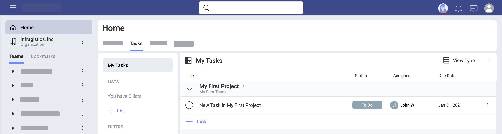
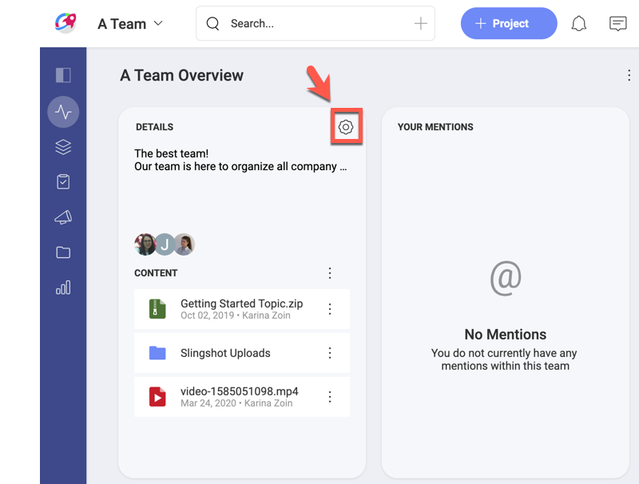
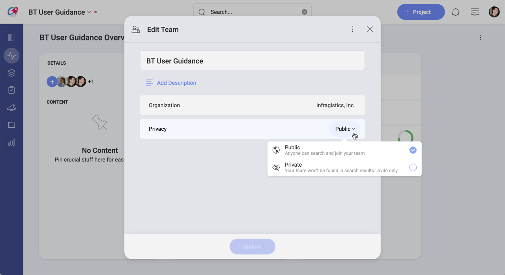

## Roles & Permissions

One of the main methods of access control in computer systems is known as role-based access control (RBAC). Basically, it's about restricting access to a system depending on the person's role, where multiple roles are created depending on the level of access required for different groups of people. As roles have different permissions, it is possible to limit specific tasks like viewing, creating, modifying, or sharing files.

Using roles and permissions is a common practice for big companies, but it's also particularly helpful for those who want to give access to external people, like third-parties and contractors. Slingshot was designed with different roles and permissions that contemplate many possible scenarios.

### What Are roles and Permissions within Slingshot?

In Slingshot, people can join an organization, one or more teams, and also one or more projects. Roles and permissions apply only to organizations and teams.

Roles represent a set of permissions assigned to a Slingshot user in relation to a team or an organization. This means every user is assigned a role when joining organizations or teams. There are three different roles with a clear set of permissions - owner, member and viewer.

### So, What Can the Different Roles Do?

**Owners** have full access to manage a team or organization. This includes inviting new members or removing them, deleting a team (not an organization), and also changing a team's name, description and privacy (public or private).  
Team owners can invite other users to the team and also make them owners. The Slingshot user who creates a team is automatically assigned as its owner. If you are the only owner of a team, you cannot leave it without assigning another member as an owner.  
Members of an Office 365 or G Suite organization need to log in with their associated email so they can be added to the Organization within Slingshot. The first time someone of the organization logs in to Slingshot, the org is created using the same name. All members of an organization join the Slingshot organization as owners.

**Members** are allowed to create and edit projects, tasks, filters, discussions, topics, boards, and also create and share dashboards. When searching and joining a public team (not by invitation), you do with the member role.

**Viewers** are limited to view and share content. To be a viewer in a team, you have to be invited with the viewer role.

### What About External Users?

Sometimes you may need to work with people from outside of your team or even from outside the organization. People with expertise in many different areas can be mixed in a team that is not part of the organization. You can also create a project that includes tasks assigned to external users.

In Slingshot, people can be part of an organization, one or more teams, and also one or more projects. Teams normally live within organizations and projects within teams. That being said, you can create a team outside of your organization to mix in external users. Also, you can invite external users or people from other teams to any project. This is particularly useful when external users will work with you for a limited amount of time. All projects have a beginning and an end after all and you can assign tasks within a project to one or more external users.

So, what path should you take?

If you are thinking on a **small contribution**, you can go to a team and create a specific task for an external user. This user won't be added to the team and will receive a notification about the task assigned. For the external user, the task will appear in *Home > Tasks*.

Alternatively, the external user might be **further involved into a specific project**, needing to collaborate in multiple tasks with other users. In this case you should add the user to that specific project within the team. Again the user won't be added to the team.

Finally, you might want to create a team to add an external user that **frequently collaborates with you and other organization members**. In this case, you should create a team outside your organization that includes the external user and other members.

### How Do Permissions Around Cloud Storages Work?

The content that is relevant to you might be stored in different cloud storages. Slingshot lets you create connections to those cloud storages to access that content, share it, and organize it in boards. Those connections can be private or shared and they are meant to be used in different scenarios.

_Only you_ have access to **private cloud storage** connections and you can create/delete them whenever you want. That being said, you are able to **share private content with others** if you want.
When you pin content from a private cloud storage to a team shared board, that specific content becomes available for the whole team. But it does not mean that team members can access the rest of the cloud storage contents.

_All the members of a team_ have access to **team cloud storage** connections and they can create/delete them whenever they want. You can also keep useful content at hand by pinning it to a team board.

> [!NOTE]
> If you use your **Office 365** account to log into Slingshot, you will start with your **OneDrive** configured. Same applies to logging with your **Google** account and starting with a **Google Drive**.

### What About Public and Private Teams?

A newly created team is public by default, meaning that any member of the main organization can search and join the team. Trust and transparency are key elements for effective collaboration, and also help with ownership and accountability.  
That being said, sometimes you might need to have a private team, leaving your team out of the search results. In this case, users can only join the team by getting invitations from existing members. This is helpful for teams that handle sensitive information, in those cases the organization wants to restrict access.

To change a team's privacy, you need to be one of the owners of the team. To do this, go to the team's [Overview](#how-can-i-get-visibility-over-a-team) and select the gear icon:

Here you can change your team's name, description and privacy.

