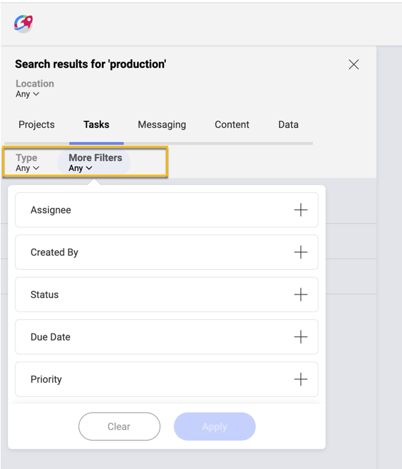
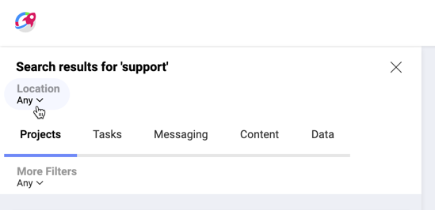

## Search title

If you have been on the Internet at least once, you know it's all about finding the right information! And the search is the tool to help you with this.  

### So, What's a Slingshot Search?

The search in Slingshot has the power to make your collaboration even more productive. Its design makes finding relevant information inside your **Projects**, **Tasks**, **Messages**, **Content**, and **Dashboards** quick and easy. The filtering options will help you further enhance search performance by eliminating unnecessary distractions.

### How to Start Your Search?

To start your search in Slingshot follow the steps below.

1. Click the search box at the top.

    

    Notice that your last searches appear in a dropdown before you start typing.

2. Start typing. Slingshot will start making suggestions. Press _Enter_ / select _Search All Results_ for a full list of results.

3. A search results pane will open on the left showing all results sorted in five tabs: _Projects_, _Tasks_, _Messaging_, *Content* and _Data_. Select one of the tabs to see related results.

4. Click/tap on a result to open it on the right. You can also use the overflow menu of each result to copy its link to the clipboard so you can share it or save it in _Bookmarks_.

### How to Use Filters?

You may receive too many results and need to refine your search to find exactly what you need. For this purpose, you will find a second tier of filters under each result tab.

These filters are specific for the selected result type. For example, if you select _Tasks_, you can then use the filter to see only results in _Task Lists_ or to filter by task's creator, assignee, due date, etc.

>[!NOTE] Your filters' settings will be kept for your next search until you close the search results pane or refresh the page. So, if next time your search criteria change don't forget to check your search filters too.

#### Filtering by Location

If you need results related to a specific team, project or from your personal space (_My Stuff_), use the _Location_ filter dropdown just above the result tabs (see below).

The _Location_ filter is applied to all results and is not affected by which result tab you chose.

So, if you want to check who completed a specific task in the  _Marketing_ or _Sales_ team for example, after choosing these two teams in the location dropdown, your next job is to select the _Tasks_ tab and apply the status filter.
