## Starting with Tasks

Welcome!  
Read on to get answers to most of your questions about tasks.

### Personal vs shared tasks
In Slingshot you can have personal and shared tasks, they work pretty much the same but they do have a few differences detailed below.

Only you have access to your **personal tasks** and you can find them in your personal space (Home).

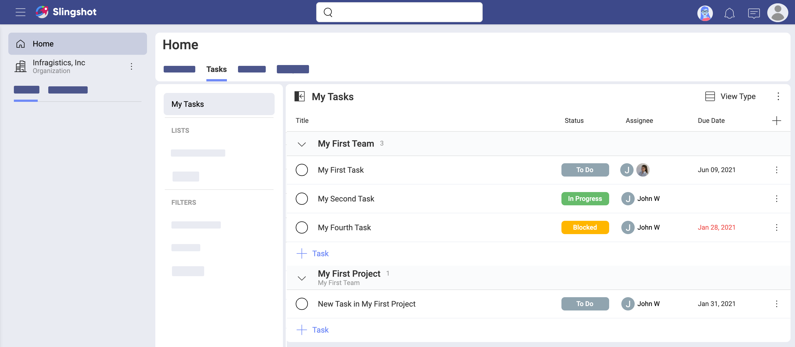

**All the members of a team or project** can access the tasks created, no matter who is assigned. And every member can manage these shared tasks freely.

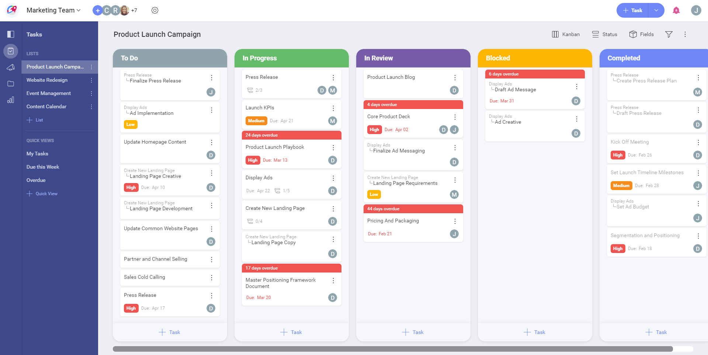

### How can I access my tasks?

You can access *Tasks* on the very left of the screen as shown below.

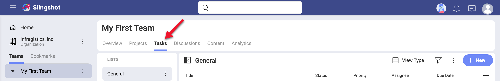

Depending on where you stand, you will be accessing different tasks.

In **Home**, you can access every task assigned to you under *My Tasks*. This includes personal, team, and project tasks, very useful to find all your tasks in just one place.

Within a **Project**, you get access to all the tasks created for the project, no matter who is assigned.  
Also, under *My Tasks* you can find the project tasks that are assigned to you.

Within a **Team**, you get access to all the tasks created for the team, no matter who is assigned.  
Also, under *My Tasks* you can find all the tasks assigned to you that are specific to the team and all its projects.

To **open a task**, just click/tap over it.

> [!NOTE]
> When you can't find a specific task, try expanding collapsed panels, removing existing filters, and/or adding filters using the properties of the task you want.

### How can I create a new task or subtask?

You can always create a **new task** with the button on the top right of the screen, no matter the visualization you are (List, Kanban, or Timeline).

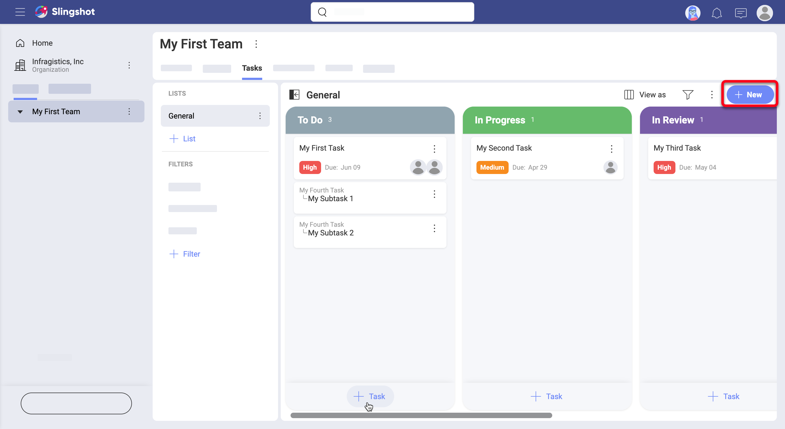

As shown above, there are always other **+ Task** buttons depending on the visualization. In the case above, you'll open an empty task with the _To Do_ status already set.

You can directly create a new **subtask** with a task's overflow menu as shown below.

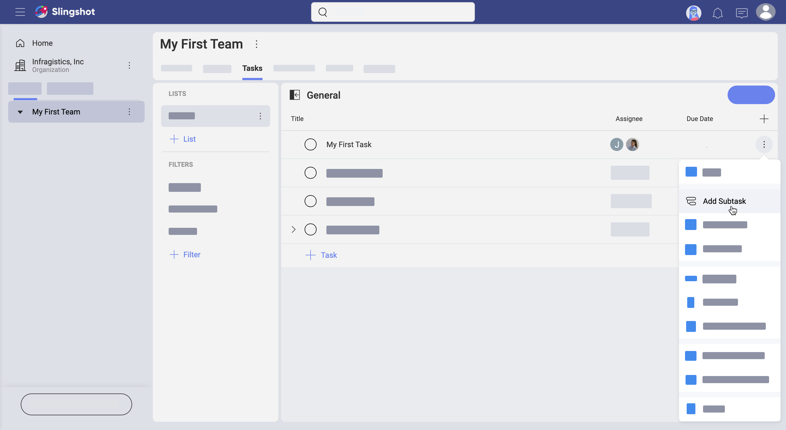

Alternatively, you can create subtasks for a task that is already opened:

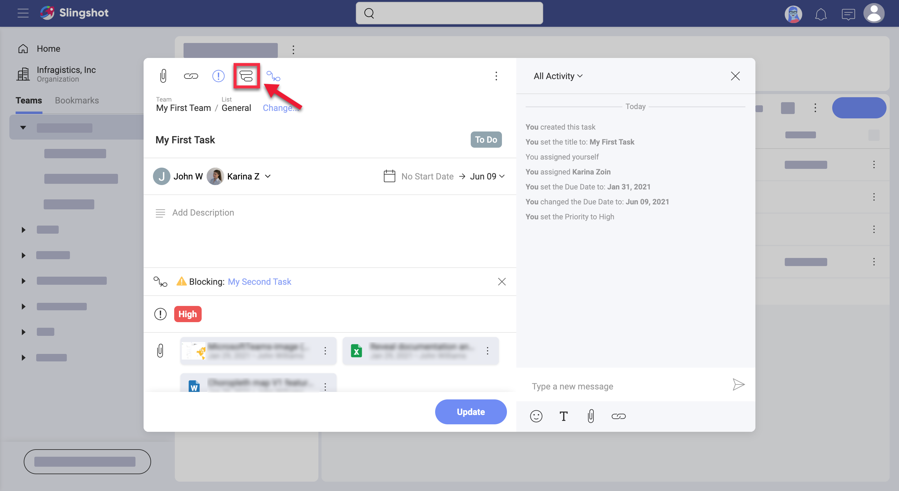

Having the task opened also allows you to insert new subtasks as shown below.

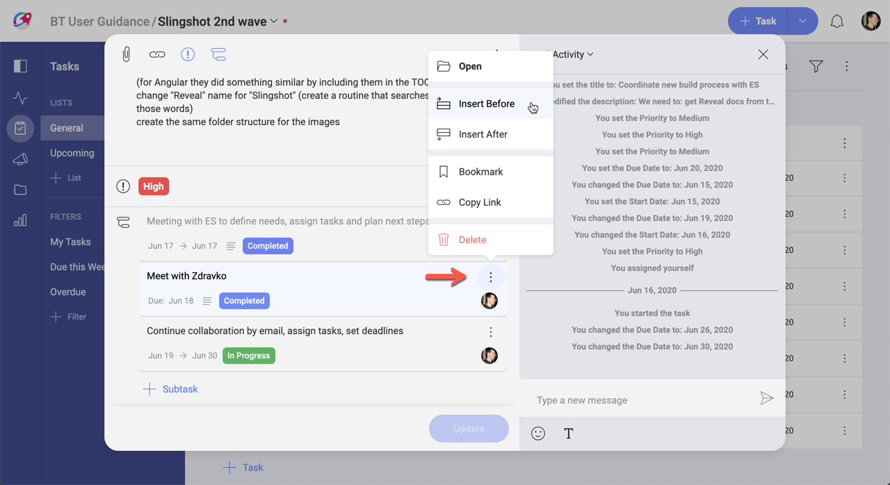

### How can I change Properties?

All the properties of a task, like status, title, assignees, or priority can be changed using different methods.

The **most reliable method** is to open a task by clicking/tapping its row (or through the overflow button and then _Open_).

A **faster method** is to just click/tap the property value you want to change, like shown below with the **Status** property.

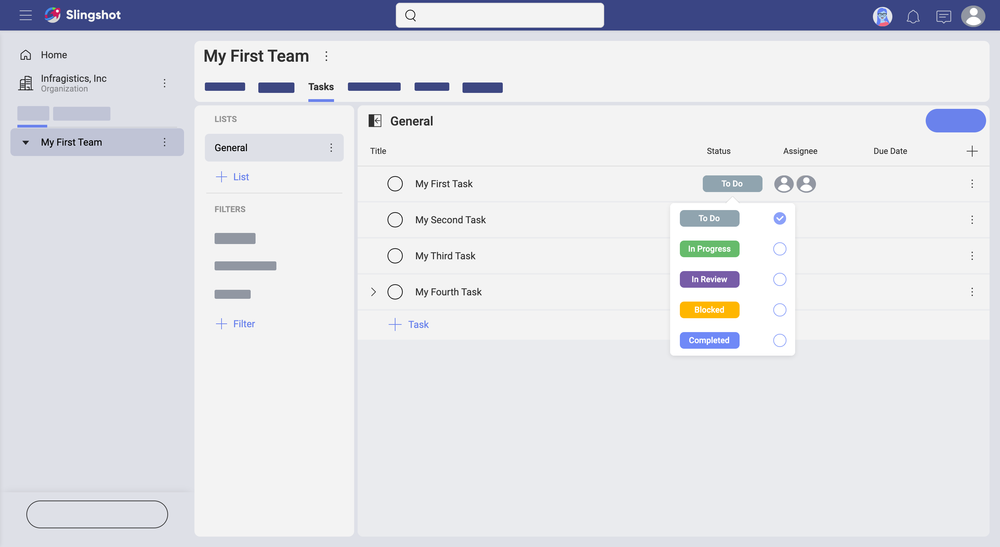

### How can I show/hide columns?
Tasks have many field properties that can be displayed in columns, however by default you can only see *Title*, *Assignee*, and *Due Date*.

To show/hide columns, just **click/tap over Fields** as shown below.

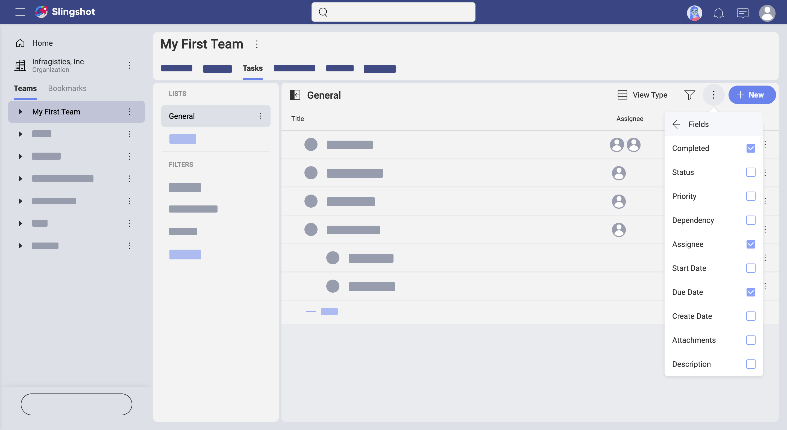

### How can I filter tasks?
Filtering allows you to choose a smaller amount of tasks, helping you find those tasks you currently need.

You can access the **Filters** editor on the very right of the screen as shown below.

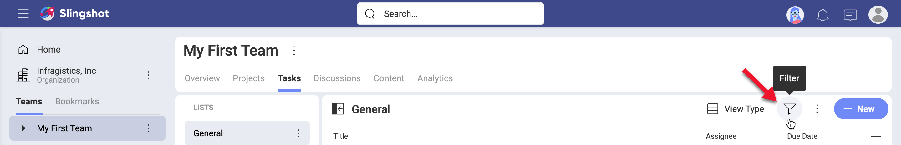

In the **Filters** editor you can create *Basic* or more *Advanced* rules. The *Basic* rules will be enough most of the time, *Advanced* is recommended in the case that you really need to define more complex conditions in your filter.

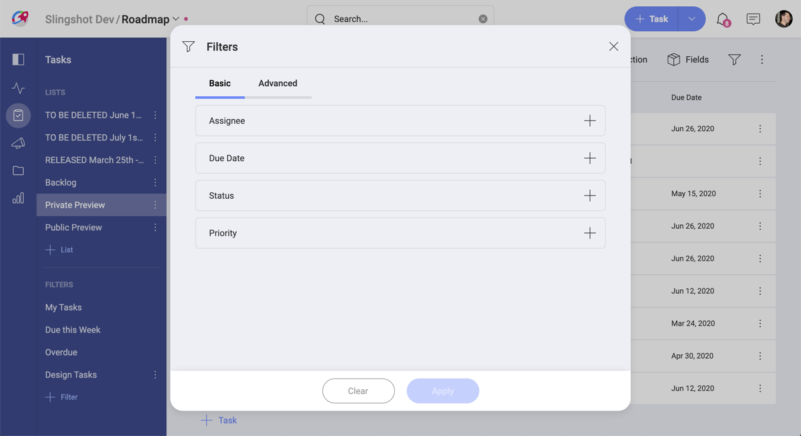

Sometimes you might want to save a filter and use it again in the future. This allows you to keep at hand a list of already filtered tasks that is relevant to you.

To create and save a filter use + Filter as shown below.

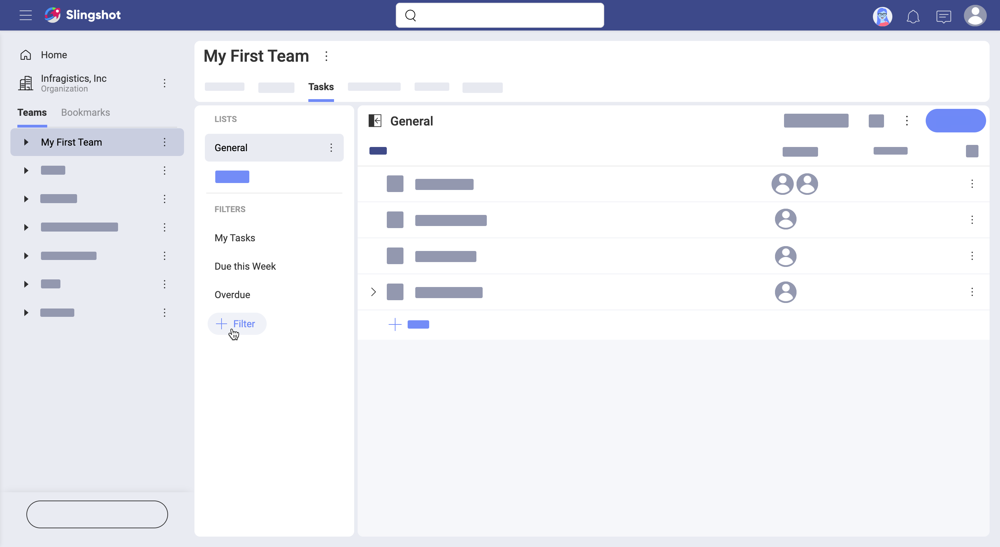

Slingshot has a few filters out-of-the-box: My Tasks, Due this Week, and Overdue. But at any time you can create new filters or edit existing ones that were previously saved.

In addition, you can save a filter you just created on the spot using **Save As Filter**, as shown below.

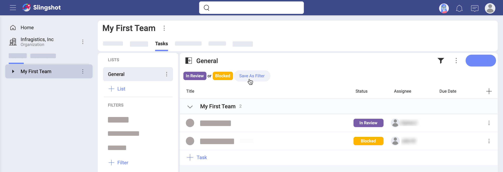

For those times that you can't find a specific task, try expanding collapsed panels, removing existing filters, and/or adding filters using the properties of the task you want. Remember that the icon changes to help you can identify when you have active filters or not.

### Switching between List, Kanban, and Timeline

You can choose between three different visualizations (list, kanban, timeline), depending on what you want to achieve.

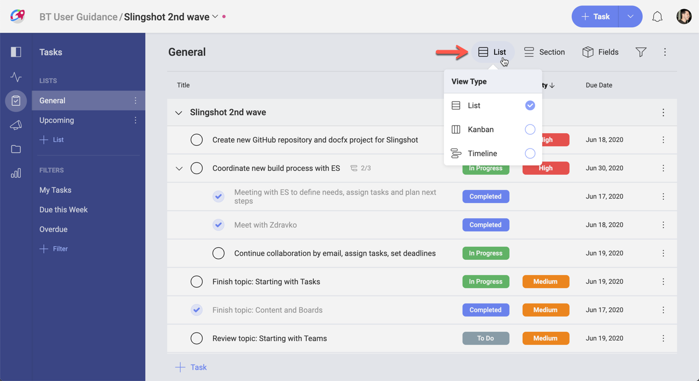

A straightforward **list** is often enough, but keep in mind that besides a flat list you can also use _group by_ options or filtering. _Group by_ options include ordering the list by section, priority, and other criteria.

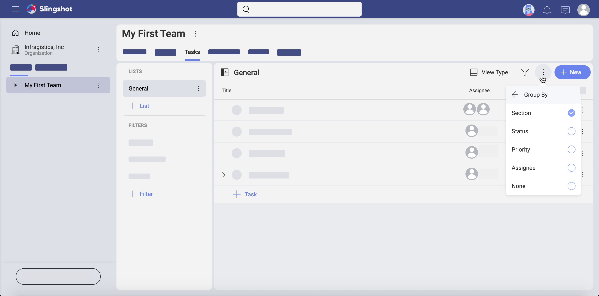

Kanban is a Japanese word, commonly known as a workflow management method designed to help visualize work and maximize efficiency.  
In Slingshot, the **kanban** visualization shows a visual representation of tasks in the form of cards. Each card contains information about the task, including its status, deadline, asignee, etc.  

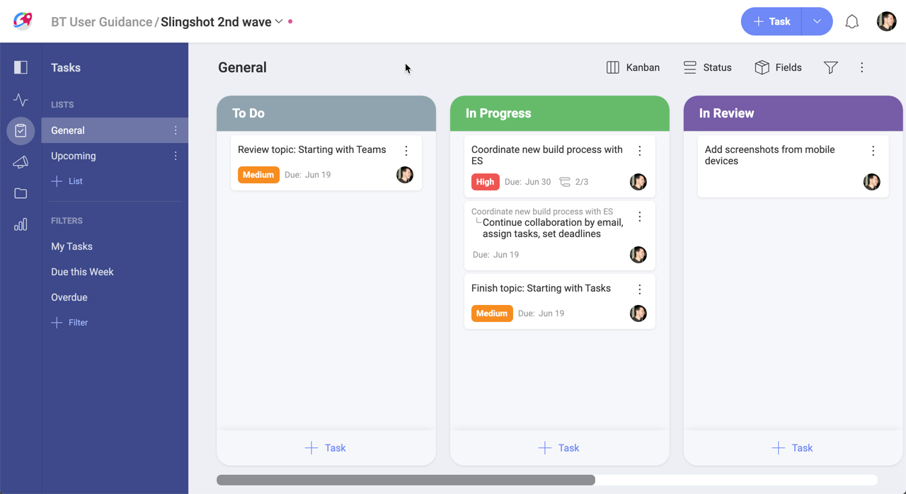

In addition, you have columns that represent different stages of the status workflow. You can use drag & drop to move the cards through the workflow by changing their status on the spot.

A timeline always show a list of events in chronological order. In Slingshot, you can see tasks over a set period of time.

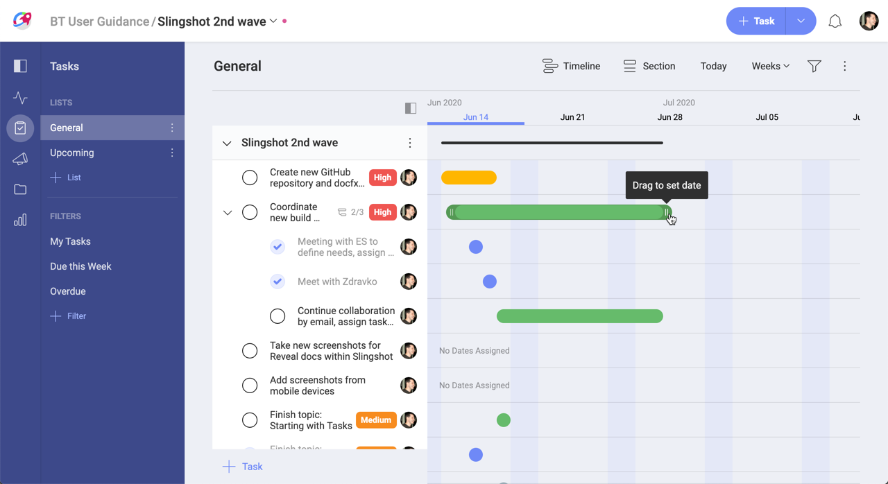

As shown above, you can pick a task and rearrange the start and due dates.  
In addition, you are able to change the scale (days, weeks, months) or even show/hide weekends.

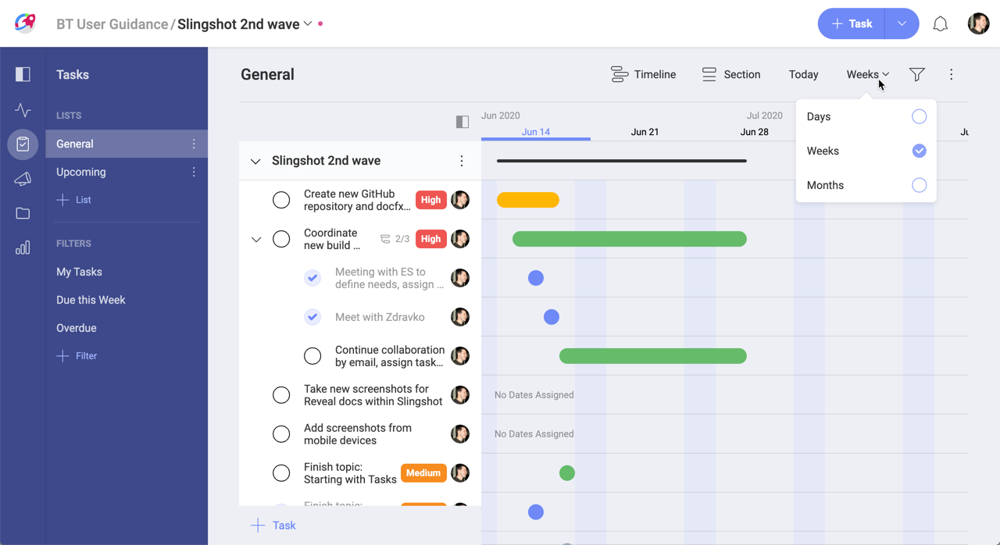

### Using Lists and Sections

In Slingshot, you can organize your tasks by using Lists and Sections.  

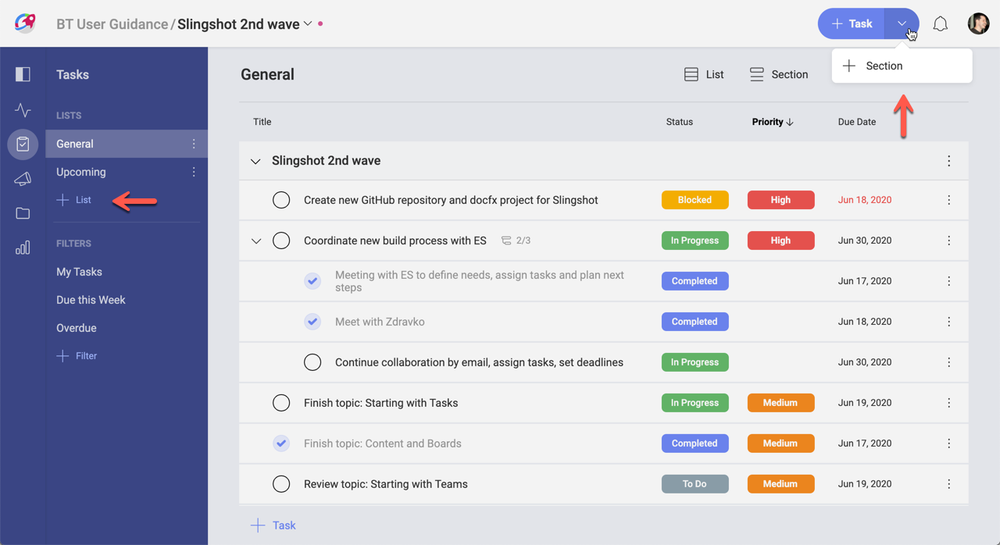

**Sections** are simply divisions of a list. A list can have one or more sections, and a natural way to organize your list of tasks is grouping by sections.

**Lists** help you organize your tasks and can be reorganized, copied, and moved around if needed.
This is very important as it makes it easy for you focus on your work, not planning ahead which lists or sections you need. All this changes can happen organically and were designed to boost productivity and avoid losing time.  

### Working with Attachments

The ability to add **attachments** ensures that Slingshot captures all the relevant information for your tasks and subtasks.

Each task can include one or more attachments, including images, documents, or links for specific tasks and subtasks.

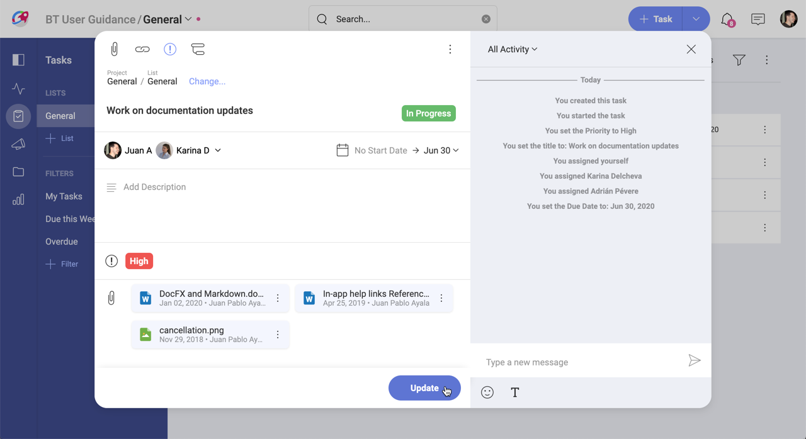

Files attached can be opened, downloaded, or detached (unpinned) from the task.

> [!NOTE]
> Attaching files to tasks is similar to pinning files to boards. You can link content from personal or team cloud storages, in both cases attachments are never stored in Slingshot.

To attach a file, open a task and **click/tap the clip icon** as show below.

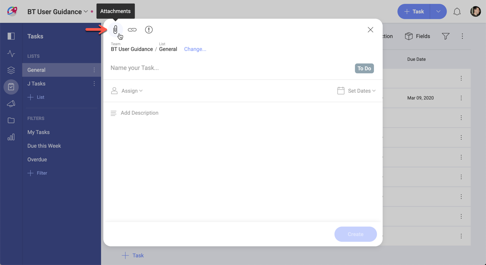

### How to create a task from a discussion

Slingshot discussions ensure all your communication and collaboration tools are in one place, making remote teams stay productive no matter where they are.  

Improve your productivity by creating tasks from your messages as shown below:

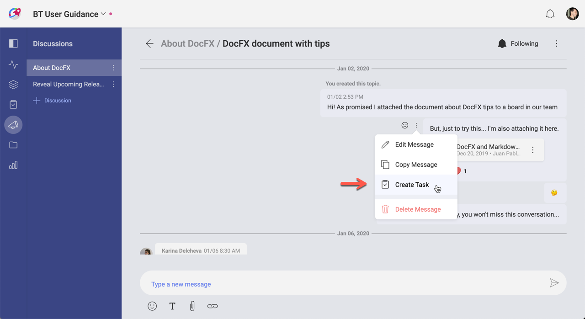
