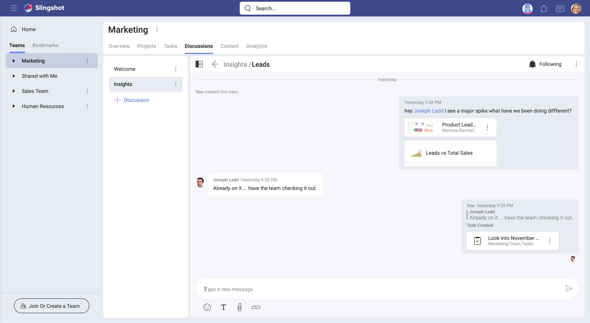
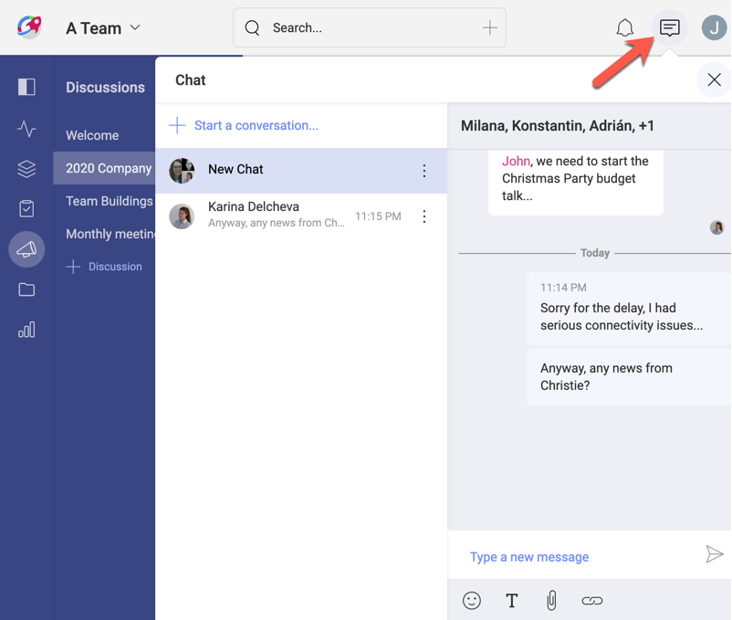
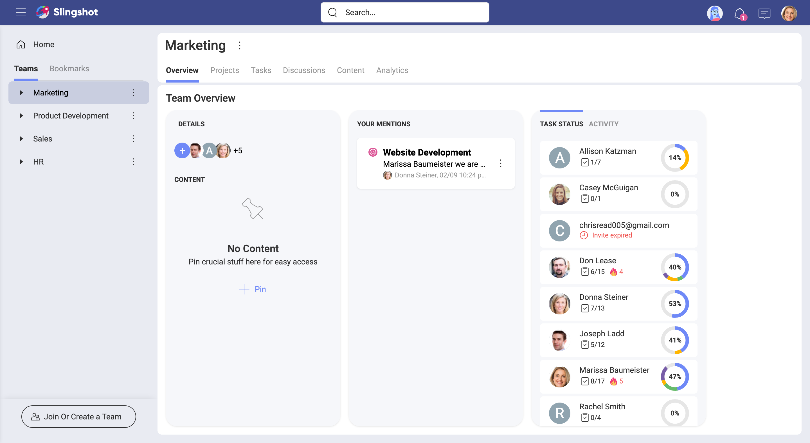

## Teams

A team can be defined as a group of people that collaborate and support each other, working together towards a common objective.

It can be said that it always comes down to having people who understand each other and work well together, true. But a combination of solid leadership, good communication, and access to the right resources can dramatically improve productivity and collaboration. And Slingshot can help in these areas.

### So, What's a Slingshot Team?

It's the virtual representation of a team, a group of people that is empowered to collaborate and support each other, working together as a team. Seems familiar, right?  
Also, the leader and team members are provided with tools to communicate, support each other, and access meaningful resources they might need for doing their work.

### Providing Tools to Your Team
Being part of a team means (or should mean) fluid communication. In Slingshot you can use different types of communication like team or project discussions, project issues, notifications, or even a general chat.

You can communicate live with the members of your team via **team discussions**, containing topics:

You can also communicate with any Slingshot user (or group of users) through the **general chat**.

Communication is not limited to writing. You can also attach files, use emojis, and react to messages.

To support each other, team members can get a sense of the team status at a glance. Using the **team overview** you get visibility over all the team members and their tasks, helping you proactively contact those in need. You can, for example, start a discussion to get a team member's attention. And they will receive a notification to alert them that they were mentioned.

Using shared team resources is required to collaborate, working towards a common objective. One of the best practices in Slingshot is to organize your content in **Boards**. Designed to manage your personal or team content, boards are just containers that point to cloud storages that hold your resources.

### Want to Know More About Teams?

Continue [here](teams-starting.md)!
