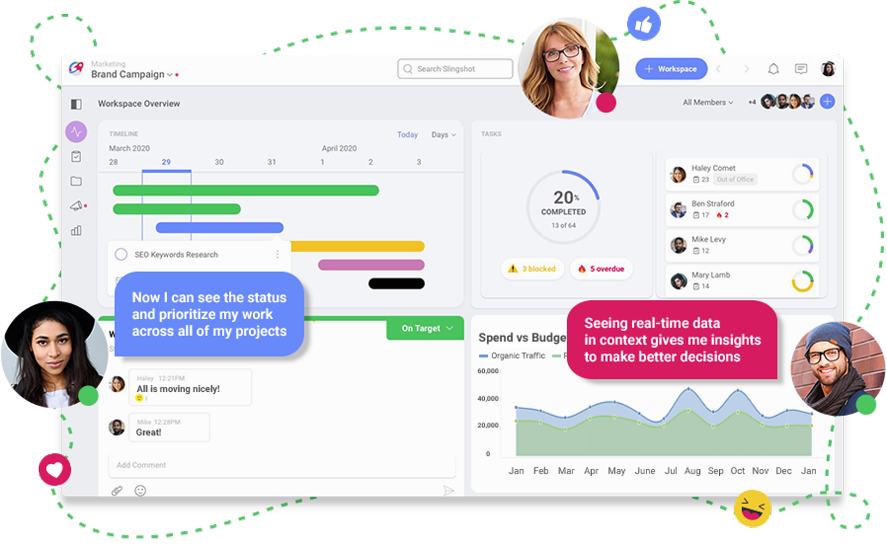
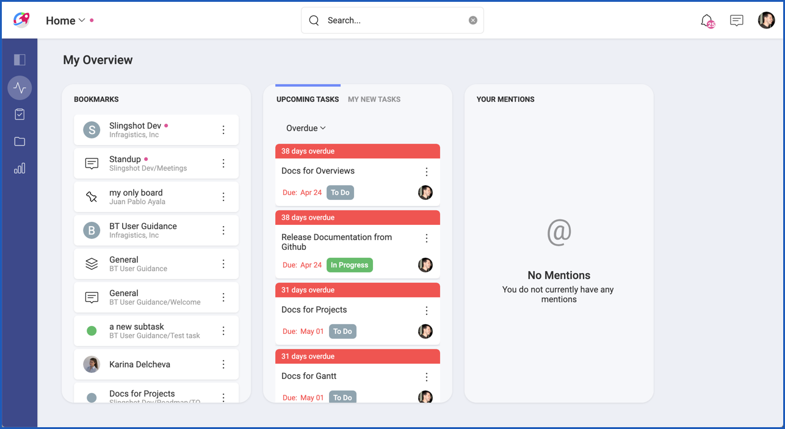
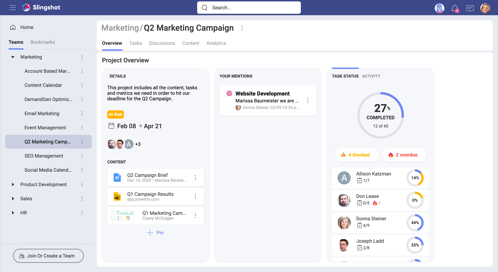
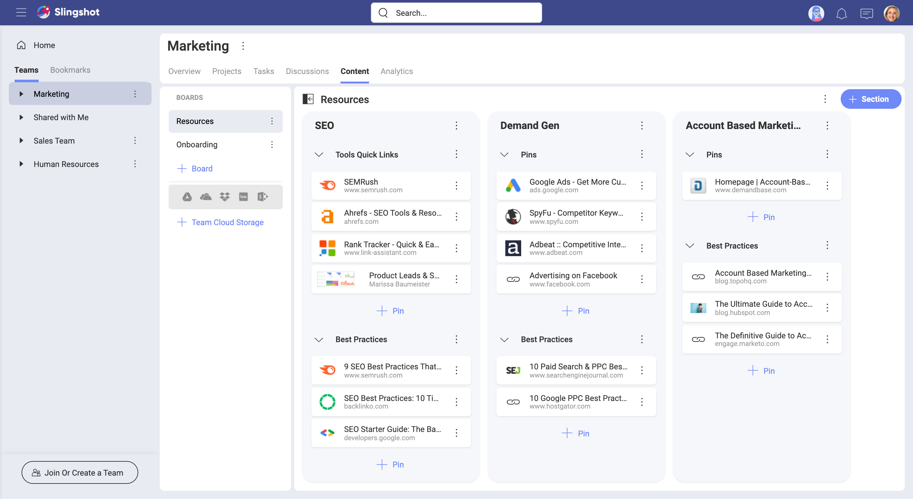
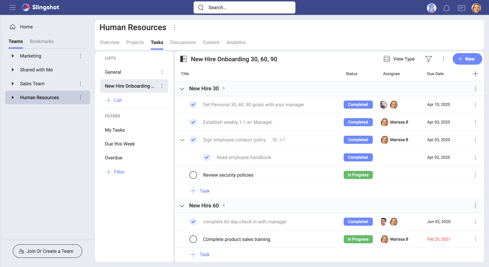
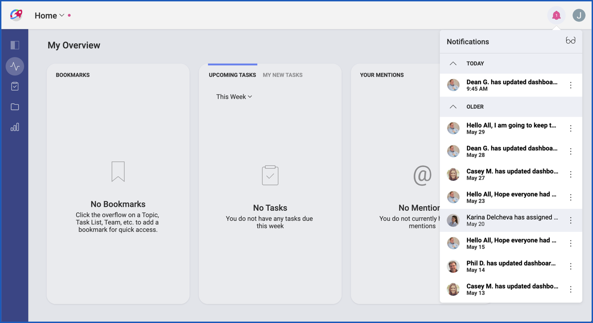
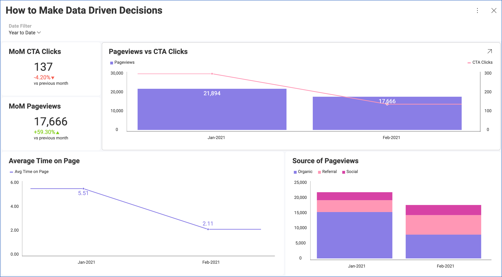
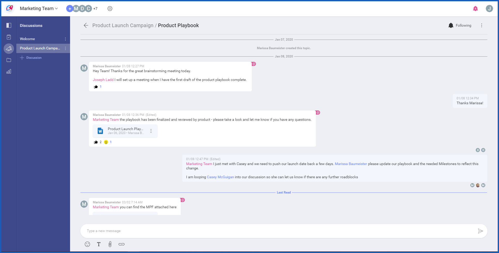
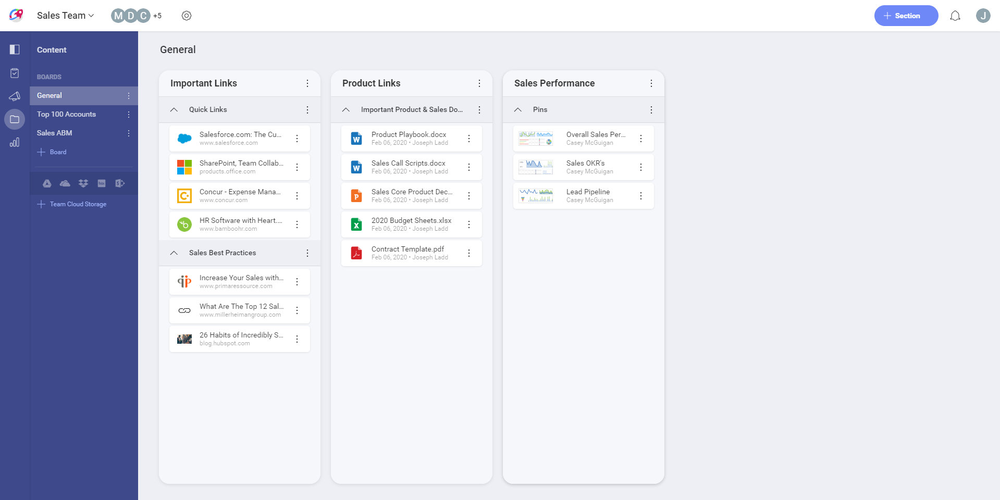

## Welcome to the Slingshot help!

Slingshot is all about effective team collaboration and delivering results on time. It helps you run productive teams across different platforms, while making sure your team is aligned and their back their decisions with real data.  
Enabling your team to work and collaborate in one place is a tremendous boost to visibility, accountability and trust. All well-known pillars that can be found in high performing teams.

So, how can Slingshot do all that for you? Take a look below...

### Slingshot Highlights

<h4 style="color:#2328B0;">Get quick access to your status and prioritize work across all projects</h4>

Above you can see that one place where you can visualize your work and organize yourself.  
All your tasks can be found here and also bookmarks, which are very useful to keep at hand links relevant to you.  
With bookmarks you can quickly navigate to your teams, projects, discussions, among others.

<h4 style="color:#2328B0;">Keep everyone in the know and make working with others easier</h4>

Encourage transparency and trust by making it easy for others to find information. Working together, with strong collaboration and support to each other is possible, even with external clients.

<h4 style="color:#2328B0;">Run higher performing Teams and successful Projects</h4>

Slingshot empowers your teams to achieve greater success by keeping everyone aligned, engaged and focused on their work. Your teams are provided with tools to communicate, support each other, and access those resources needed to do their work.

Projects are undertaken by people with expertise in many different areas, often from different teams and sometimes even from outside your organization. To ensure a high success rate, Slingshot makes sure all those people work together. They can collaborate and communicate with each other, and everyone gets good visibility over the project and all its resources.

<h4 style="color:#2328B0;">Get more work done with Tasks and leverage their functionality and flexibility</h4>

Use tasks to your advantage to create a healthy work environment that embraces transparency while driving individual accountability.
Tasks capture all the relevant information you need around a piece of work, including one or multiple assignees, subtasks, priority, start and due dates, and attachments. Plus you can change how you see tasks as needed by choosing between kanban, grid view, and timeline.

<h4 style="color:#2328B0;">Keep yourself informed with Notifications</h4>

Get updates on any changes to teams, tasks, projects, messages, and dashboards. Learn when a task was assigned to you, that you were removed from a team, or that someone sent a message in a discussion thread you're following. You can be notified in different ways like pop up messages while using the app (in-app notifications), messages on mobile devices (push notifications), and email notifications.

<h4 style="color:#2328B0;">Access real-time data in context and make better decisions</h4>

Turn your data into insights by creating and sharing data visualizations. Dashboards make easy for teams to get actionable insights by looking at shared data visualizations.  
You are able to connect to the most popular data sources like SharePoint Online, Google Drive, OneDrive, Microsoft Analysis Services, Microsoft SQL Server, CRM, and many more.  
Finally, dashboards are composed of one or more visualizations. And you can build your dashboards choosing between a huge array of visualizations, including grid, gauges (bullet graph, KPI, linear), and charts (category, financial, scatter, bubble, treemap). Category charts include column, bar, area, pie, stacked column, and many more.

<h4 style="color:#2328B0;">Real-time, organized communication with team and project members</h4>

Discussions can be used to chat among members of an Organization, Team, or Project. Organized in different threads, discussions ensure all your communication, and collaboration tools are in one place, making remote teams stay productive no matter where they are.
With Slingshot notifications, you can get informed when someone sent a message to you or in a discussion thread you're following.

<h4 style="color:#2328B0;">Connect to cloud storages and share content with colleagues or partners</h4>

Slingshot helps you focus on collaboration instead of managing content. You can access content from many cloud providers, using boards to organize that content and securely share it with others.  
Everyone'll always have the most up to date version of documents, eliminating the need to send documents back and forth.

### Coming Soon to Slingshot

<h4 style="color:#2328B0;">CHAT</h4>

Slingshot private chat will be soon available so everyone can communicate with one or several users at once. You'll be able to have multiple conversations going on at the same time, while mixing in text formatting, attachments, emojis, and links.

<h4 style="color:#2328B0;">SEARCH</h4>

This is one of those features that can boost productivity even more. We are already working on search and it's coming soon.

### Where can I get Slingshot?

Slingshot offers you a seamless, almost identical experience no matter what device you are on.
You can use a web browser or get native applications on iOS, Android, and desktop, making it easy for you to run productive teams across different devices and platforms.

[Go to Slingshot **Web**](https://my.slingshotapp.io/).

[Get Slingshot **native apps** (Android, iOS, desktop)](https://infragisticsinc297.sharepoint.com/Groups/ProdDev/EM/Releases/Pages/index.aspx).

Below you can find the versions supported for each platform:

| PLATFORM | SUPPORT |
| --- | --- |
|**Android**|Android 4.4 (KitKat) or higher (except the Kindle Fire).|
|**Desktop**|Any Windows with .NET Framework 4.6 installed. For more information on .NET Framework system requirements, check [this Microsoft article](https://docs.microsoft.com/en-us/dotnet/framework/get-started/system-requirements).|
|**IOS**|iOS 12 or higher.|
|**Web**|All major browsers on Mac and Windows (latest 2 releases). Web browsers are not supported in mobile devices.|
