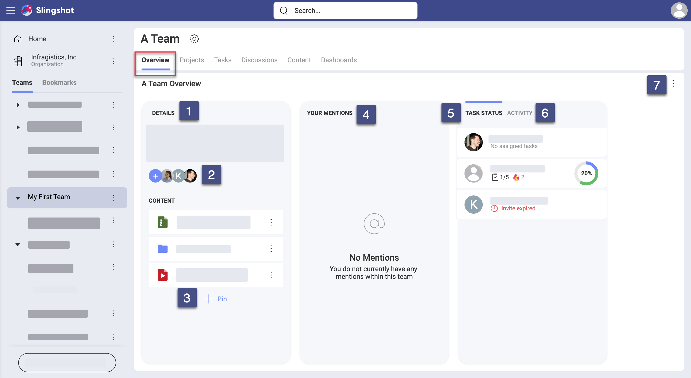

## Workspaces Overview

### How Can I Get Visibility Over a Team?

Every team has a place where the most important information is visible at first look. This is the **Team Overview**.  

After accessing a team, you will find its *Overview* tab on the left (see below).  

> Change the screenshot

You can find three widgets in every team's overview: **_Details_**, ***Your Mentions*** and ***Task Status*/*Activity***. Each of these widgets includes important information and resources for your team. 

Let's look at the widgets and their elements more closely. 

1. *(Optional)* **Description** of the team - here you can see the team's description. You can change the description by selecting the *gear icon* on top, next to your team's name.
2. **Team members** - click on the profile images under the team's description to view and [manage members](#how-can-i-manage-team-members).
3. **Content** - click the overflow menu to pin content, web links and dashboards that are essential for your team's work. To do this, select **+ Pin** at the bottom. Use the team's *Content* tab on top to store and organize more content.

    >[!NOTE] If you pin a file (or folder) in the team *Overview* and your teammates don't have this file (folder) in their personal or shared cloud storage, they will not be able to access it. In this case, select the *Content* tab on top and pin the file (folder). This way you will share it with your teammates and they will be able to access it both from *Content* and *Overview*.

4. **Mentions** - when other team members mention you, a team, or a project of yours (by using the _@ sign_) in a *Topic* in the *Teams' Discussions* or in the _Activity_ chat (see in *number 6* below), you will see a notification on this board. Upon clicking on it, you will be navigated to where the message is located.
5. **Task Status** - here you will find a list of all members. Under each name, you will see the number of all current tasks for each user with the number of tasks done. Also, you may see a *fire icon* with a number next to it, which shows how many tasks are overdue. The circle on the right uses colors to show what part of all tasks  is complete (blue), not started (grey), in progress (green), in review (purple), blocked (yellow).
6. **Activity** - here you will find a log of all recent activity in your team - changes in settings, team members, tasks, etc.
7. **Overflow** menu - use this menu to add your team's overview to *Bookmarks* or copy a link to it to your clipboard.