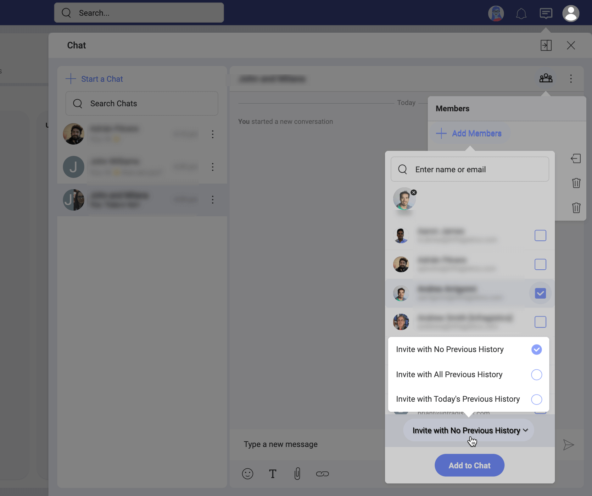
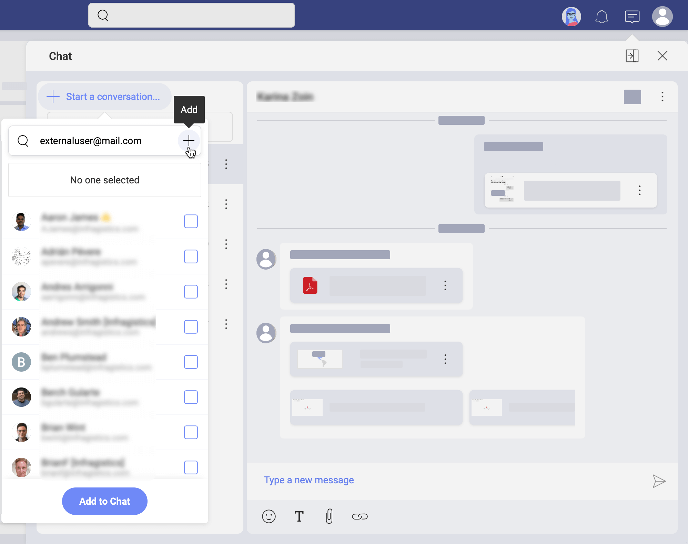

## Starting with Private Chat

After learning about the variety of tools Slingshot provides to ensure great [communication](tasks.md) experience, you are ready to explore how to use them for effective collaboration.  

Read on to get answers to most of your questions about the chat.

### Discussions vs Private Chat

In Slingshot, communication happens in discussions and private chats. To participate and start discussions and private chats you need to know more about [writing, reading and managing messages](communication.html#write-read-manage-messages). 

Each workspace has its own *Discussions* tab. To learn more about discussions, read [Starting with Discussions](discussions-starting.md). 

Unlike discussions, the private chat is workspace independent. This means you can chat with any user from any team or project. You can even [chat with external users](#chat-external-users). However, because they are *private*, your chats can be accessed only by you and the users you are chatting with. 

### How Can I Access My Chat?

In the top bar, right next to your profile picture, you will see the **chat message icon**. Click/tap the icon to open the chat screen. 

### How Can I Keep the Chat Always Visible?

In Slingshot, you can keep your chat hidden or opened on the right while going through your tasks, for example. 
To switch from hidden to always opened and vice versa, select the *dock/undock* icon next to *Close* (see screenshot below).

When the chat is *docked*, you will always see it on the right. In this mode, you can see either the last chat room opened or the list of ongoing chats. 

### How Can I Start a Private Chat?

To start a chat, open the chat screen. Then follow the steps below:

1. Click/tap the **+ Start a conversation...** blue button. 

    

2. Select a user from the list or type a name or email in the *search* box on top.
3. Click/tap **Add to Chat**. 

>[!NOTE] If you don't see the *Start a chat...* button, check whether your chat is [docked](#chat-dock). In this case, select the **undock** icon next to *Close*.

### How Can I Start a Group Chat?

Starting a group chat is similar to [starting a private chat](#private-chat-start). The only difference is that you choose two or more people to create the group chat. 

You can add more users to any ongoing chat (private or group) by opening it and selecting the *+ member* icon on top right (as shown below). 

>[!NOTE] If you create a new group chat by adding more people to a private chat, don't worry! The group chat will be opened in another chat room. Your private chat will be kept separately as well.
### Can I Rename a Chat?

You can rename your group chats to better differentiate between group chats with (almost) the same users. You will find the *rename* option in the *overflow* menu of a group chat (see below).

### How to Manage Members in a Group Chat? 

You can manage the members of a group chat by selecting the *group* icon on top of your chat room. 

You will see the chat members in a dropdown. Use the *trash* icon next to their names if you want to remove somebody. Every participant in a group chat can remove other members from the chat. Removed members will continue seeing the history of the chat but they will not have access to new messages. 

Next to your name you will find the *leave* icon. You can leave a chat anytime. 

### Can I Make the History of a Group Chat Available for New Members?

When you are adding members to an ongoing group chat, you may want them to have access to part or the whole history of the chat. 

When adding members, you will notice a **History** setting at the bottom of the users list (see the screenshot below). 

The following 3 options appear in the dropdown when collapsed: 

- *Invite with No Previous History*
- *Invite with All Previous History*
- *Invite with Today's History*

*Invite with No Previous History* is the default history setting for new chat participants. You can use the other two history options to welcome new chat members and quickly introduce them to the topic!

When finished, select the **Add to Chat** blue button. 

### How to Start a Chat with External Users?

All Slingshot users can take part in private and group chats, including the external users. 
However, external users are not part of your Organization. That's why after selecting **+ Start a conversation...** you will not see their names in the list of users. You can chat with them only if you add their emails manually in the search box as shown below.

### Leaving vs Muting a Chat

Once you lose interest, you can leave or mute a chat in Slingshot.  

**Leaving** a chat is an option for group chats only. Each member can leave a group chat when they decide they no longer need to participate in the conversation. The members, who left, cannot receive new messages anymore, but they still have access to the chat history. To leave a group chat, click/tap it to **open** > **Members icon on top** > **leave icon** next to your name.

Normally, the chat icon on top shows the total number of unread chat messages. When you **mute** a private or group chat, its new messages are no longer added to that count. This is the option for you if you do not want to follow the conversation anymore, but you still want to have access to it. 
To mute a chat, click on its **overflow menu** > **Mute Notifications**. 

### How Can I Share a File in the Chat?

In the Slingshot chat, you can share files from your device, cloud storage, or even from a team or project where these files are pinned.  

Select the paperclip icon to attach the file to your message. 
  
>[!NOTE] **Slingshot does not store your files.** When you share a file from your device, it will first be uploaded to your personal cloud storage (*OneDrive*, for example) and not to Slingshot directly. Then, to share it with others, Slingshot will just link to its location in your cloud storage.

#### File Permissions

File permissions are meant to give the file owner control over who can access their files. If you are the owner of the file you share in the chat, Slingshot will ask you what type of permissions you want to set. 
