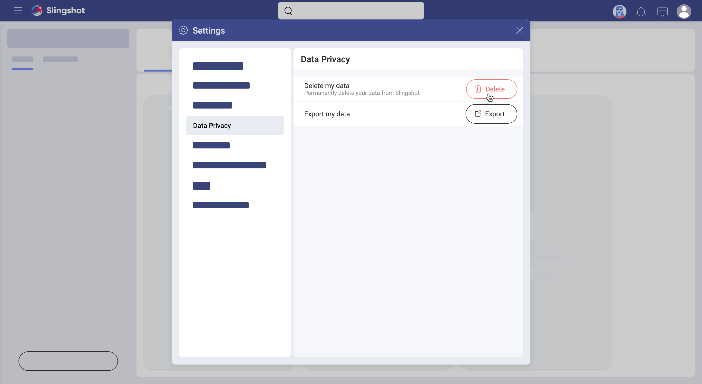

## Deleting Profile Data from Slingshot

To meet global data privacy laws, including the General Data Protection Regulation (GDPR) Slingshot gives the users the ability to have all their profile information deleted. Below, you will find who can delete profile data and how, what information will be deleted and what will be kept. 

### What is Profile Information? 

In collaboration software like Slingshot, what you do, affects the people you work with. If, for example, you start a discussion in a team, this information will be stored in Slingshot to help others. Everyone in the team can benefit from the information in the discussion and will see that you are its initiator. 

The following is considered your profile information by Slingshot and will disappear from the app as a result of the deletion: 

- your name and email address;
- your title, industry, and department if provided (see more in the [Completing Your Profile Information](profile-information.md) topic);
- all content created by you or shared with you in *My Stuff*;
- all task assignments - tasks you were assigned in a team or a project will become unassigned, but will not disappear; 
- access to pinned files and dashboards will be denied - users in Slingshot will not be able to open files and dashboards that deleted users have shared.

Deletion is permanent - once deleted, your information cannot be recovered in Slingshot. 

### What Information Will Not Be Deleted?

While collaborating with others in Slingshot, you create content that is important for your shared projects and is not part of your profile data. The information below is not considered profile data and will stay in Slingshot even after your profile is deleted. 

- Teams, projects, tasks or *Analytics* content created by you in teams and projects.
- The text of your messages in discussions or private/group chats;
- The content of any @mentions directed at you. 

>[!NOTE] When your profile data is deleted, your name will be displayed as *@deactivateduser* in all messages in discussions, private/group chats and @mentions. *@deactivateduser* will replace your name in all members lists of teams you didn't leave before your profile was deleted. 

### Who Can Delete Profile Data?

Technically speaking, the Slingshot team is the one having rights to delete profile data from Slingshot. But they do this at the request of users, of course. 

Then, who can request profile data deletion directly from the Slingshot team? The answer is:

- a user with a [personal account](roles-permissions.html#personal-account-users) in Slingshot, or 
- an Organization owner. 

What if you are a member of an Organization? Then the information in your profile is considered ownership of the Organization. In case you want to have your data deleted, you have to contact an administrator of personal data in your organization and request the deletion from them.

### How to Delete Profile Data?

Below you will find two possible scenarios. The deletion procedure steps depend on your relation to an Organization in Slingshot.

#### For Organization Owners 

If you are a user with an [Owner](roles-permissions.html#teams-projects-roles) role in your Organization team and you need to delete one or more users' profile data, then read the steps below to learn how to proceed. 

1. Contact our team at **support@slingshot.io**
2. Note you want to delete an Organization member's profile information.
3. You may be asked to provide more details about yourself. 
4. The Slingshot team will verify your right to request deletion first. Only then the deletion will start. When profile data is finally deleted, the user's name will be displayed as *@deactivateduser* wherever their content has not disappeared (see [above](#data-not-deleted)).  

#### For Users with Personal Accounts

If you have a [personal account](roles-permissions.html#personal-account-users) in Slingshot, this also means you do not belong to an Organization in Slingshot. However, you can still be part of Organization's teams and projects if invited. In this sense, your profile information does not belong to any organization and you can request data deletion from the Slingshot team directly. To do this:  

Select your profile image > *Settings* > *Data Privacy* > *Delete my Data* (as shown in the screenshot below).

If you are the sole owner of any team in Slingshot, you will be asked to assign new owners to this team before your profile is deleted. 

The deletion process may take up to 24 hours. You will not be able to log into your Slingshot profile again until deletion is finished.

>[!NOTE] If you have been invited to be a member of an Organization related team in Slingshot, you will not lose the right to delete your profile data. However, Organization related data will not be deleted together with your profile information as it is owned by the Organization.

### Can I Reactivate My Profile after It Was Deleted?

If you have a [personal account](roles-permissions.html#personal-account-users) in Slingshot, you can reactivate your profile by simply logging in again after the deletion process is completed. However, the information that was deleted from your profile cannot be recovered. Your history will not be available as well. 

If you are an Organization member, you cannot reactivate your own Slingshot profile. You need to contact the people responsible for managing Slingshot at your organization. Note that, once you return to Slingshot, you will start with clear history. 