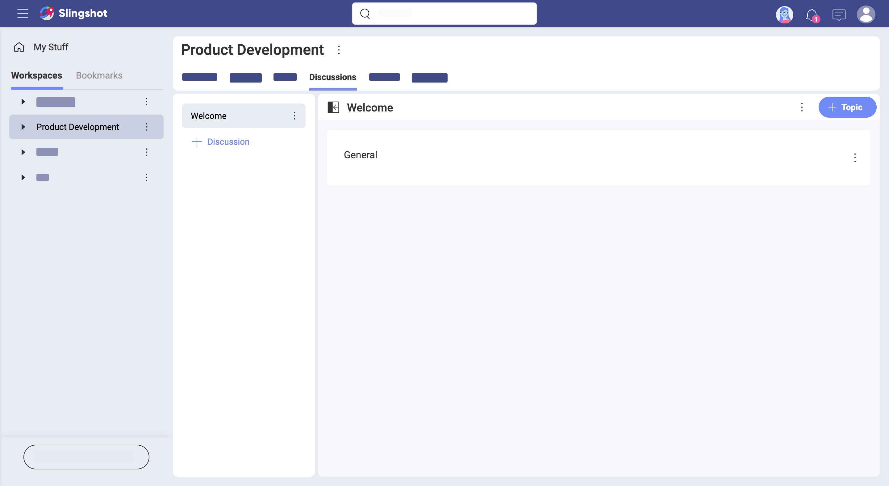
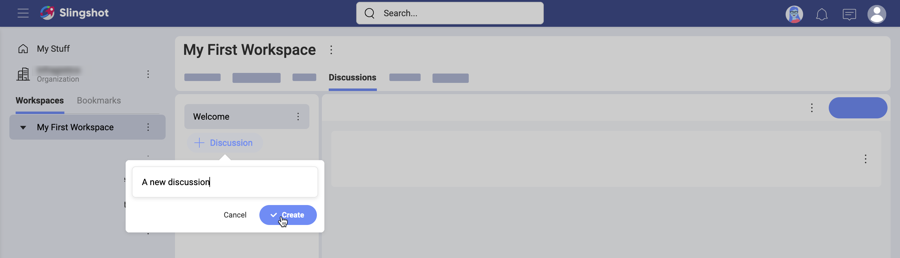
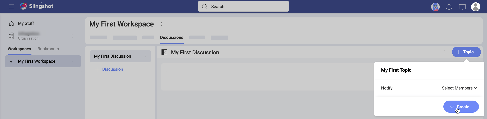
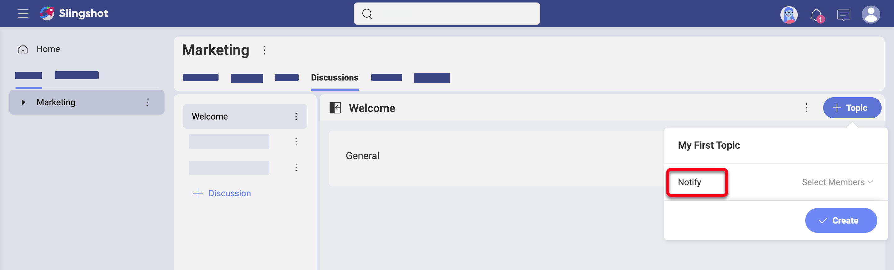
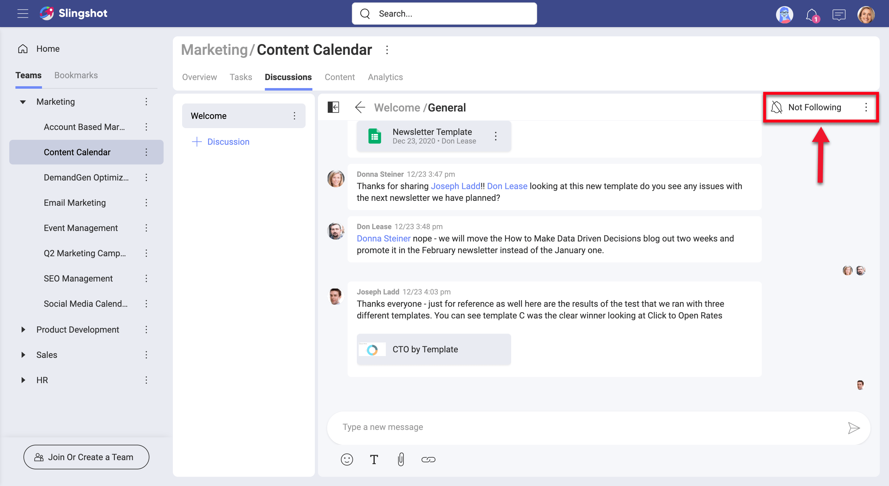
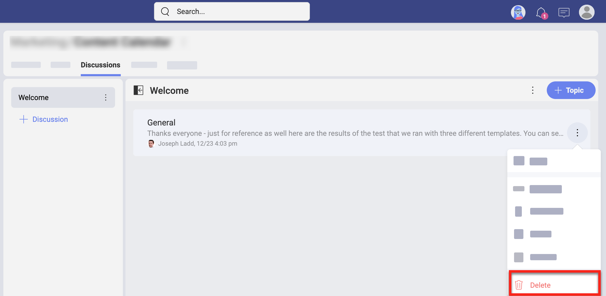

## Learn more about Discussions

Welcome! Read on to get answers to your questions about discussions.

### Discussions vs Private Chat

In Slingshot, communication happens in discussions and private chats. To participate and start discussions and private chats you need to know more about [writing, reading and managing messages](communication.html#write-read-manage-messages). 

Each workspace has its own dedicated *Discussions* tab. Discussions are organized in topics. Discussions are workspace specific. Because of this, you will not be able to see and take part in all discussions in Slingshot. Read more about [who can access discussions](discussions-starting.html#discussions-access) by following the link.

Unlike discussions, private chat is workspace independent. See more about the chat in [Starting with Private Chat](chat-starting.md)

### How Can I Access My Discussions?

To access your discussions, go to a workspace and select the **Discussions** navigation tab on top (see the screenshot below).

You can bookmark a discussion, topic, or even a message in a topic to keep it at hand. They will appear in your bookmarks list and in your personal overview.
Follow the link for further details about [overviews](overviews.md).

### Who Can Access Discussions?

Depending on where you stand, you will find different discussions. To guarantee the privacy of teams and projects, Slingshot does not allow you to access all discussions. So read on to find out who can access what! 

Within a *Team*, you can have discussions about everything concerning your team and teammates. Only team members can access team discussions.

Within a *Project*, you can have discussions that are specific for this project. Every collaborator in the project, incl. personal account users, can join these discussions. Projects live inside teams. The members of these teams also have access to project discussions. 

Within the *Organization* team, you will find *Discussions* too. Organization discussions cannot be accessed by [personal account users](roles-permissions.html#personal-account-users). This is the perfect place for announcements and other important organization related discussions. 

### How Can I Discover and Join Discussions?

Use the _Discussions_ tab in the workspaces to discover interesting discussions.

A discussion is basically a section dedicated to a specific subject and organized by a limitless list of topics. Topics are where conversations happen. After selecting a discussion, you will find all its topics on the right.   

So, technically speaking, you can't **join** discussions. But you can reply to a topic inside a discussion. Or create a new topic. 

>[!NOTE] Only Owners and Members of the workspace can reply to a topic and create a new one. Viewers can only read topics. 
### How Can I Create a New Discussion?

Every Owner or Member of a workspace can create a new discussion. The same goes for the discussions inside the *Organization* team. 

In general, discussions are *read only* for workspace viewers. However, as you know workspace can include sub-workspaces. Then, what happens if your role in the parent workspace is a viewer and in the sub-workspace - a member? You can create discussions inside the sub-workspace and only read the discussions in the parent workspace. 

>[!NOTE] Always take into consideration your role only in the workspace where you want to create a discussion or answer a topic. 

To **create a discussion**: 

1. Go to the **Discussions tab**. 
2. Select **+ Discussion** (see screenshot below). 
3. Write a meaningful name for the discussion in the text box.
4. Choose **Create**.

    

Your discussion will be added at the bottom of the discussions list.   

### How Can I Create a New Topic? 

To **create a topic**: 

1. Select a discussion.  
2. Click/tap the **+ Topic** button on the top right. 
3. Name the topic. Optionally, choose which members to be notified for its creation by adding their emails in *Notify*.   
4. Choose **Create**.
    > replace screenshot
    

Now your topic is created. You can start typing your first message to give more details on the subject. It will also serve as a conversation starter.

### How Can I Make Sure Someone is Notified of New Answers?

There are subjects where you need the attention of particular people. To make sure they receive notifications for each new message in a topic, you can use the *Notify* option upon creating a new topic. 

> replace screenshot

>[!NOTE] **Notifying limitations.** You can only notify users who are part of the workspace. 

If you have missed the opportunity to use the *Notify* function when creating the topic, you can later use the **@mention** (use the *@ sign* and start typing the username) in a message. The mentioned users or teams will be notified about your message, but will not receive any further notifications for new messages unless they opt to *follow* the topic.

### How Can I Make Sure I Am Notified of New Answers? 

When you want to make sure *you* are notified of new messages, you need to navigate to a topic, open it and change the button on top to *Following*. You will start receiving notifications in the *Notification* center.

>[!NOTE] **Auto following.** Each time you answer a topic, you will start automatically following it. This means you will receive notifications for all new answers until you explicitly unfollow the topic. 

### Deleting vs Unfollowing a Topic

Not all topics would be interesting to you or need your participation. To prevent your Slingshot discussions become overwhelming, you can unfollow or delete topics. 

When you no longer care for a topic, you can **unfollow** it. You will stop receiving notifications for new answers in this topic in the *Notifications* center. This will make it easier for you to focus on more important stuff. Just select the bell on top to switch to *Not Following*. 

When a topic is no longer relevant to a discussion, you can **delete** it. Be careful, because deleting a topic will make it disappear for all users. If it still contains valuable information, think twice before deleting it.

To delete a topic, navigate to it and select *Delete* in its overflow menu (as shown below). 

### Rearranging Discussions

Whenever you create a discussion it will be added at the end of the discussions list. There will be times when you won't be satisfied by the chronological order, for example when you accumulate a long list of discussions. Don't worry about this, because there is an easy and quick way to rearrange discussions. Just drag them up and down the list!

