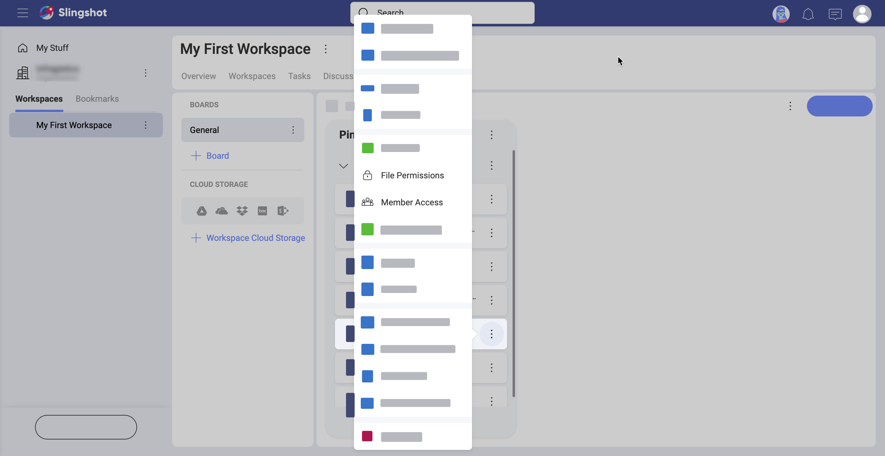
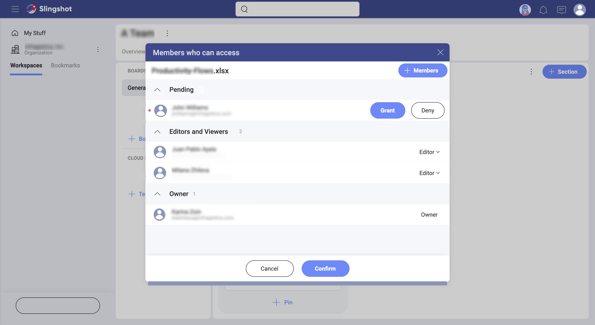

## Learn More about File Permissions

Welcome! Read on to get answers to your questions about content and boards.

### How is file security granted in Slingshot?

When [pinning files](content-boards.html#working-with-your-content-in-slingshot) to a content board to share them with others, you may be concerned with different aspects of security. Will sensitive business information be seen by someone inappropriate? Can other users delete your file? Who can edit it?

Slingshot grants you file security by giving you the ability to determine who can access your file by setting your file permissions. 

>[!NOTE] Other users **cannot delete** a file you pinned to a board. Boards are only containers that keep connections to a cloud provider where your file is located. Owners and members of the workspace, however, can delete the connection by *unpinning* the file.
### How can I set file permissions?

When you share files inside workspaces, you make these files available for the users inside the workspace. 

File permissions are meant to give the file owner control over who can access their files. Giving access through Slingshot means other users can: 

- open, 
- and edit the file.

Each time you pin a file, Slingshot will open the *File Permissions* dialog and ask you what type of permissions you prefer (see below).

Here, you can choose between the following three permission types:

 - **All Can Access** 
 - **Only Members Can Access** 
 - **Owner Gives Access** 

### What do different file permissions mean? 

**Owner Gives Access** is the default and most restrictive. It means anyone who tries to open the file for the first time has to request access from the file owner. The file owner will receive an email, prompting them to *grant* or *deny* access. By granting access the owner of the file gives permissions to the user to open and edit the file. 

The file owner can also pre-allow access for chosen workspace's members by using the **Manage Access** option in the *File Permissions* dialog. 

**Only Members Can Access** is great when you want all your workspace collaborators to have quick access to your file. If you choose *Only Members Can Access*, all workspace members will be to open and edit the file without asking the owner explicitly for access.  

> [!NOTE] You can change the default file permission type by selecting the *Remember my choice* checkbox. 

**All Can Access** is the least restrictive option. Anyone can open and edit your file. Even users who are not members of the workspace will be able to access it if they have a link to where it is located. However, you can always switch to a more restrictive type of permissions. In this case, the link to the file will not be valid anymore for any user outside of the workspace.

> [!NOTE]
> Users who want to access a file uploaded to a cloud file provider need not only permissions in Slingshot but also a valid account with that cloud provider. For example, when you try to open a file from *OneDrive* shared by another user, you will be asked to log into your *OneDrive* account. If you don't have an account with *OneDrive*, Slingshot will deny access. This **does not apply** when the file has public permissions, and you open it in a browser. 

Find out how file permissions apply when sharing a file in the chat by reading [How Can I Share a File in the Chat?](chat-starting.md). 

### Can I restrict who has rights to edit my file?
### How can I manage file permissions?

Owners can always view and edit the permissions to their files. They can also manage the members that already have access.  

To view/edit the permissions on a file, go to its overflow menu and select **File Permissions** (see below). 

To view/edit who can access the file, click/tap **Member Access**. In the dialog that is displayed (see below), you can see all members who can view and edit the file as well as the pending requests for access.

Use the **+ Members** blue button to pre-allow access for chosen users who can view and edit the file without  asking you explicitly.

>[!NOTE]
> You cannot pre-allow access to files for users who are not part of the workspace. 

On the right of each member's name, you can click/tap **Editor** > **Remove** to revoke access. 

>[!NOTE] **Access  cannot be automatically revoked.** If you change a file's permissions from *Only Members Can Access* to *Owner Gives Access* make sure you check for *Editors* in **Member Access** and revoke their permissions if necessary. Users who have already opened the file even once, are remembered as *Editors* and their access will not be automatically revoked with changing the file permissions to the more restrictive type. 

### How do file permissions work in the discussions and the chat? 