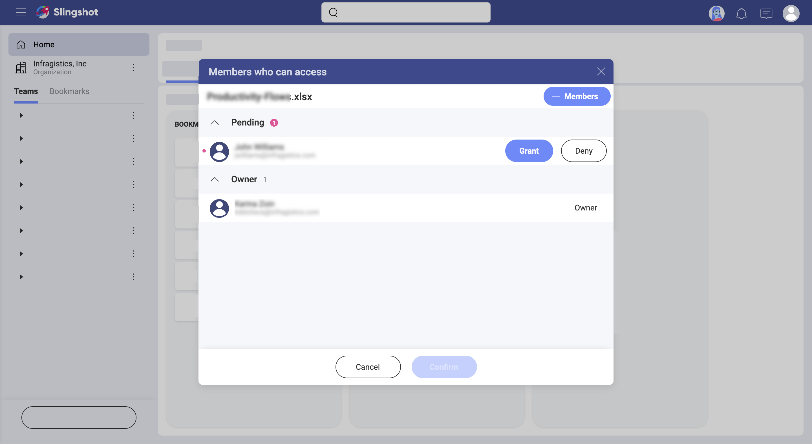

## Learn More about Files Security

Welcome! Read on to get answers to your questions about content and boards.

### How is file security granted in Slingshot?

### How to set file permissions?

When you share files inside workspaces, you make these files available for the users inside the workspace. 

File permissions are meant to give the file owner control over who can access their files. Each time you pin a file, Slingshot will ask you what type of permission you want to set. You will see a dialog that looks like this: 

Here, you can choose between the following three permission types:

 - **All Can Access** 
 - **Only Members Can Access** 
 - **Owner Gives Access** 

### 
**Owner Gives Access** is the default and most restrictive permissions type. Anyone who tries to open the file for the first time has to request access from the file owner. The file owner will receive an email, prompting them to *grant* or *deny* access. Alternatively, the owner can open the _Member Access_ dialog from the file's overflow menu. When there are pending requests, it will look like this:

The file owner can also pre-allow access for chosen workspace's members by using the **Manage Access** option when selecting the file permissions type. 

> [!NOTE] You can change the default file permission type by selecting the *Remember my choice* checkbox. 

**Only Members Can Access** is great when you want all your workspace collaborators to have quick access to your file. If you choose *Only Members Can Access*, Slingshot will automatically grant access to the file providers of the other workspace members. That means all workspace members can open and edit the file without asking the owner explicitly for access.  

**All Can Access** is the least restrictive type of permissions. Anyone with a link to the file can access it. That means any user can open the document, if they have the link to it. As an owner of the file, you can't control who opens your file unless you change to a more restrictive type of permissions. In this case, the link to the file will not be valid anymore for any user outside of the workspace.  

> [!NOTE]
> Users who want to access a file uploaded to a cloud file provider need not only permissions in Slingshot but also a valid account with that cloud provider. For example, when you try to open a file from *OneDrive* shared by another user, you will be asked to log into your *OneDrive* account. If you don't have an account with *OneDrive*, Slingshot will deny access. This **does not apply** when the file has public permissions, and you open it in a browser. 

Find out how file permissions apply when sharing a file in the chat by reading [How Can I Share a File in the Chat?](chat-starting.md). 

### How to manage file permissions?

Owners can always view and edit the permissions to their files. They can also manage the members that already have access.  

To view/edit the permissions on a file, go to its overflow menu and select **File Permissions** (see below). 

To view/edit who can access the file, click/tap **Member Access**. In the dialog that is displayed (see below), you can see all members who can view and edit the file as well as the pending requests for access.

Use the **+ Members** blue button to pre-allow access for chosen users who can view and edit the file without  asking you explicitly.

>[!NOTE]
> You cannot pre-allow access to files for users who are not part of the workspace. 

On the right of each member's name, you can click/tap **Editor** > **Remove** to revoke access. 

>[!NOTE] **Access  cannot be automatically revoked.** If you change a file's permissions from *Only Members Can Access* to *Owner Gives Access* make sure you check for *Editors* in **Member Access** and revoke their permissions if necessary. Users who have already opened the file even once, are remembered as *Editors* and their access will not be automatically revoked with changing the file permissions to the more restrictive type. 
