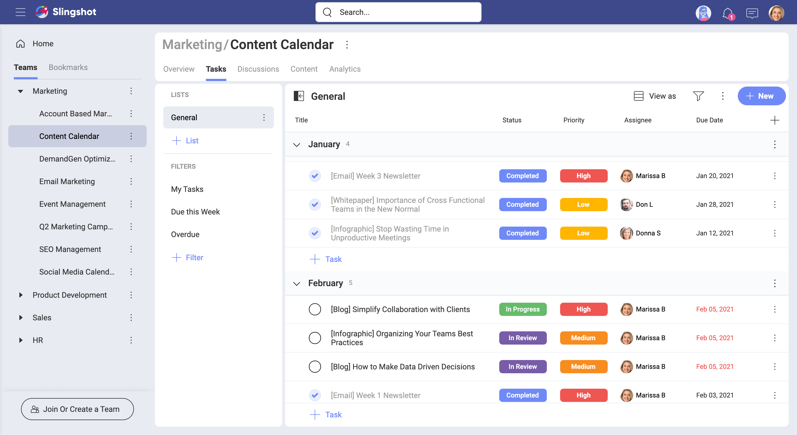
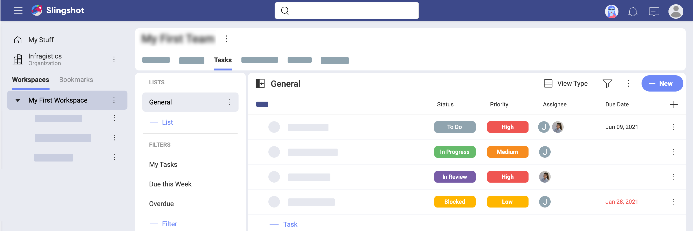
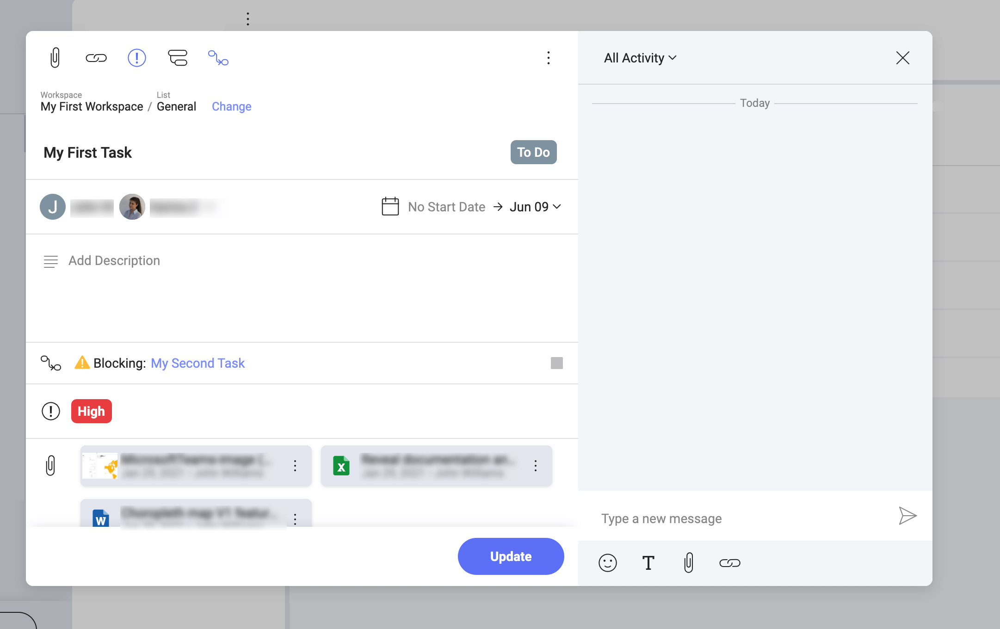

## Tasks

A task can be defined as "a piece of work to be done". Simple, right? Yet, there are many task management solutions on the market that focus solely on tasks. And Slingshot is much more than that...

### So, What's a Slingshot Task?

Think of a Slingshot task as a virtual representation of work to be done. But not just that. Slingshot tasks were designed to help you and your team to better organize work and boost productivity. How? You may ask. Take a look:
- Tasks capture all relevant information around a piece of work.
- Tasks are beginner-friendly and yet they have tons of functionality and flexibility.

> Change the screenshot

### Tasks Capture Your Information

Assigning a task is as basic as it gets, but... Do you want a single person assigned to a task? Or several people collaborating over the same task? Maybe it's better to add several subtasks and assign them to several users, while still having someone who keeps final overall responsibility for the main task? No problem, we got you covered.

In Slingshot, you can decide what works best for you: assigning only one assignee to a single task, **multiple assignees** to the same task, or breaking up a task into **subtasks**, assign those to different assignees while still having someone directly responsible for the overall task.

> Change the screenshot

Using subtasks is also a good way to differentiate **priority** for tasks and subtasks. With three levels of priority (*low, medium, high*), people collaborating over a task or subtask are free to set different priorities. 

Deadlines for tasks and subtasks might also vary. That's not an issue for Slingshot! You can set a **start date** and **due date** for tasks and subtasks independently.

Your task can be started only after another task is completed? Or your incomplete task is blocking other tasks? Slingshot helps you achieve more visibility for everybody on the team by setting task **dependencies**.  

Besides that, you might also need to add images, documents, or links for specific tasks and subtasks. The ability to **add attachments** ensures that Slingshot captures all relevant information for your tasks and subtasks, helping you keep your workflow running smoothly.

### Want to Know More About Tasks?

Continue [here](tasks-starting.md)!
