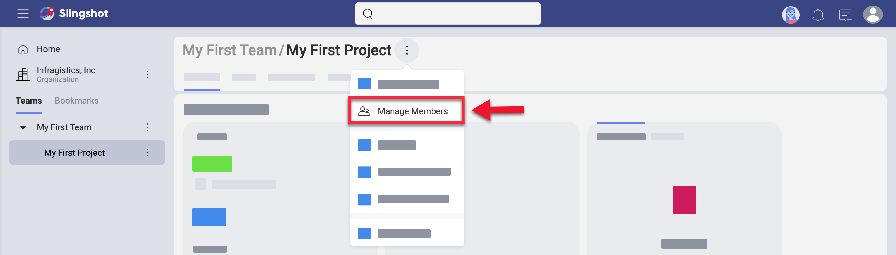
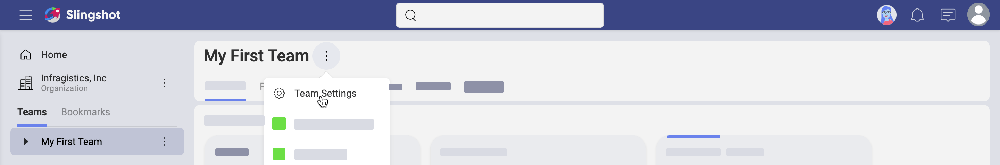

## Starting with Teams

Welcome!  
Read on to get answers to most of your questions about teams.

### Organization vs Team vs Project

In Slingshot, people can join an organization, one or more teams, and also one or more projects.  
The purpose of having an Organization team is for company leaders to have the ability to communicate key goals, metrics, strategies, and important announcements throughout their organization.   

**The Organization team** is named after your organization (for example, your company's name). Members need to log in with their organization’s email to be associated with the Organization team. Team members in the Organization can share _Discussions_, _Content_ and _Dashboards_ with each other. 

You will find your Organization team in the *My Stuff and Organization area* (see below). Here, you can switch between your personal content and content that belongs to your organization. 

> Change the screenshot

**Teams** can be associated with the organization team or not. They can include members from within and out of the main organization team. Team members share not only *Content*, *Analytics*, and *Discussions*, but also *Projects* and *Tasks*.

> Change the screenshot

**Projects** live inside of a team, but are not limited to its members. You can invite people from other teams to every project. A project contains its own *Overview*, *Tasks*, *Discussions*, *Content*, and *Dashboards*. You can also assign tasks within a project to people, who are not part of the project or the team.

> Change the screenshot

### How Can I Access my Teams?

You can access your teams on the very left of the screen, in the Teams & Projects area (shown below).

> Change the screenshot

By scrolling down you are able to navigate all your teams and their projects. If you bookmarked a team or project to keep it at hand, you can select _Bookmarks_ to find it faster.   Under each project's name you will find the team where it lives (see below).

> Change the screenshot

To navigate to any team, just click/tap over it.

### How can I discover and join other teams?

To become a team member you first need to discover your new team. Select the _Join or Create a Team_ button at the bottom of the *Teams* tab to open a dialog with the available teams.

> Change the screenshot

In this dialog, you will find **only public teams, part of your organization**. You can join these teams on the spot, getting the Member role by default.

To become part of **private teams or teams outside of your organization**, you need to be invited by their Owner.

### How Can I Create a New Team?

Every user in Slingshot can create teams.  
Access the team creation menu by selecting the *Teams* tab > *Join or Create a Team* button > *+ Create Team*.

> Change the screenshot

In this dialog, configure the following:
* ***Team Name*** - giving your team a descriptive and meaningful name is always worth the effort.
* *(Optional)* ***Description*** - descriptions are helpful and nice to have, but absolutely optional in Slingshot.
* ***Organization*** - choose whether your team will be part of the main organization or will exist as your Personal Team. How to choose and what is the difference?  
    - **Teams, part of the main organization**, follow the internal rules and principles of the organization. These teams can be [discovered and joined](#how-can-i-discover-and-join-other-teams) by every member of the main organization.

    - **Personal Teams** give you more freedom and less discoverability. Others cannot find your team in the _Join list_ so they can join only if they are invited. Only you and other owners of this team can manage it and delete it.
* **Privacy** - this setting is only available for teams, part of the main organization.
    - **Public** teams can be discovered and joined in the _Join or Create a Team screen_.
    - **Private** teams are undiscoverable and can only be joined through an invitation received via email.

>[!NOTE]
>Be aware that your team can be deleted by an Owner of the main organization anytime even if they have only Members' permissions. This is particularly useful when the Owner of a team happen to be an employee, who left the company but didn't assign new owners to the teams they created. 

Click **Create**. Your team is created and you can find it in the _Teams_ tab. 

You are now prompted to start inviting team members, but you can also leave this step for later if you prefer. 

To invite members, click/tap the **+ Members** blue button. You can choose members from the dropdown list (see below) or use the search bar to add the emails of users who are outside of your Organization. 

> Change the screenshot

>[!NOTE]
>When adding members, whose emails are not auto-completed by Slingshot, type the whole email and press Enter to add it to the list of users you want to invite.

Select **Done** when you are ready. All users in the list are assigned the default _Member_ role. From the dropdown next to each name, you can change the role to _Owner_ or _Viewer_. How are these roles different from _Member_? See in the [Roles & Permissions](roles-permissions.md) topic.

### How Can I Get Visibility Over a Team?

Every team has a place where the most important information is visible at first look. This is the **Team Overview**.  

After accessing a team, you will find its *Overview* tab on the left (see below).  

> Change the screenshot

You can find three widgets in every team's overview: **_Details_**, ***Your Mentions*** and ***Task Status*/*Activity***. Each of these widgets includes important information and resources for your team. 

Let's look at the widgets and their elements more closely. 

1. *(Optional)* **Description** of the team - here you can see the team's description. You can change the description by selecting the *gear icon* on top, next to your team's name.
2. **Team members** - click on the profile images under the team's description to view and [manage members](#how-can-i-manage-team-members).
3. **Content** - click the overflow menu to pin content, web links and dashboards that are essential for your team's work. To do this, select **+ Pin** at the bottom. Use the team's *Content* tab on top to store and organize more content.

    >[!NOTE] If you pin a file (or folder) in the team *Overview* and your teammates don't have this file (folder) in their personal or shared cloud storage, they will not be able to access it. In this case, select the *Content* tab on top and pin the file (folder). This way you will share it with your teammates and they will be able to access it both from *Content* and *Overview*.

4. **Mentions** - when other team members mention you, a team, or a project of yours (by using the _@ sign_) in a *Topic* in the *Teams' Discussions* or in the _Activity_ chat (see in *number 6* below), you will see a notification on this board. Upon clicking on it, you will be navigated to where the message is located.
5. **Task Status** - here you will find a list of all members. Under each name, you will see the number of all current tasks for each user with the number of tasks done. Also, you may see a *fire icon* with a number next to it, which shows how many tasks are overdue. The circle on the right uses colors to show what part of all tasks  is complete (blue), not started (grey), in progress (green), in review (purple), blocked (yellow).
6. **Activity** - here you will find a log of all recent activity in your team - changes in settings, team members, tasks, etc.
7. **Overflow** menu - use this menu to add your team's overview to *Bookmarks* or copy a link to it to your clipboard.

### How Can I Manage Team Members?

Team members are an essential part of the concept of a team. As an owner of a team, you may want to have more control over the members and their permissions.

**Only team owners can**:
- invite new members;
- remove members, and
- change members' roles.

**Access the team members' dialog** by clicking/tapping the 
*gear icon* next to your team's name. In the _Edit Team_ dialog, select **Manage Members** on the right. 

> Change the screenshot

To invite new members click/tap the **+ Members** blue button.

In the dialog above, you will find a list of all team members and their roles. You can change each member's role or remove the member from the team by clicking on the role's dropdown.

You can change the role of or remove more than one member at the same time. To do this:

1. Select the checked box on the right of the _+Members_ blue button.
2. Checkboxes on the right of members' roles appear.
3. Select the checkboxes of members, who you want to remove or whose roles you want to change.
4. Choose the *trash icon* or a role from the menu at the bottom center of the screen and apply to all simultaneously.

### Can I Work with People from Outside of a Team?

Sometimes you may need to work on a particular task or project with people outside of your team. In this case, it doesn't make sense to add them as members to your team.

You can assign tasks to users who are external for your team by accessing the team's **Tasks** tab on top and creating a task. 

> Change the screenshot

Users will receive a notification about the task they were assigned. For them the task will appear in _My Stuff > Tasks_.  

All members of a team can be members for its projects and you can also add external members to projects.  

To do this:

1. Navigate to a project in the **Teams & Projects** list and open it.
2. Click/tap on the **overflow** button next to the project's name.
3. Select **Manage Members** from the dropdown (as shown below)

> Change the screenshot

3. Select the **+ Members** blue button on the top right and add members who are not part of the team by typing their emails in the Search box. 
4. Press **Enter** to add the email to the list of invited users. 
5. Click **Done** and then **Update** to send invites. 

You can also go directly to a project's *Tasks* tab and assign a task to an external member.

External members, who are added to a project, will receive notifications about the project and its state. They will also be notified when the project is mentioned (by using the *@ sign* + the project's name).

The Owner of a team can also exclude team members from a project.  
After unfollowing a project, you will receive notifications only about the tasks assigned to you within this project.

### How Can I Change the Team's Privacy, Name or Description?

If you are the Owner of a team you can change your team's settings. To do this, select your team > click/tap the overflow menu next to its name > choose *Team Settings*.

> Change the screenshot

Here you can change your team's name, description and privacy.

>[!NOTE] Not only Owners are allowed to change a team's settings. Your team's name and description can be changed by users with Members' permissions provided that your team is part of the main organization and the user is Owner of the main organization.

### Why are Teams Public By Default?

A newly created team is public by default, meaning that any member of the main Organization can search and join the team. Trust and transparency are key elements for effective collaboration, and also help with ownership and accountability.

That being said, sometimes you might need to have a private team, leaving your team out of the search results. In this case, users can only join the team by getting invitations from existing members. This is helpful for teams that handle sensitive information. In those cases the organization wants to restrict access.

### Deleting vs Leaving a Team

To make a team disappear from your Slingshot space you can either delete or leave it.

Only the *Owner* can delete a team. As an exception, a *Member* can also delete a team provided that:
- the team is part of the main Organization;
- they are an Owner in the main Organization.

To **delete** a team, go to its [settings](#team-settings) > _Manage Members_ > overflow menu on top > *Delete Team*.

> Change the screenshot

Deleting removes the team with all its contents for all its members.

To remove a team and its content only for you, use the **leave** option. You can do this by going to the team's [settings](#team-settings) > select *Manage Members*, click/tap your role and select *Leave* at the bottom. If you are the only Owner of a team you cannot leave it without assigning another member as an Owner.

