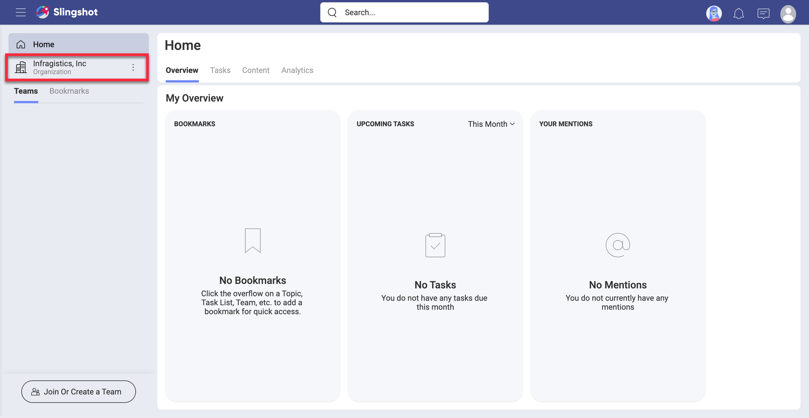
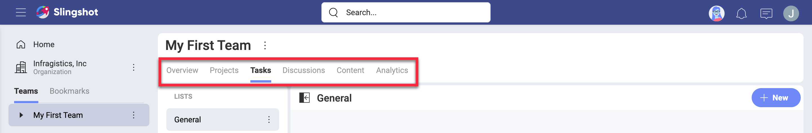
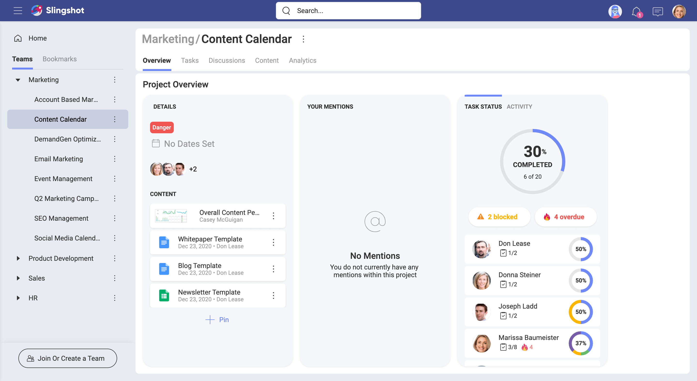
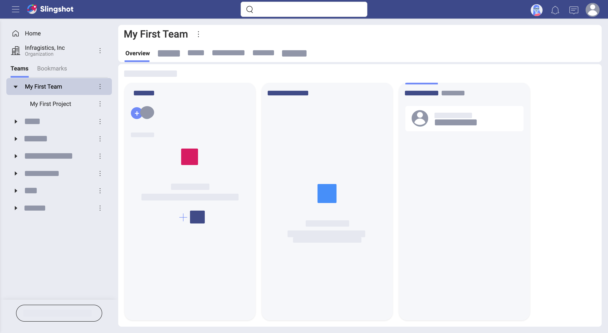
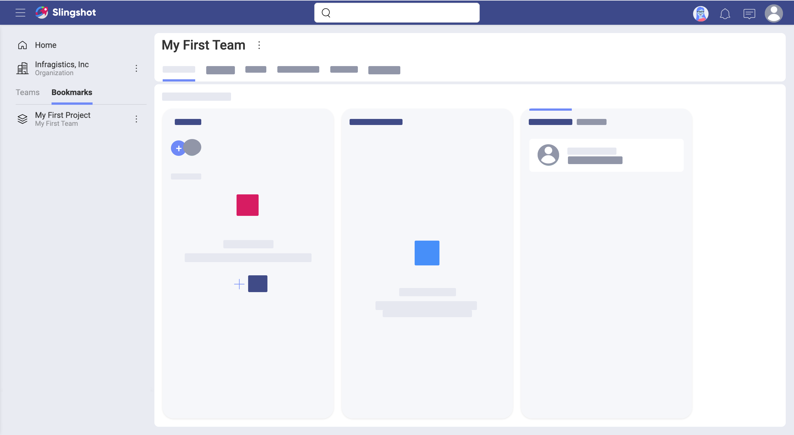
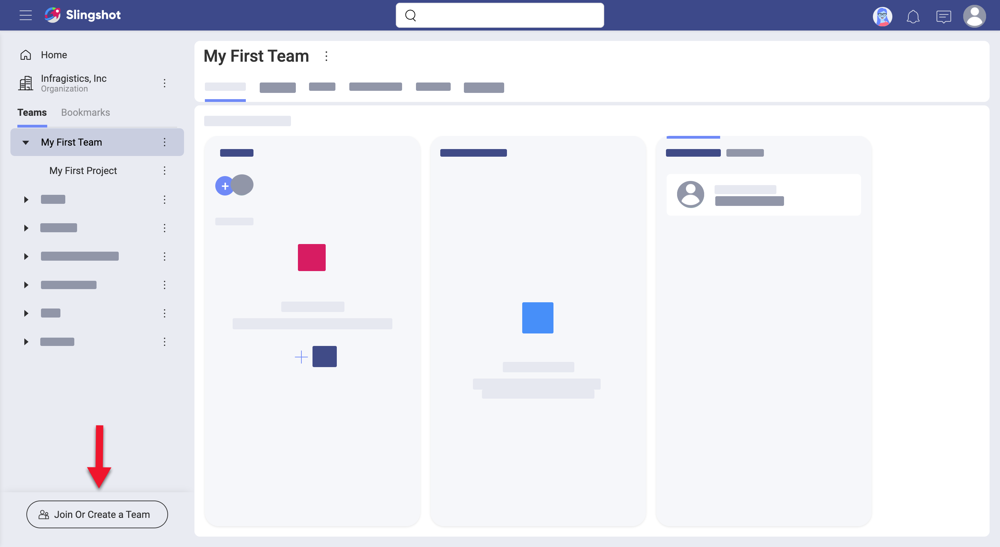
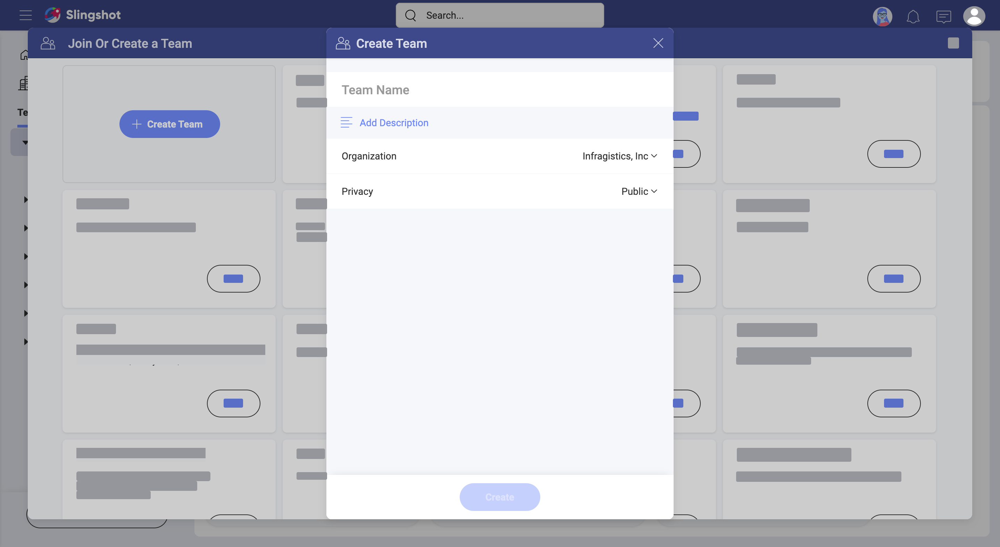
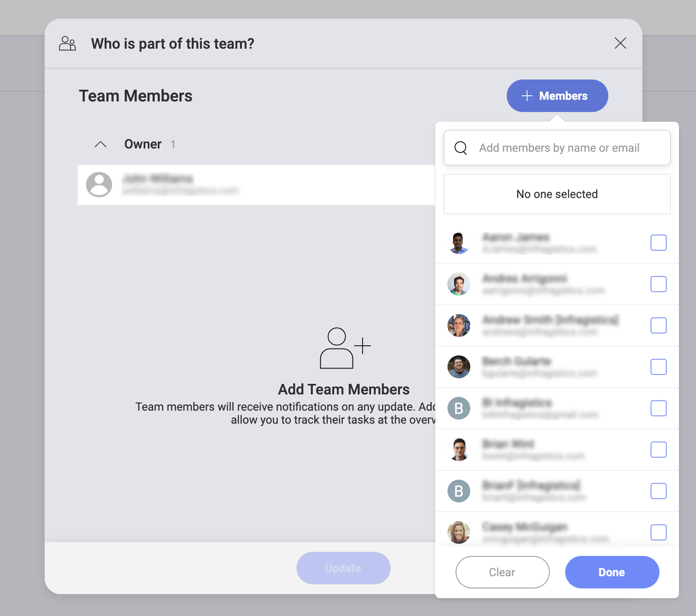
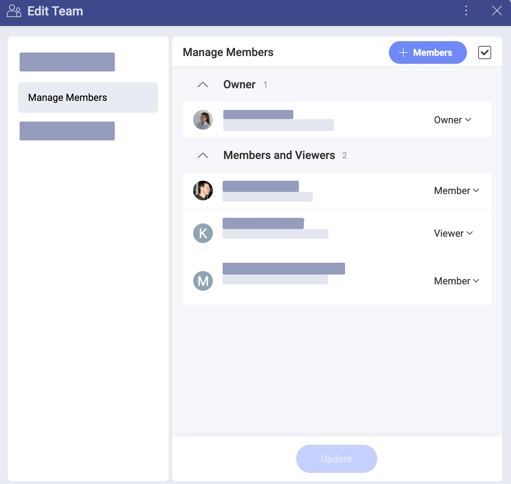
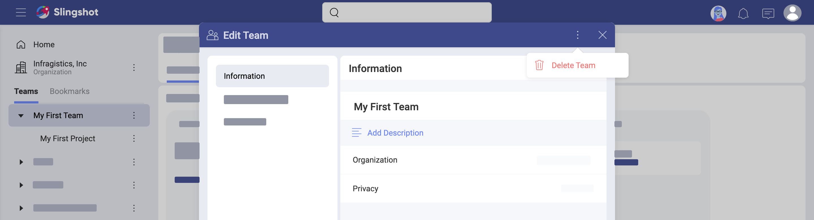

## Starting with Workspaces

Welcome!  
Read on to get answers to most of your questions about workspaces.

### Organization vs workspace vs sub-workspace

In Slingshot, people can be part of an Organization, and of limitless workspaces and sub-workspaces.
The purpose of having an Organization workspace is for company leaders to have the ability to communicate key goals, metrics, strategies, and important announcements throughout their organization.   

**The Organization workspace** is named after your organization (for example, your company's name). Members need to log in with their organization’s email to be associated with the Organization workspace. Team members in the Organization can share _Discussions_, _Content_ and _Analytics_ with each other. 

You will find your Organization workspace right under *My Stuff* (see below). 

> Change the screenshot

**Workspaces** can be associated with the Organization workspace or not. They can include members from within and out of the main Organization. Workspace members share not only *Content*, *Analytics*, and *Discussions*, but also *Tasks* and *sub-workspaces*.

> Change the screenshot

**Sub-workspaces** live inside of a workspace and can be found under the _Workspaces_ between the _Overview_ and the _Tasks_ of the [parent workspace](workspaces.html#sub-workspaces). Sub-workspaces are not limited to the members of the parent workspace. You can invite people from other workspaces to every sub-workspace. A sub-workspace contains its own *Overview*, *Tasks*, *Discussions*, *Content*, and *Analytics*. You can also assign tasks within a sub-workspace to users, who are not part of the sub-workspace or its parent workspace.

> Change the screenshot

### How can I access my workspaces?

You can access your workspaces on the very left of the screen, in the Workspaces area (shown below).

> Change the screenshot

By scrolling down you are able to navigate all your workspaces and their sub-workspaces. To access a workspace faster, you can bookmark it. From now on, you can also find this workspace under the _Bookmarks_ tab. If you are in doubt where a sub-workspace comes from, check under its name. You will see the name of its parent workspace written in grey (see the screenshot).

> Change the screenshot

To open any workspace, just click/tap over it.

### How can I discover and join other workspaces?

To become a workspace member you first need to discover your new workspace. Select the _Join or Create a Workspace_ button at the bottom of the *Workspaces* panel to open a dialog with the available workspaces.

> Change the screenshot

In this dialog, you will find **only public workspaces, part of your Organization**. You can join these workspaces on the spot, getting the member role by default.

To become part of **private workspace or workspaces outside of your Organization**, you need to be invited by their owner.

### How can I join a sub-workspace? 

As it was already mentioned, sub-workspaces can mix together users from the parent workspace with users, who are not part of it. [Personal account users](roles-permissions.html#personal-account-users) can also join a sub-workspace without being members of its parent workspace.

To join a workspace, if you are not a member of the parent workspace, you have to **receive an invitation** by an owner of the sub-workspace or its parent workspace. 

After you are added to a sub-workspace, you will receive notifications about the project and its state. You will also be notified when the project is mentioned (by using the *@ sign* + the project's name).

If you are part of the parent workspace and you haven't joined some of its sub-workspaces, you can click on the blue button under its name. There you will find the available sub-workspaces and you can select *Join* next to the name of the ones you want to join (see below). 

> screenshot showing the *Join* button and at least two unjoined sub-workspaces and one that is already added

>[!NOTE] You can always view the content in sub-workspaces without joining them. However, you will not receive any notification updates from them.

### What is added to the Shared workspace? 

As you already know, in Slingshot you can work with other users in a sub-workspace even when you are not a member of its parent workspace. You will find all such sub-workspaces under the *Shared* workspace.
The *Shared* workspace automatically appears in the Workspaces panel the first time you are added individually to a sub-workspace. 
### How can I create a new workspace?

Every user in Slingshot can create workspaces.  
Access the workspace creation menu by selecting the *Join or Create a Team* button at the bottom of the *Workspaces* panel and then *+ Create Workspace*.

> Change the screenshot

In this dialog, configure the following:
* ***Workspace Name*** - giving your workspace an appropriate name is always worth the effort.
* *(Optional)* ***Description*** - descriptions are helpful and nice to have, but absolutely optional in Slingshot.
* ***Organization*** - choose whether your workspace will be part of the Organization workspace or will exist as your Personal. How to choose and what is the difference?  
    - **Workspaces, part of the main organization** follow the internal rules and principles of the Organization. These workspaces can be [discovered and joined](#how-can-i-discover-and-join-other-workspaces) by every member of the Organization.

    - **Personal Organization** - by choosing this option, you will have more freedom and less discoverability for your workspace. Others cannot find your team without being invited. This is perfect when you want to control access to your workspace.
* **Privacy** - this setting is only available if you choose to be part of the Organization.
    - **Public** workspaces can be discovered and joined in the _Join or Create a Workspace_ dialog.
    - **Private** teams are undiscoverable and can only be joined through an invitation received via email.
* **Status**, **Start Date**, **End Date** - all these properties of your workspace will be visible for everybody in the workspace *Overview*. 

Click **Create**. Your workspace is created and you can find it in the *Workspaces* panel. 
### How can I add members to a workspace? 

The *Who is collaborating in this workspace?* dialog appears right after you create the workspace. To invite members, click/tap the **+ Members** blue button. Choose Organization members from the dropdown list (see below) or use the text box at the top to add the emails of [personal account users](roles-permissions.html#what-about-users-with-no-organization). 

> Change the screenshot

>[!NOTE]
>When adding members, whose emails are not auto-completed by Slingshot, type the whole email and press Enter to add it to the list of users you want to invite.

Select **Done** when you are ready. All users in the list are assigned the default _Member_ role. From the dropdown next to each name, you can change the role to _owner_ or _Viewer_. How are these roles different from _Member_? See in the [Roles & Permissions](roles-permissions.md) topic.

### How can I create a workspace inside the workspace?

You can create limitless workspaces within a [parent workspace](workspaces.html#using-workspaces-within-the-workspace). To create a new sub-workspace (a workspace within a workspace), follow the steps below. 

1. Select a workspace from the Workspace panel on the left. 
2. Go to the _Workspaces_ tab. 
3. Select the *+ Workspace* at the top right.
4. You are only required to choose a name for your sub-workspace. _Status_, _Start Date_ and _End Date_ are optional.
5. Select _Create_. Your new sub-workspace will appear in a list inside _Workspaces_. You will also see it under the parent workspace in the main *Workspace* panel on the left.
### How can I manage workspace members?

You have to be a workspace owner to be able to: 

- invite new members;
- remove members, and
- change their roles.

To access the workspace members dialog select the overflow menu of a workspace and then **Manage Members**. 

> Change the screenshot

To invite new members select the **+ Members** blue button.

You can change each member's role or remove the member from the workspace by clicking on their role.

You can remove or change the role of more than one member at the same time. To do this:

1. Select the checked box on the right of the _+Members_ blue button.
2. On the right of each member's role appears a checkbox.
3. Select the checkboxes of the members you want to change simultaneously.
4. Choose the *trash icon* or a role from the menu at the bottom center of the screen and apply to all.

The same rules for managing members in the parent workspace are applicable to all its sub-workspaces.

>[!NOTE] Owners of the parent workspace cannot manage members in a sub-workspace where they are not an owner.
### Can I assign tasks to people from outside of a workspace?

Sometimes you may need to work on a particular task or project with people outside of your workspace. In this case, it doesn't make sense to add them as members to your workspace.

You can assign tasks to users who are external for your workspace by accessing the workspace's **Tasks** tab on top and creating a task. 

> Change the screenshot

Users will receive a notification about the task they were assigned. For them the task will appear in _My Stuff_ > _Tasks_. The same applies for assigning tasks to external users in sub-workspaces.

If you unfollow a sub-workspace, you will receive notifications only for the tasks assigned to you within this the sub-workspace.

### How can I change the workspace privacy, name or description?

If you are the owner of a workspace (or sub-workspace) you can change its settings. To do this, select your workspace overflow menu > *Workspace Settings*.

> Screenshot showing the workspace settings menu on the right 

Here you can change your workspace's name, description and privacy.

### Deleting vs leaving a workspace

To make a workspace disappear from your Workspace panel you can either delete it or leave it.

Only the *owner* can delete a workspace. As an exception.

To **delete** a workspace, go to its [settings](#workspace-settings) > _Manage Members_ > overflow menu on top > *Delete Workspace*.

> Change the screenshot

Deleting removes the workspace with all its contents for all its members.

To remove a workspace and its content only for you, use the **leave** option. You can do this by going to the workspace's[settings](#team-settings) > select *Manage Members*, click/tap your role and select *Leave*. If you are the only owner of a workspace you cannot leave it without assigning another member as an owner.

