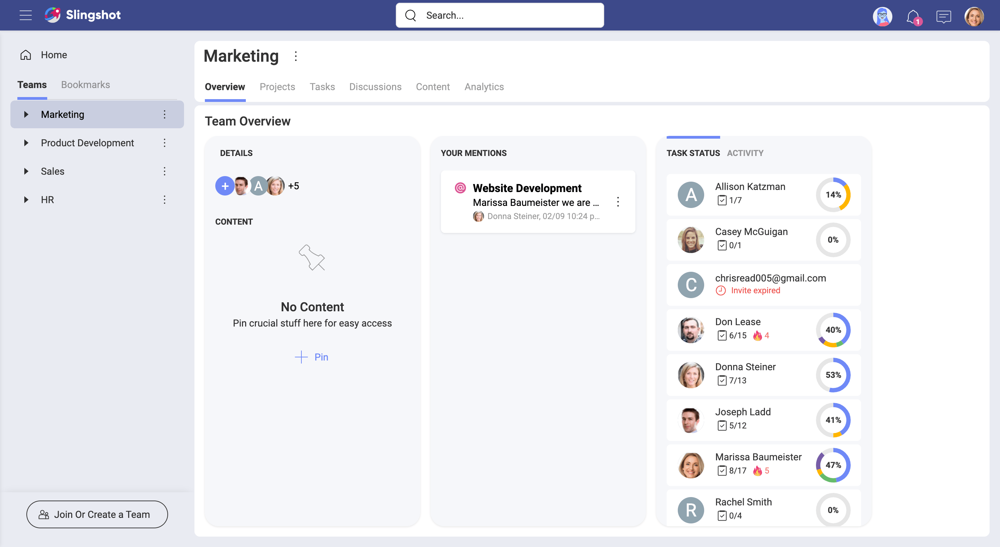
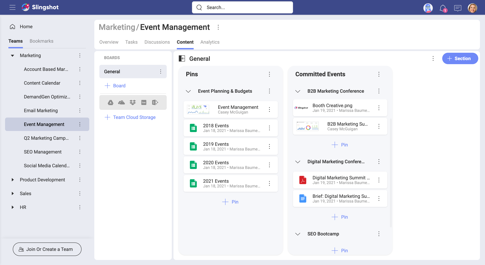
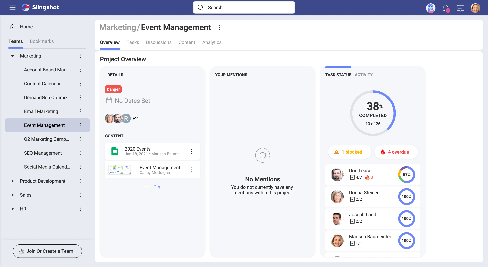

## Workspaces

A *workspace* is defined as an area required to do one's job. Nowadays, your workspace can be your office, desk, or even a coffee shop or your home. In IT, "workspace" is often used to refer to the area of a computer screen where you work and the way it is arranged.  

Traditionally, the workspace is an are used by a group of people who collaborate and support each other, working together towards a common objective. When it comes to collaboration, a combination of solid leadership, good communication, and access to the right resources can dramatically improve productivity. And Slingshot can help with that.

### So, what's a Slingshot workspace?

The Slingshot workspace is close to the IT definition of a workspace. Slingshot's workspace provides you with a screen where you can combine different tools that support your work. It's also very close to the traditional understanding as it delivers an area where you can communicate and collaborate with others.  

### Providing tools for effective communication

Your workspace in Slingshot is intended to facilitate your collaboration with others. Being part of a team means fluid communication. That's why you can use different types of communication like workspace discussions, task activity comments, notifications, or even a general chat.

The most effective way to involve everyone in a discussion and maintain high transparency in the workspace, is to create a topic in the workspace discussions (see below). 

You can also communicate with any Slingshot user (or group of users) through the **private chat**.

Communication is not limited to writing. You can also attach files, use emojis, and react to messages.

### Ensuring collaboration fluency 

To support each other, the members of a workspace can get a sense of the workspace status at a glance. Using the workspace *overview* you can keep yourself informed about all members and their tasks, helping you proactively contact those in need. You can, for example, start a discussion to get a team member's attention. And they will receive a notification to alert them that they were mentioned.

When you work towards a common objective, using shared resources is required. One of the best practices in Slingshot is to organize your content in *Boards*. Designed to manage your personal or workspace content, boards are just containers. They keep connections to cloud storages, where you hold your resources.

### Using workspaces within the workspace

> I think that I can get rid of the first paragraph with no regrets.

More often than not, you will work with different people in your workspace on different tasks. Sometimes even people from outside the workspace might have to join to work on a specific project. For example, if you are part of a Marketing workspace, you may want to separate the marketing campaigns. All collaborators will benefit from the opportunity to track the progress on each campaign more easily, to communicate faster and to get data about the campaign success rate from *Slingshot's* _Analytics_. 

It's always important to organize the different groups and projects within the workspace in a way that fosters productive collaboration and best practices. By giving you the ability to create workspaces within the workspace, Slingshot empowers solid leadership, good communication, and access to the right resources for each group of collaborators. 

For this guide's purposes, the term **sub-workspace** will be used to refer to a workspace within the workspace. The main workspace that contains sub-workspaces will be sometimes called a **parent workspace**.  

A sub-workspace provides you with the same collaboration tools as the parent workspace. Let's look at a quick list!

- *Overview* - provides a quick snapshot of what's going on: overall status (*On Target, At Risk, Danger, Completed*), start and due dates, crucial resources, everyone's progress on tasks and all mentions directed at you. 
- *Tasks* - all the tasks associated with the sub-workspace are tracked and organized in lists.   
- *Content* - helps you share and organize neatly all resources required to collaborate.   
- *Discussions* - you can communicate with a focus on your sub-workspace's shared objective.

### Want to know more about workspaces?

Continue [here](workspaces-starting.md)!

