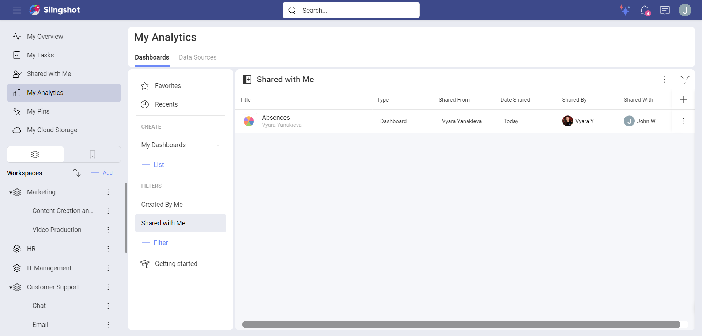
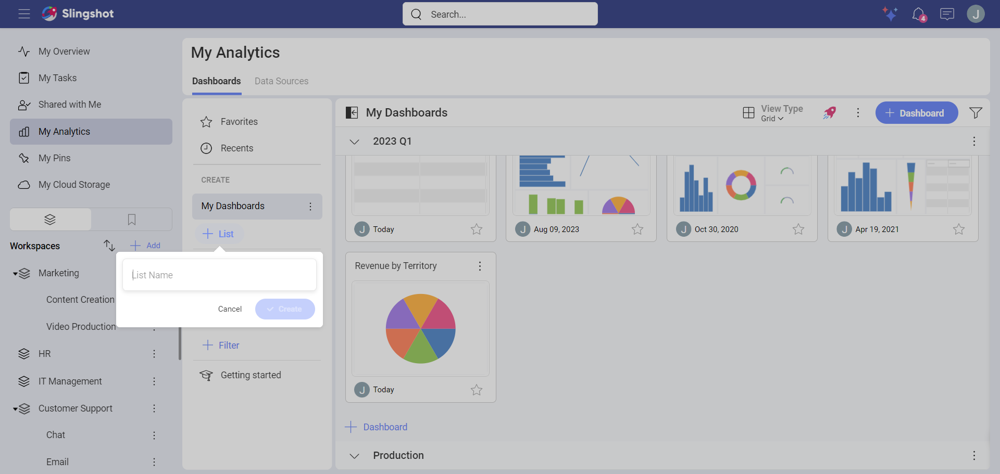
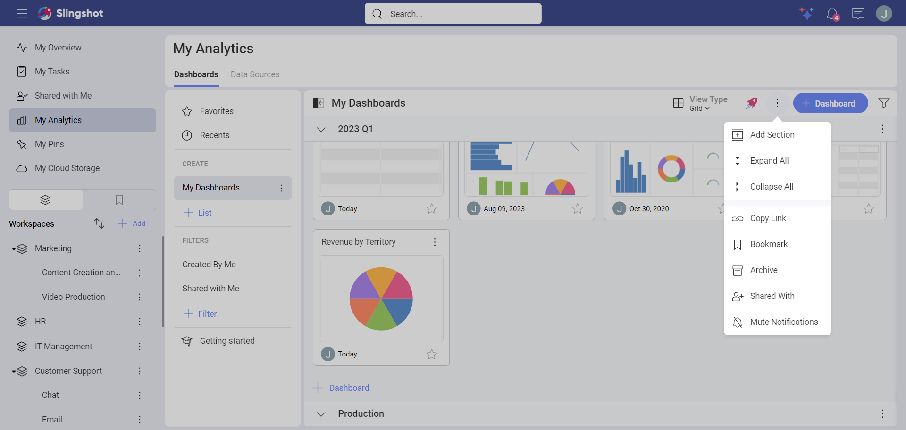
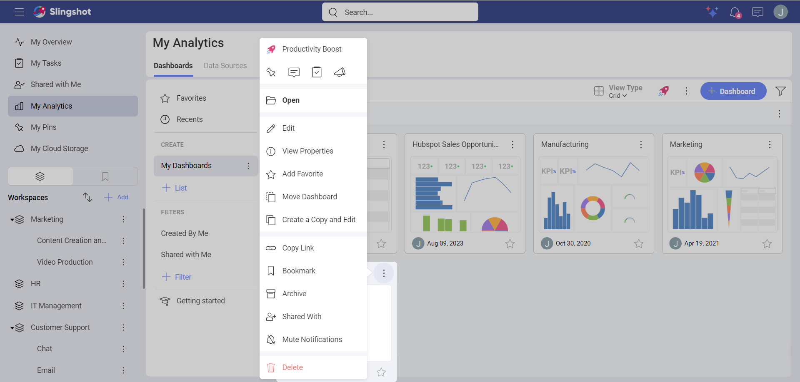
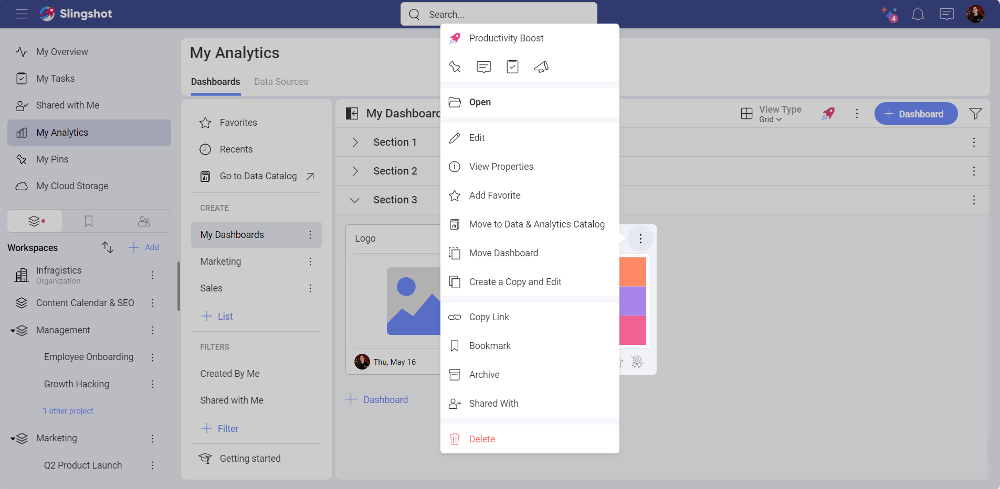
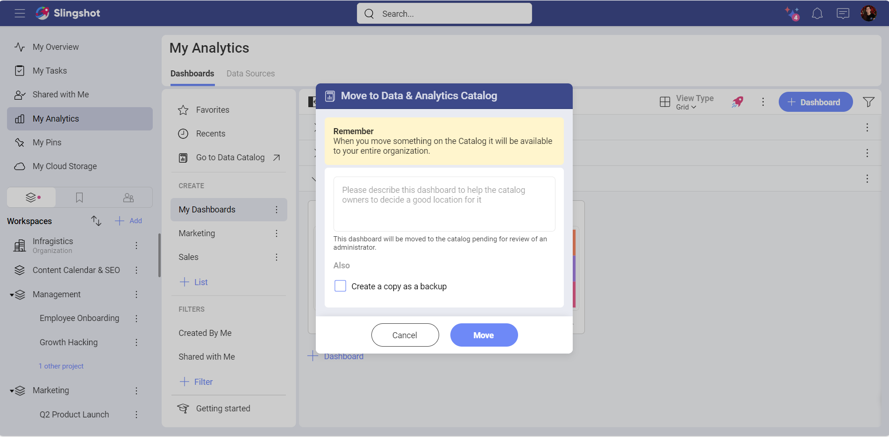

# Managing Your Dashboards

Whether you are trying to manage dashboards in your personal space or in
a Workspace, you will always be able to choose between *dashboards created by you* or *dashboards shared with you*.

## Organizing your Dashboards

Analytics allows you to store and organize your dashboards in different *Lists* and *Sections*. Sections are simply divisions of a list. A list can have one or more sections.

You can create a list with the following steps:

1. Click/tap on the **+List** button.

2. Give a name to the list.

3. Click/tap on **Create**.

4. Once you have named your list, you can start adding dashboards from the **+Dashboard** button.

You can create a section with the following steps:

1. Open a dashboard list.

2. Open its *overflow* menu next to the **+ Dashboard** button.

2. Choose **Add Section**. 

3. Name it and click/tap on **Create**.

4. Once you have named your section, you can start adding dashboards from the **+Dashboard** button.

## Moving or Copying Dashboards

Open the dashboard’s overflow menu actions and choose to copy the dashboard or move it between **sections** and/or **[workspaces](../../workspaces.md)**.

If you are part of an organization, you can also move the dashboard to the *Data and Analytics Catalog*. To do that, you need to:

1. Open the overflow menu of the dashboard.

2. Click/tap on **Move to Data & Analytics Catalog**.

3. You will see the following dialog where you can request from the owner of the organization to add the dashboard to the catalog.

4. When they accept the request, the entire organization will be able to see the dashboard.

