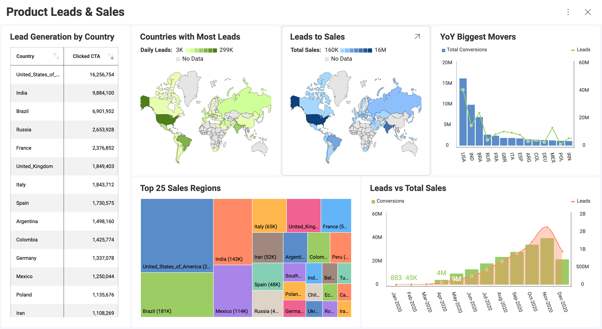

# Dashboards

Dashboards are a quick and simple way to display minimal information at
first sight. It is a data visualization composed of a collection of
visualizations which are laid out to communicate the status, metrics,
or performance of a business. Each visualization is meant to have
different pieces of related information, enabling users to make sense of their data.

## The Dashboard Creation Process

  - **Discover the KPI**: decide what you or your analysts want to show
    in your dashboard, and what it needs to revolve around.

  - **Plan the Dashboard**: how will you represent your information
    graphically? Will you use a [grid](~/docs/analytics/data-visualizations/visualization-types/grid-chart.md), a map,
    [gauges](~/docs/analytics/data-visualizations/visualization-types/gauge-charts.md), [category charts](~/docs/analytics/data-visualizations/visualization-types/category-charts.md)?
    Will you use any [filters](~/docs/analytics/filters/overview.md)?

  - **Prepare the data** to be used in Analytics. Here is a quick overview
    of [how to work with spreadsheets](~/docs/analytics/datasources/working-files/working-with-spreadsheets.md) in Analytics.

  - **Create the dashboard**: for a complete walkthrough, read [this topic](creating-dashboards.md).

  - **Review and iterate**: once your dashboard is ready, you can review
    it and make any changes you or your analysts deem necessary.

## Topics Overview

Within Analytics, you will be able to:

   - [Create Dashboards](creating-dashboards.md)

  - [Upload Dashboards](uploading-dashboards.md)

  - [Interact with Dashboards](dashboards-interactions.md)

  - [Style your Dashboards](dashboard-styling.md)

  - [Link Dashboards to other Dashboards or to URLs](dashboard-linking.md)

  - [Share your Dashboards](sharing-dashboards/share-a-dashboard.md)

  - [Manage your existing Dashboards](managing-dashboards.md)

  - [Export Dashboards](how-to-export-a-dashboard.md) as [Images](export-as-images.md), [PDF files](export-as-pdft-document.md), [PowerPoint presentations](export-as-powerpoint-presentation.md) or
  [Excel spreadsheets](export-as-excel-data-format.md)

You can also import any [dashboards created with previous versions of ReportPlus](Uploading-Dashboards.md).
