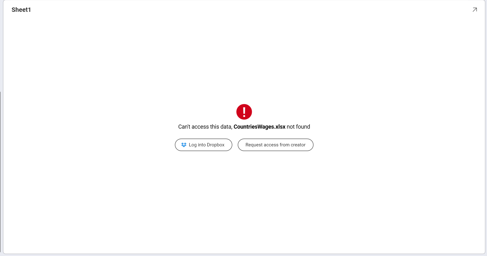
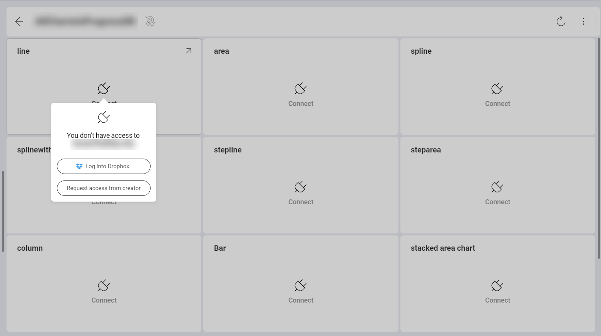
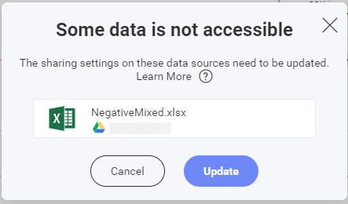

# Requesting Access to Shared Dashboards with Cloud Files

When trying to open а dashboard, which has been shared with you, you
might be unable to see its content due to one of the following reasons:

  - Cloud file used as data source has been **deleted** from the cloud service.

  - The owner of the dashboard has **revoked the permissions** they had given you to the cloud file used as data source.

If the file has been **deleted**, Analytics will show you the following
message when you click the shared dashboard:

If your permissions to the file have been **revoked**, you will see:

## Granting Access to Data Source Files with Revoked Permissions

Click the *Request Access* button to notify the owner of the dashboard
about your denied access. They will also receive an email notification.

When **the owner** opens the notification (through the app or email message), they will see the following dialog, prompting them to update the sharing settings to the data sources:

After the owner clicks *Update* they will see a message notifying them
whether the access has been successfully fixed.
