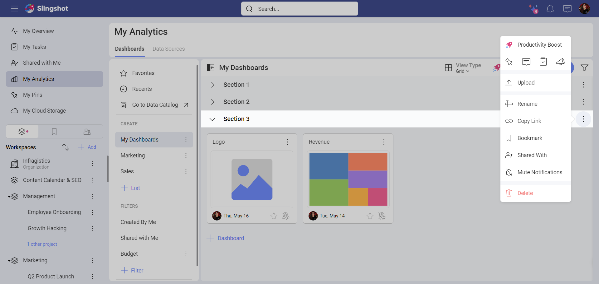

---
title: How to Upload Dashboards to Slingshot
_description: See how to work with dashboards saved on your device by directly uploading them.
--- 

# Uploading Dashboards

In Slingshot, you can also work with dashboards saved on your computer/device by directly uploading them. To do that, perform the following steps:

1. Go to **My Analytics**.

2. Open a dashboard section where you want to save the dashboard.

3. Choose **Upload** from its overflow menu.

    

4.  A dialog showing your local files will open. Double click/tap on the
    dashboard you want to upload. Reveal dashboards' file extension is
    **.rdash**.

    >[!NOTE]
    >**Uploading ReportPlus Dashboards** Reveal also allows you to upload and work with dashboards created in ReportPlus. ReportPlus dashboards' file extension is **.rplus**.

Your dashboard is now uploaded and ready to be edited and shared with others.
