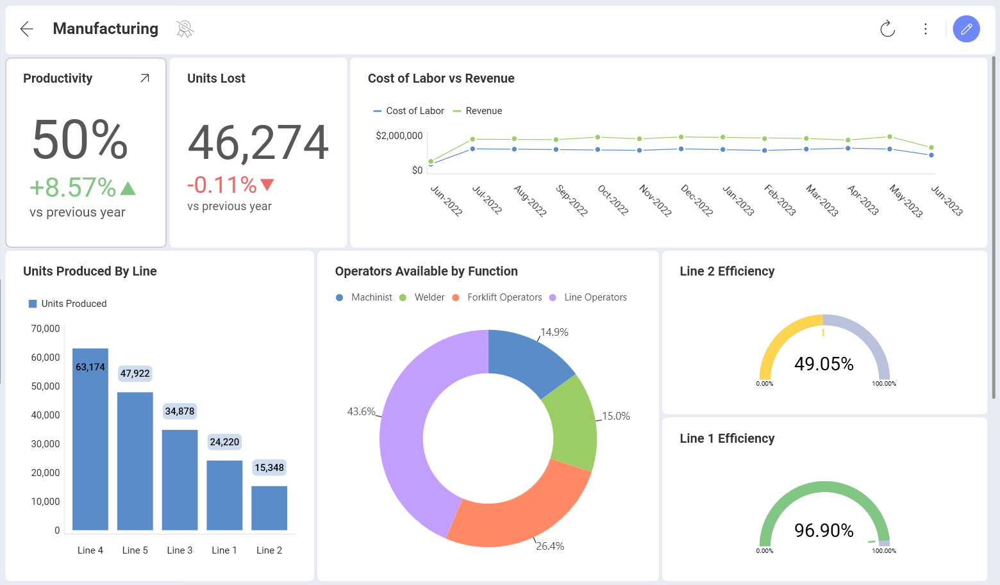

# Data Visualizations

Analytics helps you get the most insight possible out of business data by providing a variety of visualizations.

## What is a Visualization?

For users to get the most insight possible out of business data, Analytics provides several options to customize the way information is visualized. These are called "visualizations". Any dashboard is composed of one or more visualizations.

The dashboard shown below contains a wide variety of visualizations, all of which analyze different aspects of Manufacturing.

## Choosing the Right Chart Type

In choosing the best chart type you need to look at your data and answer the questions that will help you find out what story you are trying to tell with your visualization.

Are you trying to compare data, show data distribution or present it as a part to a whole breakdown? Are you doing a trend analysis of your financial, marketing or sales data, need a date/time axis? Are you looking at relationships between data? Or you just want to show KPIs and gauges, which are really easy to read and tell a quick story? Is it important to plot your data on a map?

Answer what you want to show with your data and use the table below to choose the most suitable chart.

<table>
<colgroup>
<col style="width: 6%" />
<col style="width: 6%" />
<col style="width: 6%" />
<col style="width: 6%" />
<col style="width: 6%" />
<col style="width: 6%" />
<col style="width: 6%" />
<col style="width: 6%" />
<col style="width: 6%" />
<col style="width: 6%" />
<col style="width: 6%" />
</colgroup>
<body>
  <tr>
    <td><b>Compare Data</b></td>
    <td>
       
      <a href="visualization-types/category-charts.md">Bar</a>
    </td>
    <td>
       
      <a href="visualization-types/category-charts.md">Column</a>
    </td>
    <td>
       
      <a href="visualization-types/category-charts.md">Area</a>
    </td>
    <td>
       
      <a href="visualization-types/category-charts.md">Spline</a>
    </td>
    <td>
       
      <a href="visualization-types/combo-charts.md">Combo</a>
    </td>
    <td>
       
      <a href="visualization-types/gauge-charts.html#circular-gauge">Circular Gauge</a>
    </td>
    <td>
       
      <a href="visualization-types/category-charts.md">Spline Area</a>
    </td>
    <td>
       
      <a href="visualization-types/financial-charts.md">OHLC</a>
    </td>
    <td>
       
      <a href="visualization-types/financial-charts.md">Candlestick</a>
    </td>
    <td>
       
      <a href="visualization-types/time-series-charts.md">Time Series</a>
    </td>
  </tr>
  <tr>
    <td><b>Part to Whole</b></td>
    <td>
       
      <a href="visualization-types/category-charts.md">Stacked Column</a>
    </td>
    <td>
       
      <a href="visualization-types/category-charts.md">Stacked Bar</a>
    </td>
    <td>
       
      <a href="visualization-types/category-charts.md">Stacked Area</a>
    </td>
    <td>
       
      <a href="visualization-types/category-charts.md">Pie</a>
    </td>
    <td>
       
      <a href="visualization-types/category-charts.md">Dougnut</a>
    </td>
    <td>
       
      <a href="visualization-types/category-charts.md">Funnel</a>
    </td>
    <td>
       
      <a href="visualization-types/treemap-charts.md">Treemap</a>
    </td>
    <td />
    <td />
    <td />
  </tr>
  <tr>
    <td><b>Data Distribution</b></td>
    <td>
       
      <a href="visualization-types/category-charts.md">Step Area</a>
    </td>
    <td>
       
      <a href="visualization-types/category-charts.md">Stacked Column</a>
    </td>
    <td>
       
      <a href="visualization-types/scatter-bubble-charts.md">Scatter</a>
    </td>
    <td>
       
      <a href="visualization-types/scatter-bubble-charts.md">Bubble</a>
    </td>
    <td />
    <td />
    <td />
    <td />
    <td />
    <td />
  <tr>
    <td><b>Data Trend Analysis<b/></td>
    <td>
       
      <a href="visualization-types/category-charts.md">Line</a>
    </td>
    <td>
       
      <a href="visualization-types/category-charts.md">Spline</a>
    </td>
    <td>
       
      <a href="visualization-types/combo-charts.md">Combo</a>
    </td>
    <td>
       
      <a href="visualization-types/financial-charts.md">OHLC</a>
    </td>
    <td>
       
      <a href="visualization-types/financial-charts.md">Candlestick</a>
    </td>
    <td>
       
      <a href="visualization-types/radial-charts.md">Radial</a>
    </td>
    <td>
       
      <a href="visualization-types/time-series-charts.md">Time Series</a>
    </td>
    <td />
    <td />
    <td />
  </tr>
  <tr>
  <td><b>Data Relationships</b></td>
  <td>
     
    <a href="visualization-types/scatter-bubble-charts.md">Scatter</a>
  </td>
  <td>
     
    <a href="visualization-types/scatter-bubble-charts.md">Bubble</a>
  </td>
  <td>
     
    <a href="visualization-types/category-charts.md">Line</a>
  </td>
  <td />
  <td />
  <td />
  <td />
  <td />
  <td />
  <td />
  </tr>
  <tr>
  <td><b>KPIs and Gauges</b></td>
  <td>
     
    <a href="visualization-types/gauge-charts.html#bullet-graph">Bullet Graph</a>
  </td>
  <td>
     
    <a href="visualization-types/gauge-charts.html#linear-gauge">Linear</a>
  </td>
  <td>
     
    <a href="visualization-types/gauge-charts.html#text-gauge">Text</a>
  </td>
  <td>
     
    <a href="visualization-types/kpi-gauge.md">KPI</a>
  </td>
  <td>
     
    <a href="visualization-types/gauge-charts.html#circular-gauge">Circular</a>
  </td>
  <td />
    <td />
    <td />
    <td />
    <td />
  </tr>
  <tr>
  <td><b>Geospatial Data</b></td>
  <td>
     
    <a href="visualization-types/choropleth-map/choropleth-map.md">Choropleth Map</a>
  </td>
  <td>
     
    <a href="visualization-types/scatter-map/scatter-map.md">Scatter Map</a>
  </td>
  <td />
  <td />
  <td />
  <td />
  <td />
  <td />
  <td />
  <td />
</body>
</table>

If you need more information about how to use each of these visualizations, use the hyperlinks in the table.

## Topics Overview

In the _Visualization Types_ dropdown (see the table of contents on the left) you will find an A-Z list of all kinds of charts Analytics provides.

In [Working with the Visualizations Editor](visualizations-editor.md) you will be introduced to the Visualizations Editor's main parts and will also learn how to start creating your first visualization.

In the [_Fields_](fields/overview.md) topics you will find more information on how to aggregate, filter and highlight the most valuable aspects of the data fields you are using to build your visualization.

In [Reusing Visualization](reusing-visualizations.md) you will find useful ideas on how to speed up the dashboards creation process.

In [Statistical Functions](statistical-functions.md) you will find how advanced predictive analysis works in Analytics. See how to use the *Time series forecast*, *Linear regression*, and *Outliers Detection* function to receive more insight from your data.  

## Visualization Tutorials

Within this section, you will find basic, step-by-step tutorials for the
Analytics visualizations. All sections use the Data Visualizations data
source, which you can download using [this link](https://download.infragistics.com/slingshot/samples/Slingshot_Visualization_Tutorials.xlsx).
For specific information on what each visualization supports, visit the **Data Visualizations** section of the documentation.

<table>
<colgroup>
<col style="width: 20%" />
<col style="width: 20%" />
<col style="width: 20%" />
<col style="width: 20%" />
<col style="width: 20%" />
</colgroup>
<tbody>
<tr class="odd">
<td>
 

<a href="~/docs/analytics/visualization-tutorials/simple-charts.md">Area</a> 

</td>
<td>
 

<a href="~/docs/analytics/visualization-tutorials/simple-charts.md">Bar</a> 

</td>
<td>
 

<a href="~/docs/analytics/visualization-tutorials/gauge-charts.md">Bullet Graph</a> 

</td>
<td>
 

<a href="~/docs/analytics/visualization-tutorials/candlestick-chart.md">Candlestick</a> 

</td>
<td>
 

<a href="~/docs/analytics/visualization-tutorials/gauge-charts.md">Circular</a> 

</td>
</tr>
<tr class="even">
<td>
 

<a href="~/docs/analytics/visualization-tutorials/simple-charts.md">Column</a> 

</td>
<td>
 

<a href="~/docs/analytics/visualization-tutorials/simple-charts.md">Doughnut</a> 

</td>
<td>
 

<a href="~/docs/analytics/visualization-tutorials/simple-charts.md">Funnel</a> 

</td>
<td>
 

<a href="~/docs/analytics/visualization-tutorials/image-chart.md">Image</a> 

</td>
<td>
 

<a href="~/docs/analytics/visualization-tutorials/kpi-gauge.md">KPI</a> 

</td>
</tr>
<tr class="odd">
<td>
 

<a href="~/docs/analytics/visualization-tutorials/simple-charts.md">Line</a> 

</td>
<td>
 

<a href="~/docs/analytics/visualization-tutorials/gauge-charts.md">Linear</a> 

</td>
<td>
 

<a href="~/docs/analytics/visualization-tutorials/ohlc-chart.md">OHLC</a> 

</td>
<td>
 

<a href="~/docs/analytics/visualization-tutorials/simple-charts.md">Pie</a> 

</td>
<td>
 

<a href="~/docs/analytics/visualization-tutorials/simple-charts.md">Radial</a> 

</td>
</tr>
<tr class="even">
<td>
 

<a href="~/docs/analytics/visualization-tutorials/sparkline-charts.md">Sparkline</a> 

</td>
<td>
 

<a href="~/docs/analytics/visualization-tutorials/simple-charts.md">Spline</a> 

</td>
<td>
 

<a href="~/docs/analytics/visualization-tutorials/simple-charts.md">Spline with Area</a> 

</td>
<td>
 

<a href="~/docs/analytics/visualization-tutorials/stacked-charts.md">Stacked Area</a> 

</td>
<td>
 

<a href="~/docs/analytics/visualization-tutorials/stacked-charts.md">Stacked Bar</a> 

</td>
</tr>
<tr class="odd">
<td>
 

<a href="~/docs/analytics/visualization-tutorials/stacked-charts.md">Stacked Column</a> 

</td>
<td>
 

<a href="~/docs/analytics/visualization-tutorials/simple-charts.md">Step Area</a> 

</td>
<td>
 

<a href="~/docs/analytics/visualization-tutorials/simple-charts.md">Step Line</a> 

</td>
<td>
 

<a href="~/docs/analytics/visualization-tutorials/gauge-charts.md">Text</a> 

</td>
<td>
 

<a href="~/docs/analytics/visualization-tutorials/text-view.md">Text View</a> 

</td>
</tr>
</tbody>
</table>
