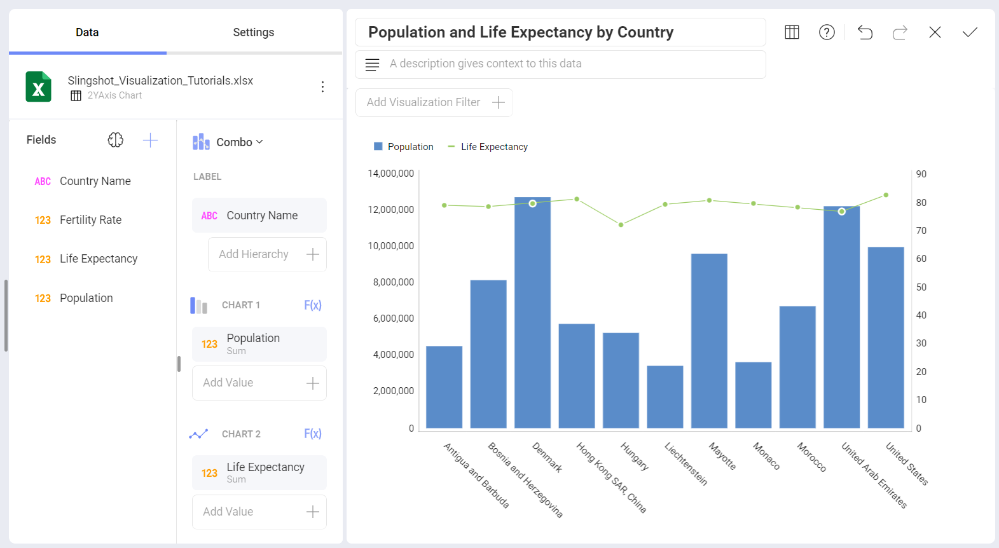
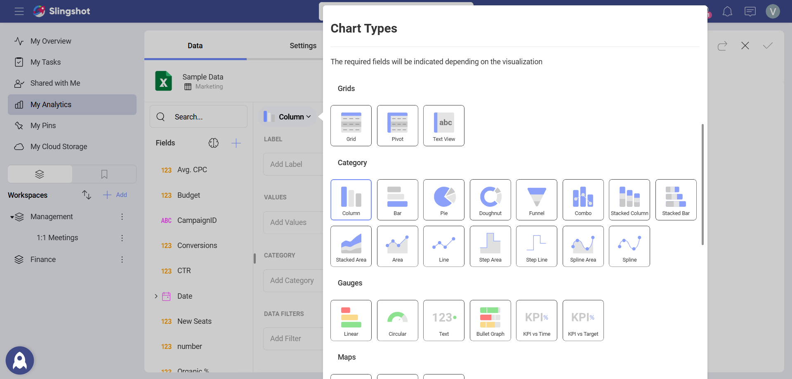
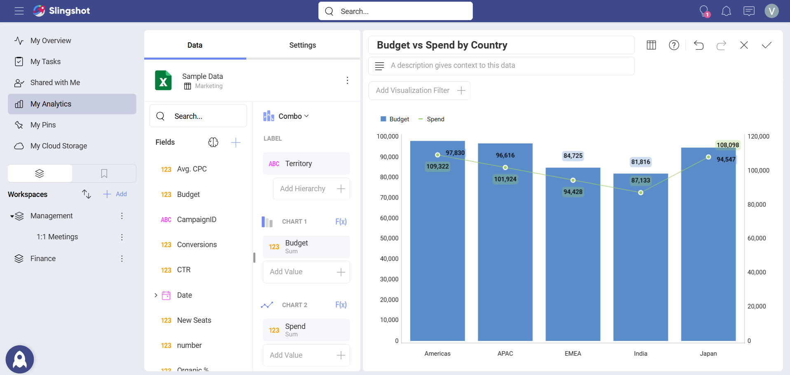
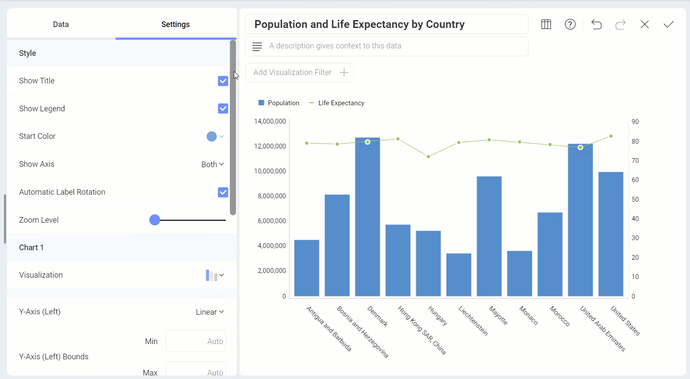

# Combo Charts

This type of chart combines two or more chart types in one single chart.

Regular charts usually have one X-axis and one Y-axis. Combo charts can
have two Y-axis, allowing you to display two different types of data
points in the same chart.

E.g., as shown below, a combo chart can display *Budget vs Spend* based on *Territory*.

To create a combo visualization, you need to:

1. Select your data source.

2. Choose the **Combo** chart from the list of chart types. 

3. Configure the label and values for both charts.

## Settings for Combo Charts

In *Settings* you can:

  - **Choose the Style**. - You can enable the Title, Legend or choose the Start Color.

  - **Hide or show Axis**.

  - **Enable the Automatic Label Rotation**.

  - **Adjust the Zoom Level**.

  - **Change the visualization type for one or both charts**. - You can choose between seven available types (Column, Stacked
    Column, Area, Line, Step Area, Step Line, and Spline Area).

  - **Choose between Linear scale or Logarithmic**. - With Logarithmic, the scale for your values will be calculated with
    a non-linear scale which takes magnitude into account instead of the
    usual linear scale.

  - **Set up the minimum and maximum values for your charts**. - Minimum is set to 0 by default and maximum is calculated
    automatically depending on your values.

  - **Choose to share the left axis for both charts**. - A left and right axis are used by default.

  - **Switch the chart on top**. - Analytics applies opacity to the chart displayed behind, to make it
    visually more transparent.

  - **[Connect this visualization to another dashboard or a URL](../../dashboards/dashboard-linking.md)**
