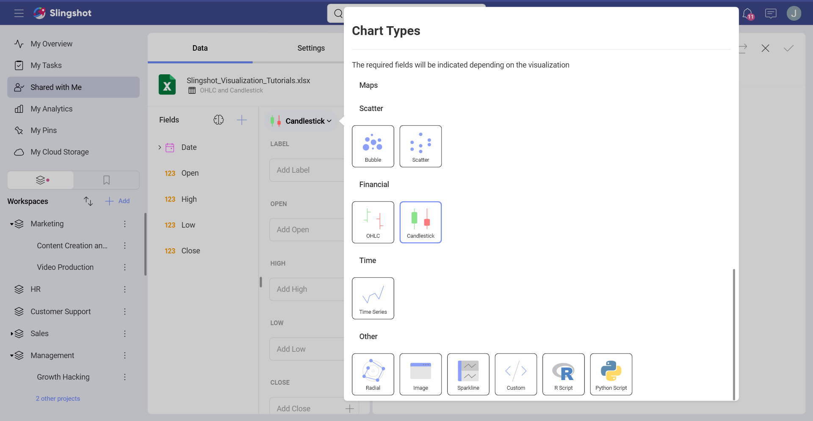
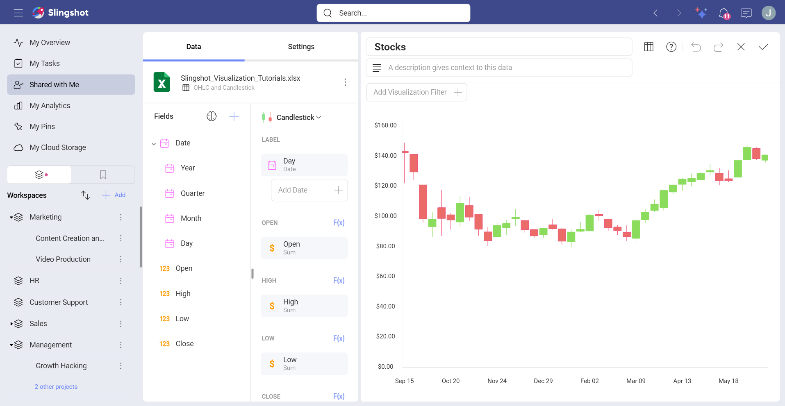

# Financial Charts

Financial charts are used to describe stock price movements during a
full day (open and close values, and the highest and lowest values).

The color for each of the Candlestick or OHLC sections is meant to represent
whether the closing price is below or above its starting value.

