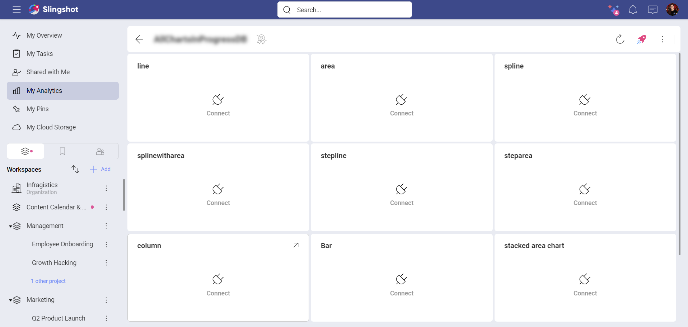
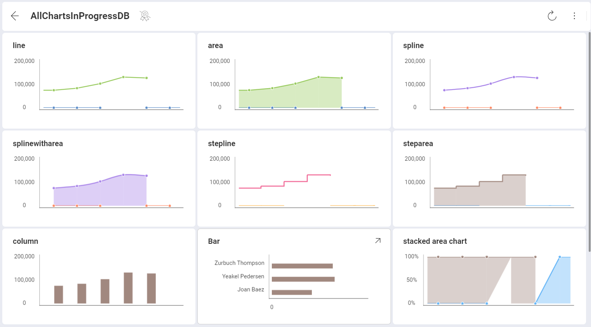
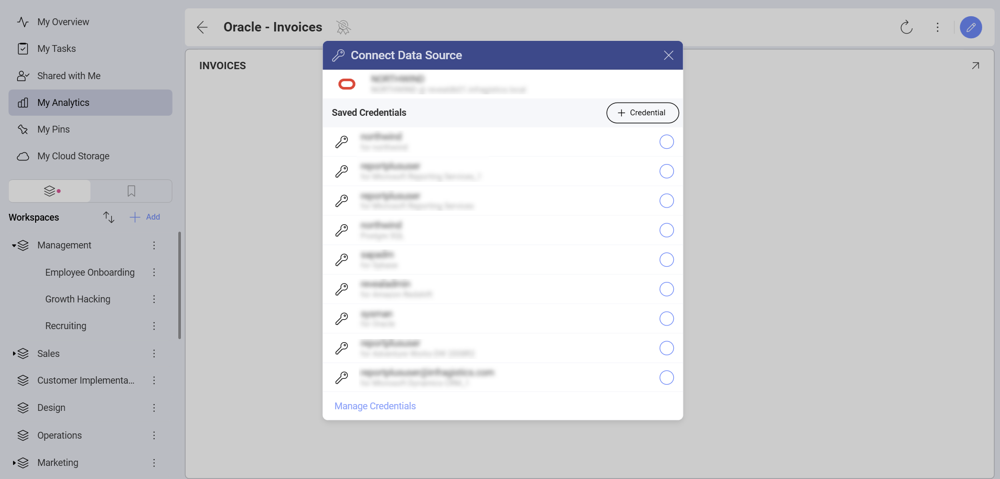

# Connecting a Dashboard to Its Data Source

In Analytics, you can connect to a data source [before](overview.md) or after a dashboard is created. Connecting to a data source is part of the dashboard creation process. However, you can have a dashboard, which is already created, but still not connected to a data source. There are two scenarios where this can happen: this dashboard is [shared](~/docs/analytics/dashboards/sharing-dashboards/share-a-dashboard.md) with you, or you have [uploaded](~/docs/analytics/dashboards/uploading-dashboards.md) it to Analytics. 

A dashboard created with data sources you have not yet added into your application will look like shown below, when you open it for the first time: 

Each visualization has a **Log into** button (*it can be accessed when you click/tap on **Connect***) on it, enabling you to connect to the data source used. To see the dashboard, you need to: 

1. Click/tap on **Connect** and choose **Log into**.

2. Fill in the account credentials. 

3. Select **Add**.

4. The complete dashboard will be displayed in a *Dashboard View* mode. 

In the *Connect Data Source* dialog, you may have a list of data source credentials (see screenshot below). These are credentials you have used to log into other source accounts, or that you have added in advance in the [Manage Analytics Credentials](~/docs/analytics/datasources/managing-data-source-credentials.md) menu.

If there are visualizations in the dashboard, which are created with another data source, you will still need to connect them to their data source to view them.

## Related Topics 

- **Editing your dashboard**. Now after connecting the dashboard to its data source and being able to view it, you may want to edit it, as well. You can do so by accessing the *Dashboard Edit* mode from the overflow menu. Learn more in the [Interacting with Your Dashboards](~/docs/analytics/dashboards/dashboards-interactions.md) topic. 

- **Access permissions to a shared dashboard**. The dashboard you just connected to its data source was most probably shared with you in Analytics. Did you know that there are three types of access permissions that determine the operations you are allowed to do with the dashboard? Learn about this and other specifics in the [Sharing a Dashboard](~/docs/analytics/dashboards/sharing-dashboards/share-a-dashboard.md) topic.