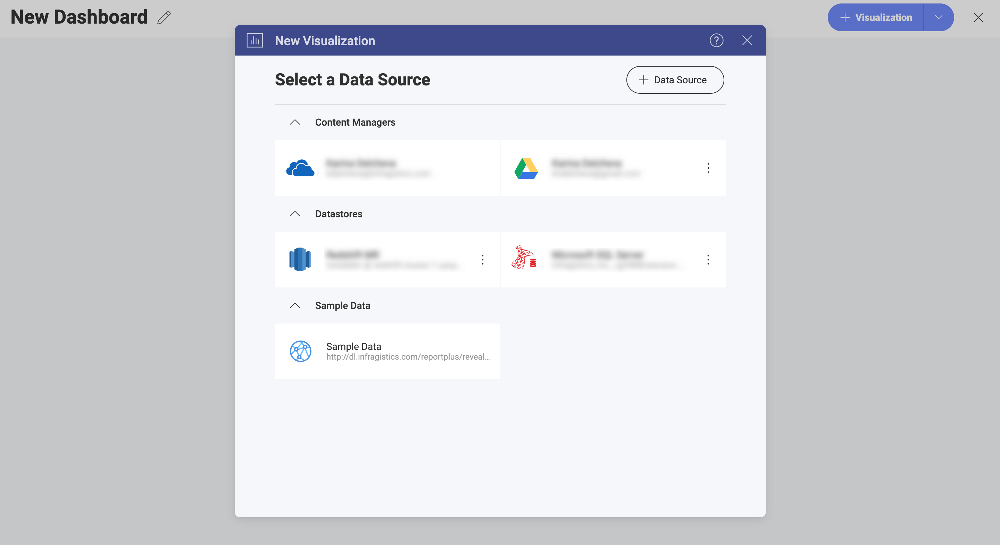
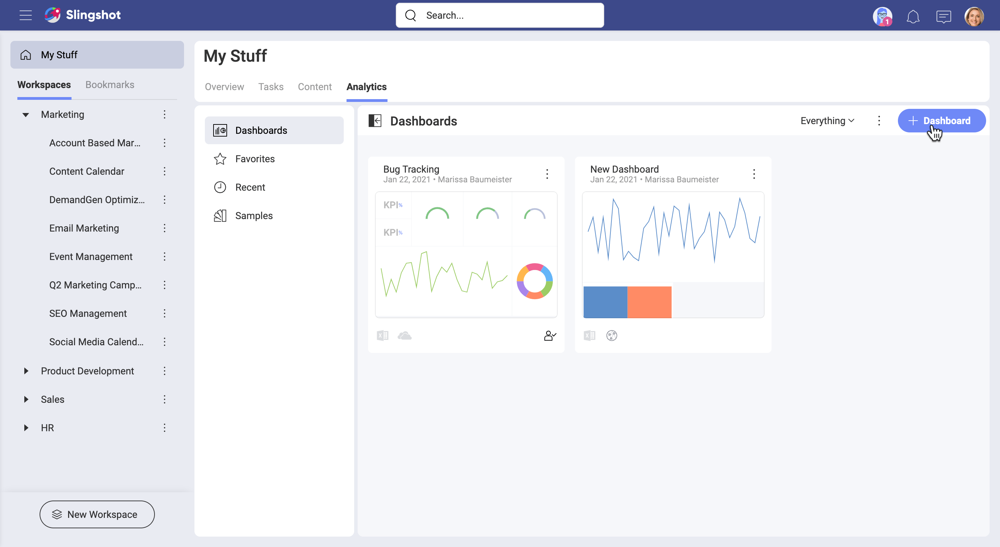
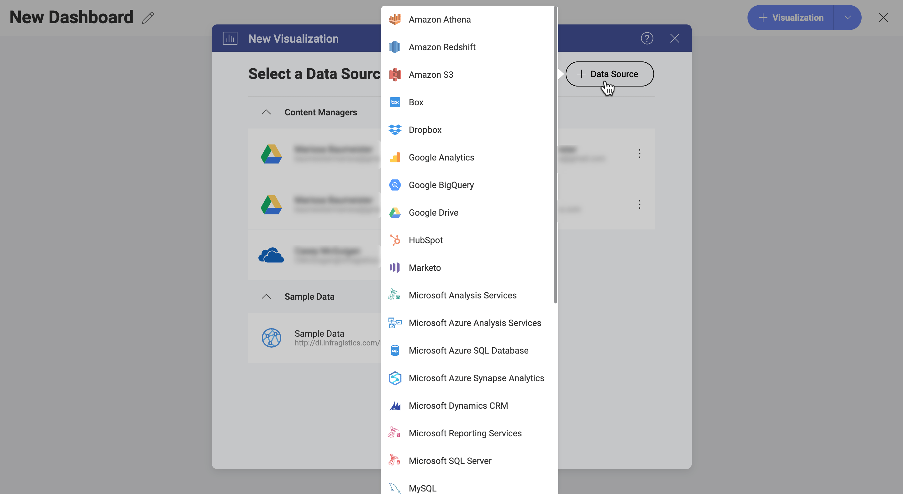

## Data Sources

Data Sources are the places where your data comes from. Analytics provides
you with the opportunity to connect to different enterprise data sources. You can choose from analytics tools, content managers, cloud services, CRMs,
databases, spreadsheets, and public data sources.

The screenshot below displays a number of different data sources the user John Williams has connected to in his account.

### Connecting to Data Sources

To retrieve information from a data source and use it for your visualizations you need to connect to it first. Once you have connected to a data source, it will be saved in the _Select a Data Source_ menu (see the screenshot above) for quick selection next time you need it.

To connect to a data source, perform the steps below.  

1. In *Analytics > Dashboards*, click/tap the **+ Dashboard** blue button.
   
2. In the _New Visualization_ dialog, you will see a list of recently used data sources. To create a new connection, select the **+ Data Source** button on the right.
   
3. Select a data source provider from the dropdown list.

After selecting a data source provider, you will be prompted to **configure** it. Not sure how to do this? Find out in the article about the chosen data source (see the list below).

   - [Amazon Redshift](~/docs/analytics/datasources/supported-data-sources/redshift.md)

   - [Box](~/docs/analytics/datasources/supported-data-sourcesbox.md)

   - [Dropbox](~/docs/analytics/datasources/supported-data-sources/dropbox.md)

   - [Google Analytics](~/docs/analytics/datasources/supported-data-sources/google-analytics.md)

   - [Google BigQuery](~/docs/analytics/datasources/supported-data-sources/google-bigquery.md)

   - [Google Drive](~/docs/analytics/datasources/supported-data-sources/google-drive.md)

   - [Hubspot](~/docs/analytics/datasources/supported-data-sources/hubspot.md)

   - [Marketo](~/docs/analytics/datasources/supported-data-sources/marketo.md)

   - [Microsoft Analysis Services](~/docs/analytics/datasources/supported-data-sources/microsoft-analysis-services/configuring-microsoft-analysis-services.md)*

   - [Microsoft Azure Analysis Services](~/docs/analytics/datasources/supported-data-sources/microsoft-azure-analysis-services.md)

   - [Microsoft Azure SQL Database](~/docs/analytics/datasources/supported-data-sources/azure-sql.md)*

   - [Microsoft Azure Synapse Analytics](~/docs/analytics/datasources/supported-data-sources/microsoft-azure-synapse-analytics.md)

   - [Microsoft Dynamics CRM](~/docs/analytics/datasources/supported-data-sources/microsoft-dynamics-crm.md)

   - [Microsoft Reporting Services (SSRS)](~/docs/analytics/datasources/supported-data-sources/microsoft-reporting-services.md)

   - [Microsoft SQL Server](~/docs/analytics/datasources/supported-data-sources/microsoft-sql-server.md)*

   - [MySQL](~/docs/analytics/datasources/supported-data-sources/mysql.md)*

   - [OData Feed](~/docs/analytics/datasources/supported-data-sources/odata-feed.md)

   - [OneDrive](~/docs/analytics/datasources/supported-data-sources/onedrive.md)

   - [Oracle](~/docs/analytics/datasources/supported-data-sources/oracle.md)*

   - [PostgreSQL](~/docs/analytics/datasources/supported-data-sources/postgresql.md)*

   - [Quickbooks](~/docs/analytics/datasources/supported-data-sources/quickbooks.md)

   - [REST API](~/docs/analytics/datasources/supported-data-sources/rest-api.md)

   - [Salesforce](~/docs/analytics/datasources/supported-data-sources/salesforce.md)

   - [SharePoint](~/docs/analytics/datasources/supported-data-sources/sharepoint.md)

   - [Sybase](~/docs/analytics/datasources/supported-data-sources/sybase.md)*

   - [Web Resource](~/docs/analytics/datasources/supported-data-sources/web-resource.md)

   - [JSON files](~/docs/analytics/datasources/working-files/working-with-json-files.md)
   - [Spreadsheets]((~/docs/analytics/datasources/working-files/working-with-spreadsheets.md))

>[!NOTE]
> **Databases** (*) are not supported in the Web version of Analytics.

### Related Topics

- You received a dashboard that consumes data from a data source you still haven't connected to? See how to open it in the [Connecting a Dashboard to Its Data Source](connect-dashboard-to-data-source.md) topic.
- You started creating a visualization, but changed your mind about the data source? Read how to connect to a different data source while you are in the Visualization Editor in [Changing the Data Source for a Visualization](changing-data-source-visualization.md).
- You want to use data from more than one data source for your visualization? Read the [Combining Data Sources in one Visualization](data-blending.md)
