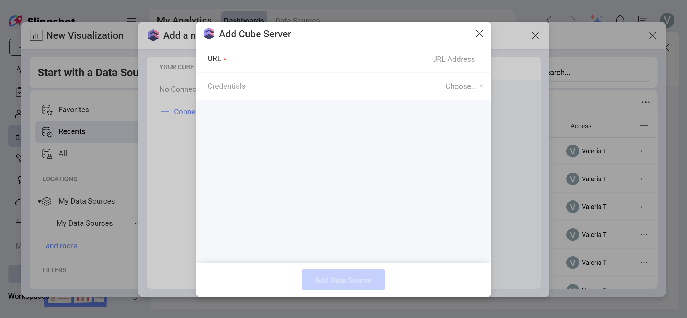

# Cube

>[!NOTE]
**Prerequisites** Make sure you have the following:
- A reachable Cube REST API endpoint, such as `https://your-cube-host/cubejs-api/v1`
- At least one published cube model that Reveal users can query
- A bearer token strategy, such as JWT, if your Cube deployment requires authentication

Cube is a headless business intelligence platform that exposes your data models through a REST API. Connect to Cube as a data source in Slingshot to build dashboards on top of the measures and dimensions defined in your Cube data model.

## Connecting to Cube

To configure a Cube data source, you will need to enter the
following information:

1.  **URL**: the base URL of your Cube deployment's REST API endpoint. For
    Cube Cloud, this is the REST API URL shown in your deployment's connection
    settings.

2.  **Credentials**: after selecting *Credentials*, you will be able to
    enter the credentials for your Cube deployment or select existing
    ones if applicable.

      - **Token**: the authentication token used to access your Cube REST API.
        You can generate this from your Cube deployment.

      - **Alias**: the name for your data source account.

 Once ready, select **Add Data Source**.

For more information about the REST API and authentication tokens, you can check the <a href="https://cube.dev/docs/product/apis-integrations/rest-api" target="_blank" rel="noopener">Cube REST API documentation</a>.

## Setting Up Your Data

After connecting to Cube, you will see the data exposed by your Cube deployment. The **cubes** and **views** defined in your data model appear as tables that you can query.

### Working with Cubes and Views

With Analytics, you can retrieve data from a whole cube or select a particular
<a href="https://cube.dev/docs/product/data-modeling/reference/view" target="_blank" rel="noopener">view</a> that
exposes a curated subset of measures and dimensions from one or more cubes.

In the data source dialog, views appear alongside cubes. Select the cube or view you need to load only the data relevant to your analysis.

## Working in the Visualization Editor

Once your data source has been added, you will be taken to the *Visualization Editor*. Here you can build your dashboard. Note that based on the visualization that you have chosen, you will see different types of fields.

When you are ready with your visualization, you can click/tap on the checkmark in the top right corner to save it as a dashboard in **My Analytics** ⇒ **My Dashboards** or in a specific workspace.

## Related Articles

- [Data Sources Overview](~/docs/analytics/datasources/overview.md)
- [Managing Your Data Source Credentials](~/docs/analytics/datasources/managing-data-source-credentials.md)
- [Combining Data Sources in One Visualization](~/docs/analytics/datasources/data-blending.md)
