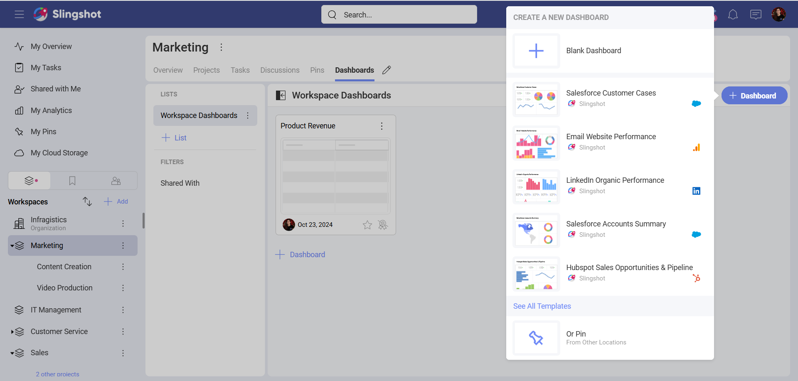
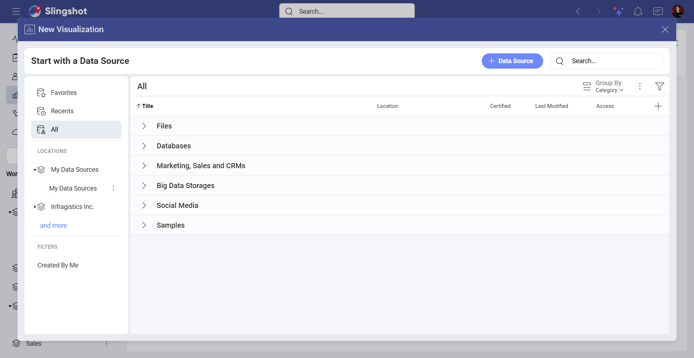
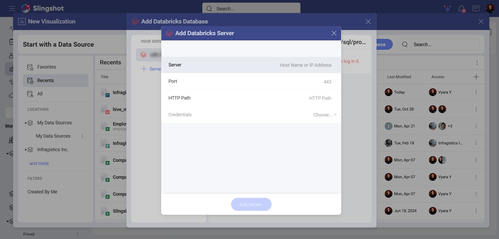
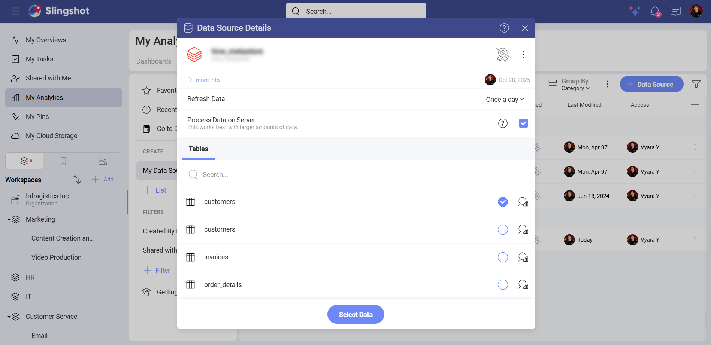
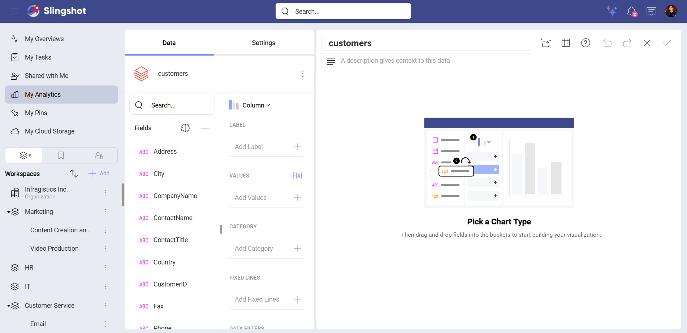
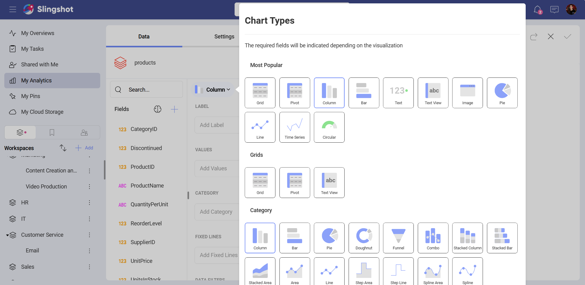
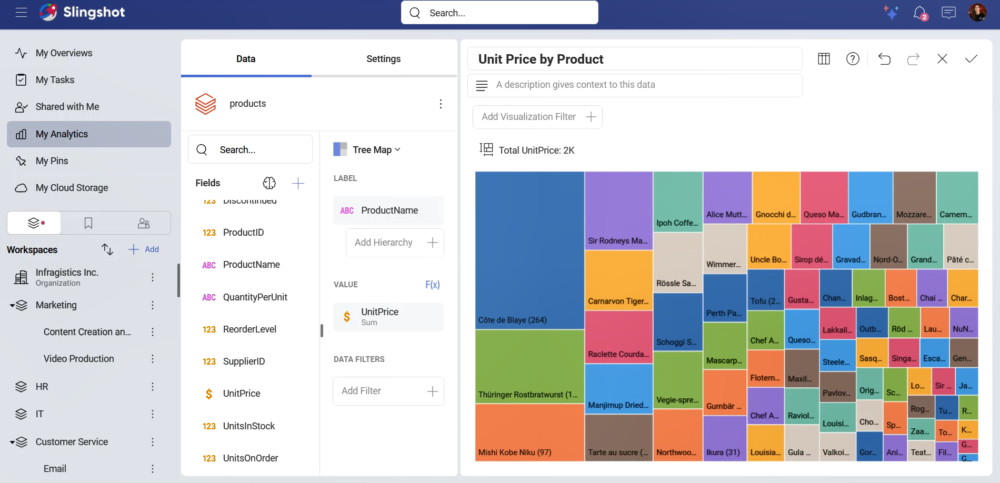

# Databricks

The Databricks data source in Slingshot allows you to access big volumes of data in order to create insightful visualizations.

## Connecting to Databricks

To connect to **Databricks**, you need to:

1.	Click/tap on the **+ Dashboard** button in a dashboard list.

2. Choose **Blank Dashboard**. 

3.	Click on the **+Data Source** button.

4.  Select **Databricks** from the *Data Sources* list.

5.	You will be prompted to enter the following information:

- Server: This is the hostname of the Databricks workspace.

- Port: Here you can enter the server port details. If no information is entered, Analytics will connect to the port in the hint text (443) by default.

- HTTP Path: This is the path to Databricks resources in a server.

- Credentials: After selecting *Credentials*, you will need to enter:

    - Client ID: This is the OAuth application’s client ID.

   - Client Secret: This is the secret associated with the OAuth application.

If you want to find more information about how you can obtain the connection details (Server, Port, and HTTP Path), you can check <a href="https://docs.databricks.com/aws/en/integrations/compute-details" target="blank" rel="noopener">this</a> article.

<a href="https://docs.databricks.com/aws/en/dev-tools/auth/oauth-m2m" target="blank" rel="noopener">Here</a> you can find additional information about your Client ID and your Client Secret.

## Setting up Your Data

Once you have configurated your Databricks data source connection, you can:

1.	Select a database.

2.	Choose a table.

## Working in the Visualization Editor

Once your data source has been added, you will be taken to the [Visualization Editor](/docfx/en/docs/analytics/data-visualizations/visualization-editor.md). Here you can build a dashboard while using the fields within your table.

By default, you will see the *Column* chart. You can select it in order to choose another chart type. 

>[!NOTE] There are different setting options depending on the chart type.  

In our case we wanted to see hierarchical data about unit prices of different products. We selected the Map visualization, chose *ProductName* for **Label** and selected *UnitPrice* for **Value**.

