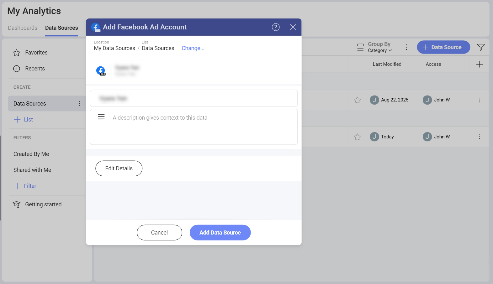
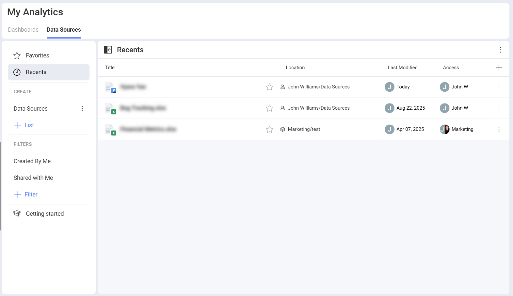
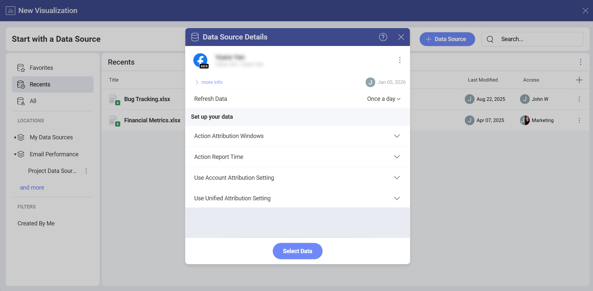
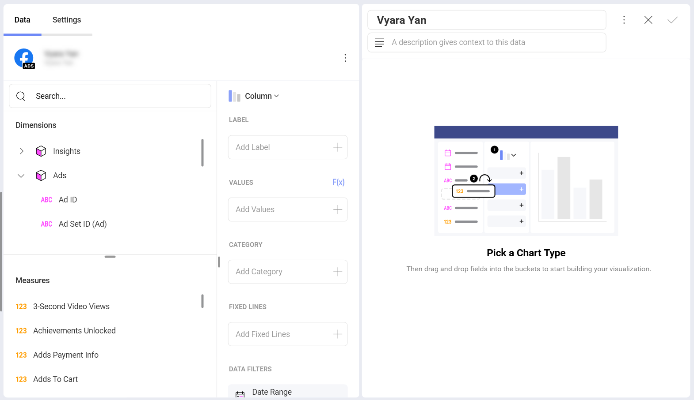
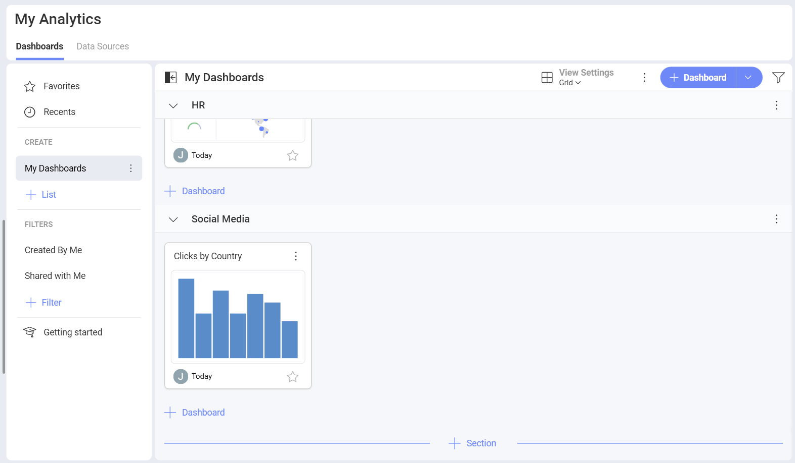

# Facebook Ads

The *Facebook Ads* data source connector in *Analytics* allows you to bring your Facebook marketing data to Slingshot. Use your *Ad account* data to create insightful dashboards and measure your business' social media performance.

## Prerequisites

Before you try using the *Facebook Ads* data source in Analytics, make sure that:

- You use a <a href="https://www.facebook.com/business/help/" target="_blank">Facebook for Business</a> account.

- In the <a href="https://www.facebook.com/business/help/200000840044554?id=802745156580214" target="_blank">*Ads Manager*</a>, you have <a href="https://www.facebook.com/business/help/910137316041095?id=420299598837059" target="_blank">added, requested or created an *Ad account*</a> for the profile or Facebook page you want to connect.

- The *Ad account* for the profile/page you want to connect is not deactivated. If you are not sure, use this <a href="https://www.facebook.com/business/help/1798922733589154" target="_blank">Facebook help article</a> to check and reactivate your Ad account if needed. 

## Adding a New Facebook Data Source Ad Account

If you have already added your Facebook Ads data source to the *Data Sources* list, you can skip this part and continue with [Setting Up Your Data](#setting-up-your-data).

To add a *Facebook Ads* data source to your list, follow the steps described below:

1.	Click on the **+Dashboard** button under the **My Analytics** section.

2.	Click on the **+Data Source** button.

3.	Select *Facebook Ads* that is under **Social Media** in the **Data Sources** list.

4. You will be prompted to log in with your *Facebook* profile. 

    >[!NOTE] You need to have at least one *Ad account* associated with the Facebook profile you are trying to connect in *Slingshot*. 

5. In the next dialog, you will be presented with one or more Facebook Ad Accounts to choose from. Select the account that you want to analyze and click/tap on **Select and Continue**.

6. In the last dialog that opens, you can change the Ad Account name, add an appropriate description, see if the data source is certified (available to *Enterprise* users), and edit the details. Adding appropriate descriptions helps all users navigate through long lists and find the data sources they are searching for. Select **Add Data Source** to finish the process.

You will see your new Facebook Ad account connection added to your recently used Data Sources.

## Setting Up Your Data

From the *Data Sources* list, select the Facebook Ad account you want to connect. You will see the *Data Source details* dialog, which allows you to review and set up your data (look at the screenshot below). 

Here you will find the following data source details: 

- Type and Name

- Description

- [Certification](../../../certifications.md)

- Who added the data source and when

- Who last modified it and when 

- Who (users and workspaces) has access to it 

- How often the data is refreshed. To change the time period, select the drop-down menu on the right.

The settings under **Set up your data** help you choose what data to load in the *Visualization Editor*.

- <a href="https://www.facebook.com/business/help/2198119873776795?id=768381033531365" target="_blank">*Attribution Window*</a>: You can select it in order to show data for a specific time period from the drop-down list.

- *Action Report Time*: You can choose it in order to have data reported *on impression*, *on conversion* and *mixed*.

- <a href="https://www.facebook.com/business/help/460276478298895?id=561906377587030" target="_blank">*Account Attribution Setting*</a>

- *Unified Attribution Setting*

When ready, click/tap on **Select Data** to continue to the *Visualization Editor*. 

## Working in the Visualization Editor

Once your data source has been added, you will be taken to the Visualization Editor. 

By default, the *Column* visualization will be selected. You can click/tap on it in order to choose another chart type from the drop-down menu. 

When you are ready with the visualization editor, you can save the dashboard in **My Analytics** ⇒ **My Dashboards**, a specific workspace or a project. 

If you want to find more information about the data sources, you can head [here](../../datasources/overview.md). 

