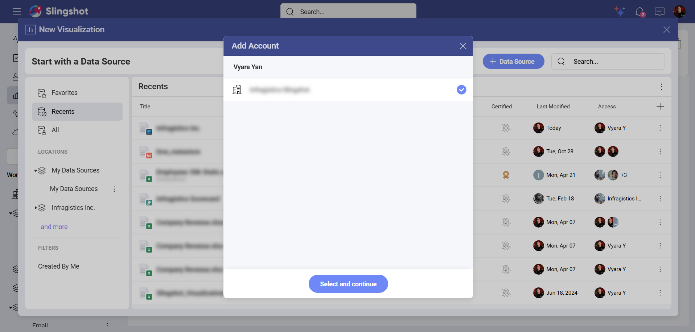
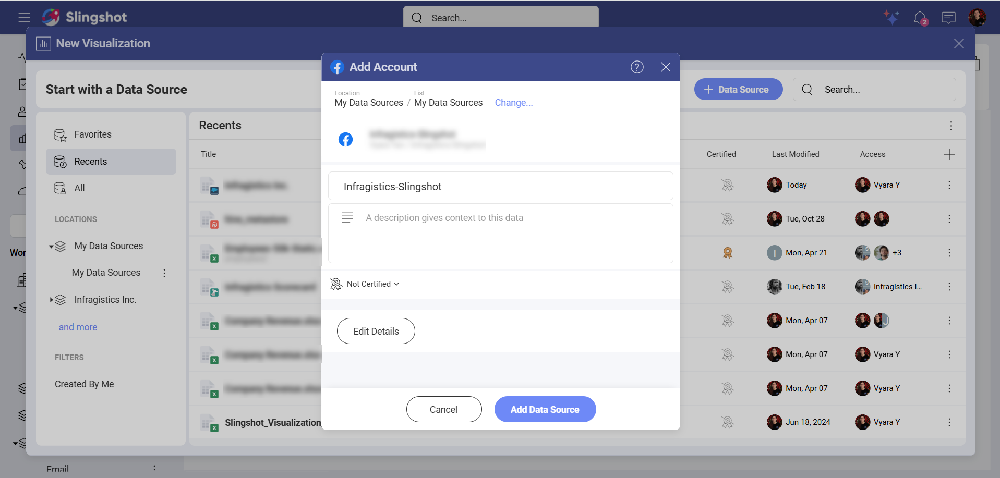
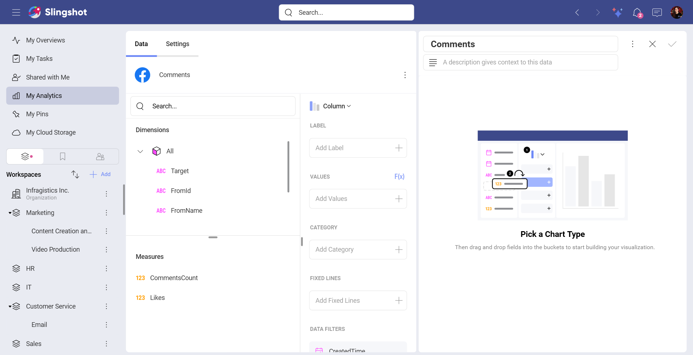

# Facebook Organic

With The Facebook Organic data source connector in Slingshot, you can create visualizations based on data about your unpaid social media performance. 

## Prerequisites 

To connect to *Facebook Organic* in Slingshot, you need to be a **Page Admin** or **Business Admin**. Alternatively, you need to be invited to the Facebook page and have the proper permissions to view insights and page content.

To learn more about the different page permission levels, head <a href="https://www.facebook.com/business/help/1101781386943864" target="blank" rel="noopener">here.</a>

<a href="https://www.facebook.com/help/187316341316631 " target="blank" rel="noopener">Here</a> you can find more information about how you can invite a Facebook user to your page. 

## Connecting to Facebook Organic

If you are a **Page Admin** or a **Business Admin**, you can follow the steps below to connect to the Facebook Organic data source in Slingshot. 

1.	Click/tap on the **+ Dashboard** button in a dashboard list.

2. Choose **Blank Dashboard**. 

3.	Click on the **+Data Source** button.

4.	Select **Facebook** that is under *Social Media* in the *Data Sources* list.

5.	You will be prompted to log in with your **Facebook profile**.

If you have been <a href="https://www.facebook.com/help/1021117938014211" target="blank" rel="noopener">invited to a Facebook page</a>, you need to first accept the invitation. Then, you can follow the steps mentioned above to connect to the Facebook Organic data source in Slingshot.

## Setting up Your Data

After connecting to *Facebook Organic*, you will need to:

1.	Add an account. You will be presented with one or more Facebook Organic Accounts to choose from. Select the account that you want to analyze and click/tap on **Select and continue**.

2.	Add the **Data Source**. Before adding the data source, you can change the Account name, add an appropriate description, see if the data source is certified (available to *Enterprise* users), and edit the details. Adding appropriate descriptions helps all users navigate through long lists and find the data sources they are searching for. 

3.	Choose a table.

## Working in the Visualization Editor

Once you have chosen a table, you will be taken to the *Visualization Editor*. Here you can build a dashboard while using the data within your table.

The Facebook Organic data is organized in two categories that you can use to build your visualization:

- *Dimensions* contain qualitative data ("Target", "Message", etc.).

- *Measures* consist of numeric data.

>[!NOTE]  By default, you will see the *Column* chart. You can select it in order to choose another chart type.

When you are ready with the *Visualization Editor*, you can save the dashboard in *My Analytics* ⇒ *My Dashboards*, a specific workspace or a project.