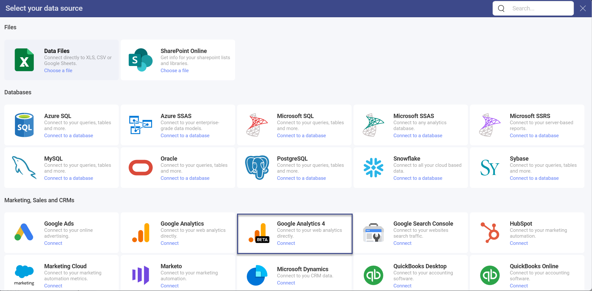
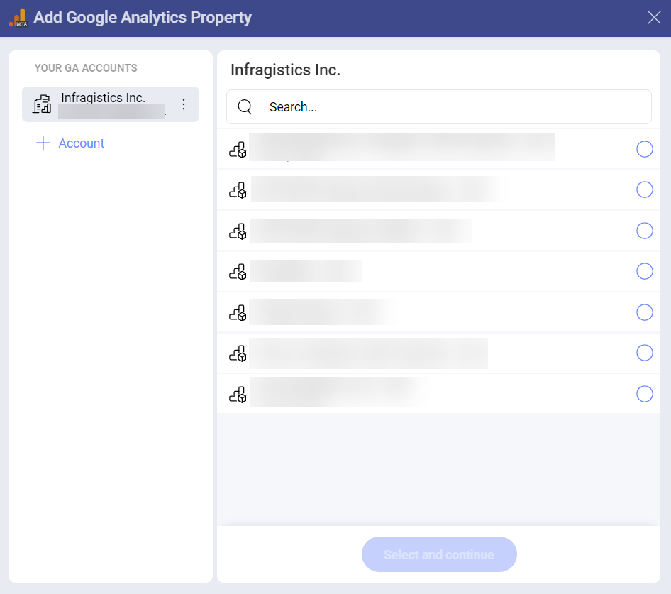
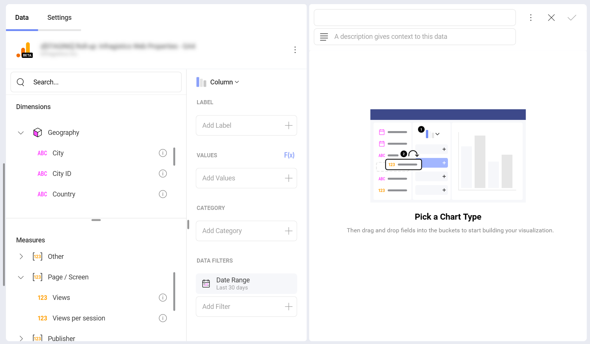
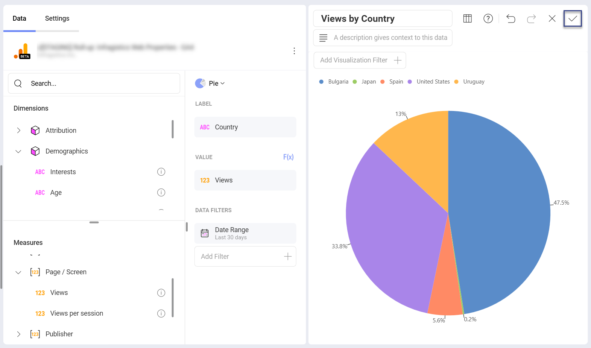
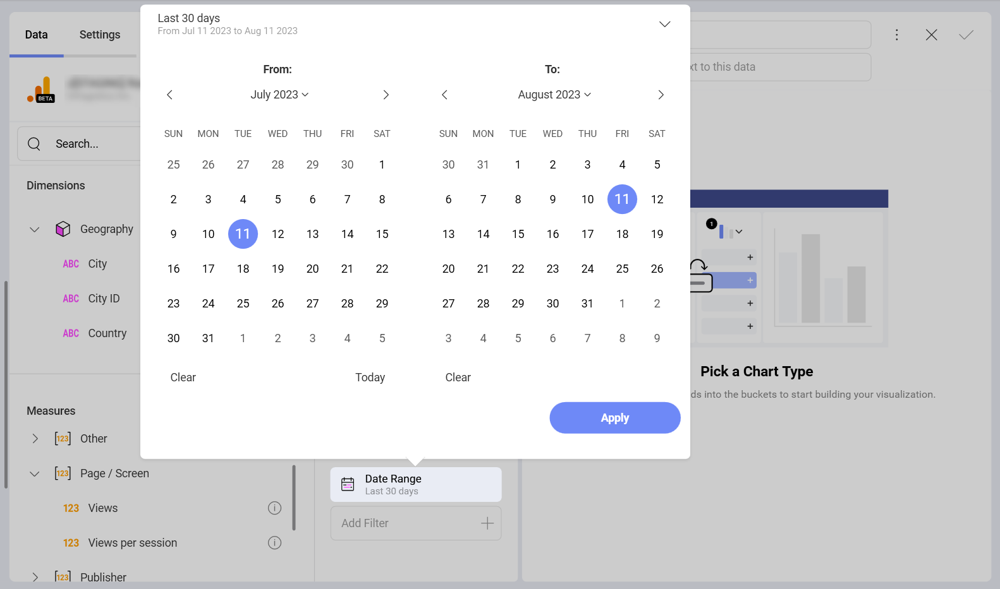

# Google Analytics 4

Google Analytics 4 is one of the most used analytics services on the web. It tracks and reports website traffic.
You can connect your Google Analytics 4 account to Slingshot in order to get clear and concise information with the help of different visualizations.

## Connecting to Google Analytics 4

1.	Select *Google Analytics 4* as your data source in order to see *Google’s* login screen.

2.	Enter your login credentials and click/tap on *Sign In*. In case you see an authorization prompt, you can choose *Allow*.

3.	If you have several Google Analytics accounts, select the one you want to use.

4.	Select the Google Analytics property that you want to use.

## Working in the Visualization Editor

Once your data source has been added, you will be taken to the *Visualization Editor*. Here you can build your dashboard with the help of visualizations.

Note that the Column visualization is selected by default. You can click/tap on it in order to choose another chart type from the drop-down menu. You will see the data presented in two categories:

- **Dimensions** (depicted by a cube icon with a pink side): Dimensions are attributes of your data. For example, the dimension *Country* (under *Geography*) shows where your website's audience comes from.

- **Measures** (depicted by 123 icon): Measures consist of numeric data. For example, the measure *Views* (under *Page/Screen*) indicates the number of views for a certain period of time.

To learn more about dimensions and metrics, you can check <a href="https://support.google.com/analytics/answer/9143382" target="_blank">this</a> article.

>[!Note] Some dimensions and measures cannot be used together. For a list of valid dimensions-measures combinations, you can refer to the <a href="https://ga-dev-tools.google/ga4/dimensions-metrics-explorer/" target="_blank">Dimensions & Metrics Explorer</a> on the Google Developer website.

When you are ready with your visualization, you can save it as a dashboard by clicking/tapping on the checkmark in the top right corner. 

## Date Range Data Filter

You can filter your data by selecting a specific data range in the calendar. You can also choose one of the preset date ranges by clicking the arrow in the upper right corner:

If you want to find out more information about the different data sources, you can head [here](/docfx/en/docs/analytics/datasources/overview.md). 

