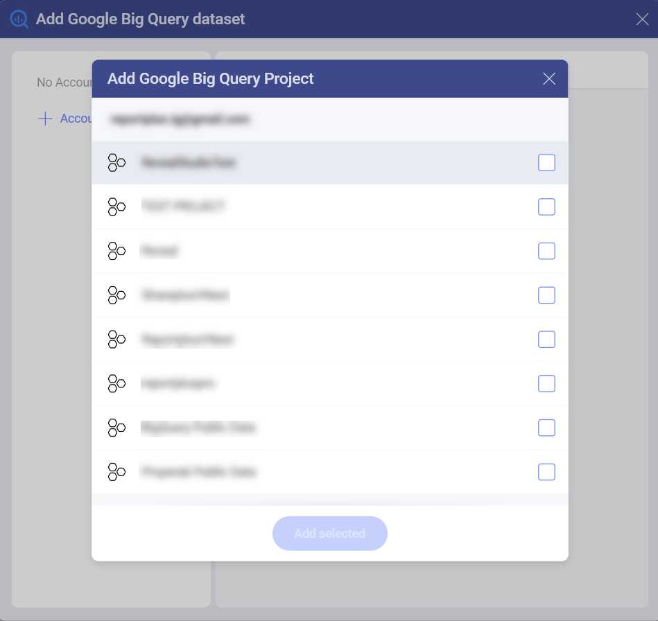

# Google BigQuery

The Google BigQuery data source provides a significant speed increase
when processing big data within Analytics. This allows you to use datasets
with millions of records for your visualizations with no slow down.

## Connecting to Google BigQuery

Upon selecting Google BigQuery, you will be prompted to connect to your
**Google account**.

Once you've added a Google account, you will have access to your BigQuery
datasets. To start using them for your visualizations, you need to:

1.  **Select a project** in the *New Data Source* dialog that opens up:

    

2.  **Select a dataset** by marking the empty circle next to it:

    

3.  **Select a table** from the dataset. Use the *magnifying glass* icon on the right
    to preview the data.

    

You are now directed to the *Visualization editor* where you can start
building your visualizations with the data retrieved from Google
BigQuery.

 

## Limitations in the Visualization Editor

When working with big data in Analytics, there are a couple of limitations
in the Visualization Editor due to the specific approach used to handle
data sources storing millions of records.

### Limitations in Functions Available for Calculated Fields

Currently, only a limited number of **functions** are available for
*Calculated Fields* using data from BigQuery:

- [Date](~/docs/analytics/data-visualizations/fields/calculated-fields/date.md) - date; time.

- [Logic](~/docs/analytics/data-visualizations/fields/calculated-fields/logic.md) - false; true; if; not.

- [Math](~/docs/analytics/data-visualizations/fields/calculated-fields/math.md) - abs; exp; log; log10; mod; rand; sign; sqrt; trunc.

- [Strings](~/docs/analytics/data-visualizations/fields/calculated-fields/string.md) - find; len; trim; lower; mid; upper.

### Limitations in Data Blending

Currently, Data Blending ([combining data sources in one visualization](~/docs/analytics/datasources/data-blending.md)) is **not available** when using data from the Google BigQuery data source.
