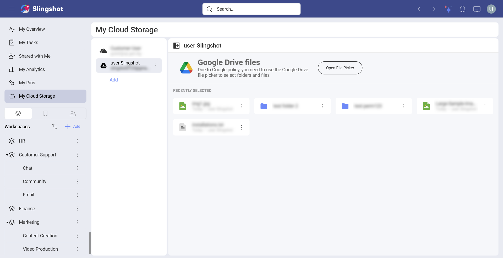
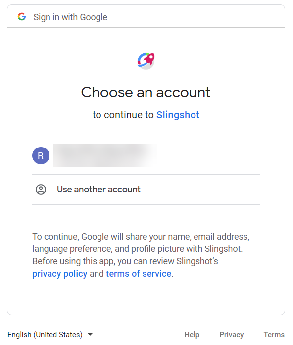
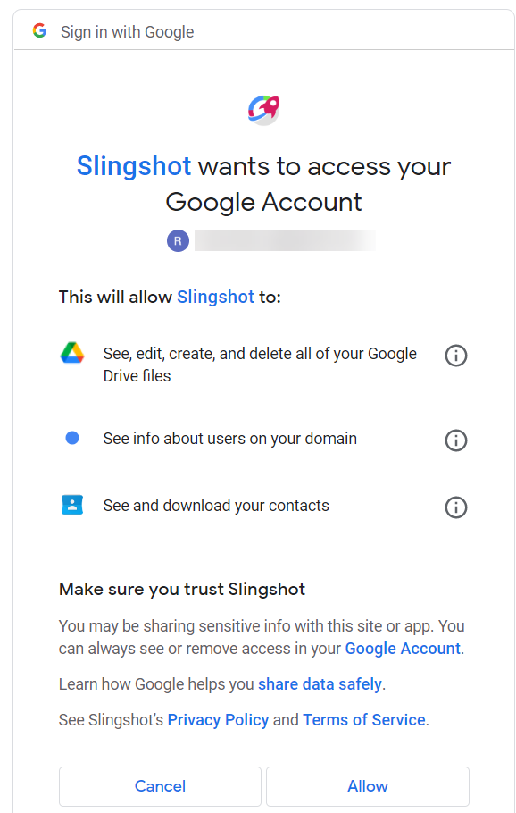
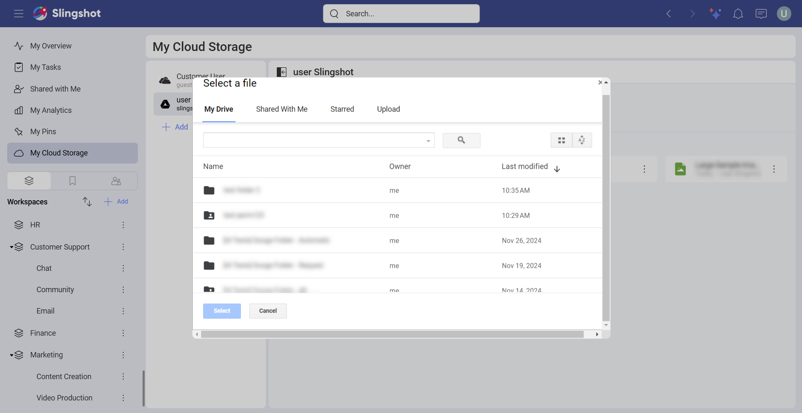

# Google Drive

If you are signed in with your Google account, you will have your Google
Drive automatically added to your data sources:

To use your Google Drive data, follow the steps below.

1.  Upon selecting your Google Drive (or a folder inside it), you will be prompt to choose an account and connect it to the app. Enter your **login credentials** or choose an account and select *Next*.

    
    
2. An **authorization prompt** will pop up. You can select **Allow** to finish the process.

   

Once you have added Google Drive to the list of cloud storages, you won't be asked for these permissions again. 

## File Picker

To use your files from your Google Drive account, you need to click/tap on **Open File Picker**. A dialog will open up, containing the following sections:

- My Drive - You can browse through all your Google Drive files.

- Shared with Me - You can see all the Google Drive files that users have shared with you.

- Starred -  You can have quick access to specific files that you have starred in your Google Drive account.

- Upload  - You can upload a file by dragging it or selecting it from your device.

Once you have chosen your file, you can use your Google Drive data to build your [visualizations](../../dashboards/creating-dashboards.md).

>[!NOTE] 
>When you click/tap on **Delete** from the overflow menu of a Google Drive file in Slingshot, the file will be stored in your Gooogle Drive *Trash* folder until you delete the file from there as well.

## Supported Files

When working within Analytics, you will be able to use a wide variety of
files:

  - **Spreadsheets & tabular data**: Excel (.xls, .xlsx), CSV, TSV, which you can use
    dynamically within Analytics.

  - **Other files** (including images or document files such as PDFs,
    texts, etc.), which will be displayed in a preview mode only.
