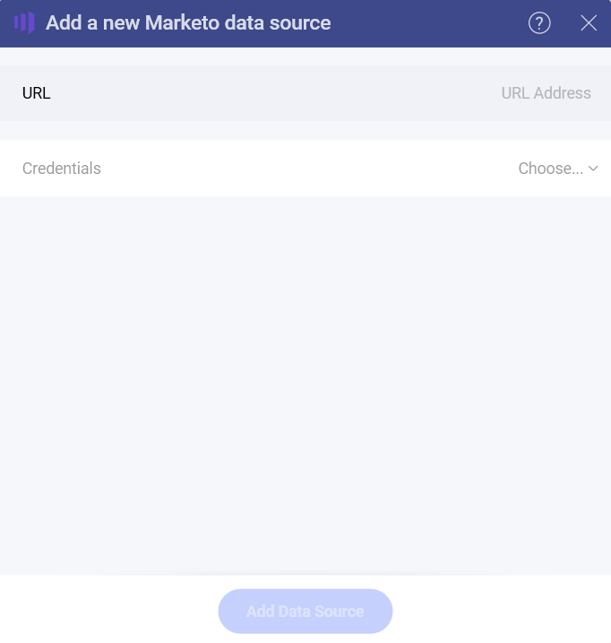
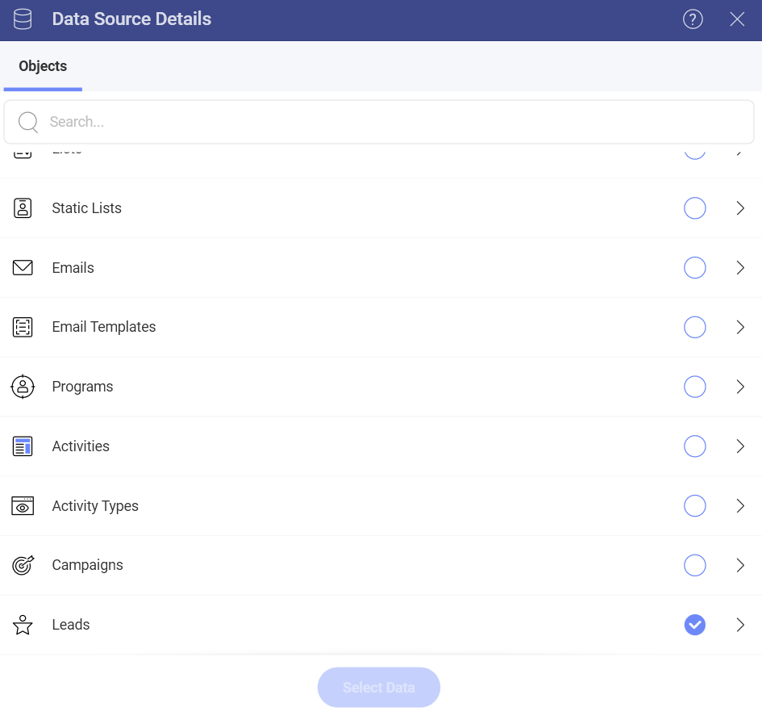
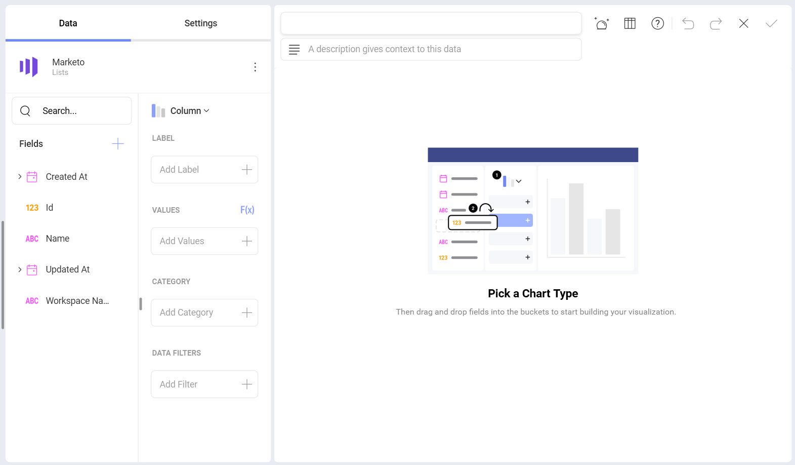
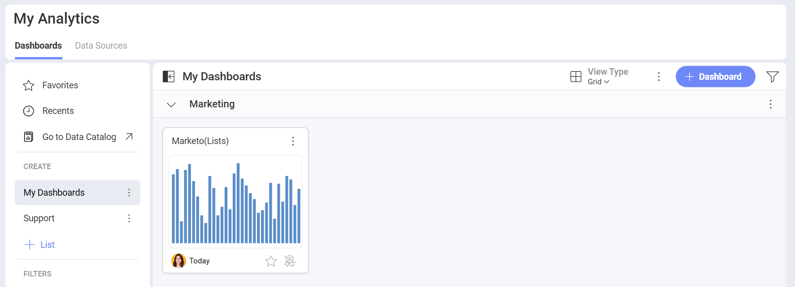

# Marketo 

## Connecting to Marketo 

Upon selecting the Marketo data source, you will see the following screen:

Marketo’s REST APIs are authenticated with 2-legged OAuth 2.0, so you need to complete the following information to configure your connection:

1. **URL** - paste here the *Identity URL* you will find in your Marketo Admin panel. 
2. **Credentials**:
- **Client ID** 
-  **Client Secret**

Your *Admin* panel in Marketo contains the authentication elements listed above. For more information on how to find them, check the article about <a href="https://developers.marketo.com/rest-api/authentication" target="_blank">Authentication</a> in Marketo's documentation. 

If you need details about how to create the OAuth credentials you need, check out <a href="https://developers.marketo.com/rest-api/custom-services/?_fsi=oP2ZRHsM" target="_blank">this</a> article.

## Setting Up Your Data

After logging in, you can set up your Marketo data in the following dialog:

**Activities** and **Leads** objects require you to set two parameters - *From* and *To* (dates) to query the data, before you can continue to the *Visualization editor*. The date range must be no more than 31 days, incl. the first and the last day. 

> [!NOTE]
> Please, note that you may need to wait up to several minutes until your data from the **Activities** and **Leads** objects is loaded in the *Visualization Editor*.  

## Working in the Visualization Editor

Once your data source has been added, you will be taken to the *Visualization Editor*. By default, the *Column* visualization will be selected. You can click/tap on it in order to choose another [chart type](../../visualization-tutorials/overview.md). Keep in mind that based on the visualization that you have chosen, you will see different types of fields.

When you are ready with your visualization, you can click/tap on the checkmark in the top right corner to save it as a dashboard. In the example below we saved the dashboard in **My Analytics** ⇒ **My Dashboards** ⇒ **Marketing**.

