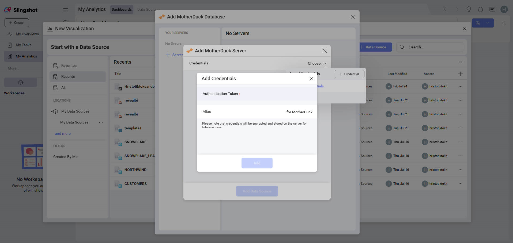

# MotherDuck

MotherDuck is a cloud-based SQL analytics platform built on DuckDB, designed for fast analytical queries on large datasets. Use it as a data source in Slingshot to build interactive dashboards and analyze your data efficiently.

> [!NOTE]
> **Limitations in Web**. In the *Analytics Web* app, you can connect only to publicly accessible MotherDuck accounts. If your MotherDuck workspace is restricted or private, you can use *Analytics Desktop*, *iOS*, or *Android* to connect to it. The device where you're running Analytics needs to have access to your MotherDuck workspace. This limitation does not apply to *Analytics Embedded*.

## Connecting to MotherDuck

To configure a MotherDuck data source, you will need to enter the following information:

1. **Credentials**: after selecting *Credentials*, you will be able to enter the credentials for your MotherDuck workspace or select existing ones if applicable:

   - **Token**: your MotherDuck authentication token. You can generate this from your MotherDuck account settings.

   - **Alias**: the name for your data source account. It will be displayed in the list of accounts in the previous dialog.

   Once ready, select **Add** and then **Add Server**.

For more information about generating your authentication token, you can check the <a href="https://docs.motherduck.com/authentication" target="_blank" rel="noopener">MotherDuck authentication documentation</a>.

## Setting Up Your Data

After connecting to your MotherDuck workspace, you will see a list of available databases. Select the database you want to use, then choose a table or view to load your data.

> [!TIP]
> Use MotherDuck views to return a filtered or aggregated subset of data instead of loading an entire table.

### Working with Tables and Views

With Analytics, you can retrieve data from entire tables or select a particular view that returns a subset of data from one or more tables.

In the data source dialog, views appear alongside tables. Select the table or view you need to load only the data relevant to your analysis.

## Working in the Visualization Editor

Once you have selected your table or view, you will be taken to the *Visualization Editor*. Here you can build your dashboard. By default, the *Column* visualization will be selected. Select it to choose a different chart type.

When you are ready with the visualization editor, you can save the dashboard in **My Analytics** ⇒ **My Dashboards** or in a specific workspace.

## Related Articles

- [Data Sources Overview](~/docs/analytics/datasources/overview.md)
- [Managing Your Data Source Credentials](~/docs/analytics/datasources/managing-data-source-credentials.md)
- [Combining Data Sources in One Visualization](~/docs/analytics/datasources/data-blending.md)
