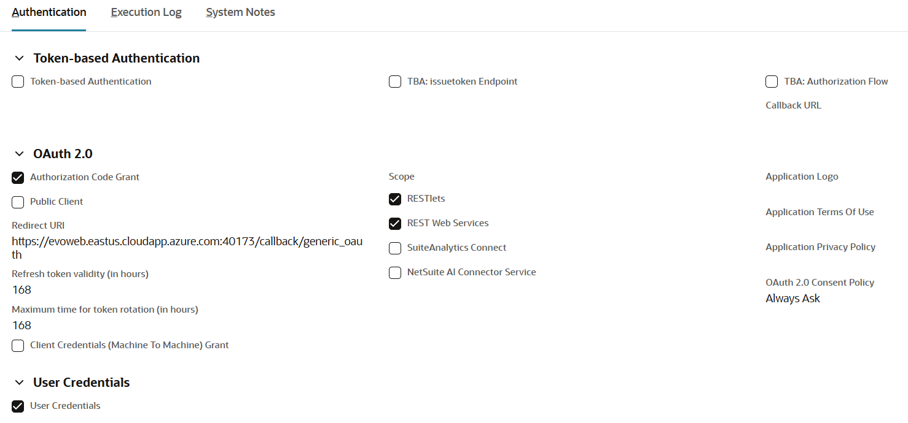
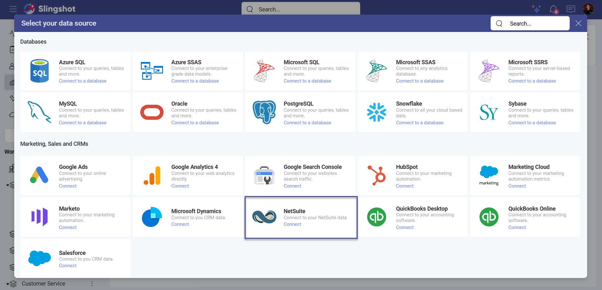
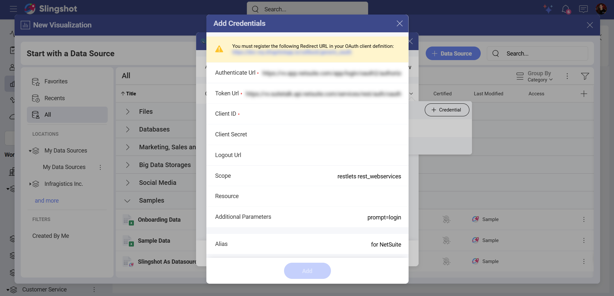
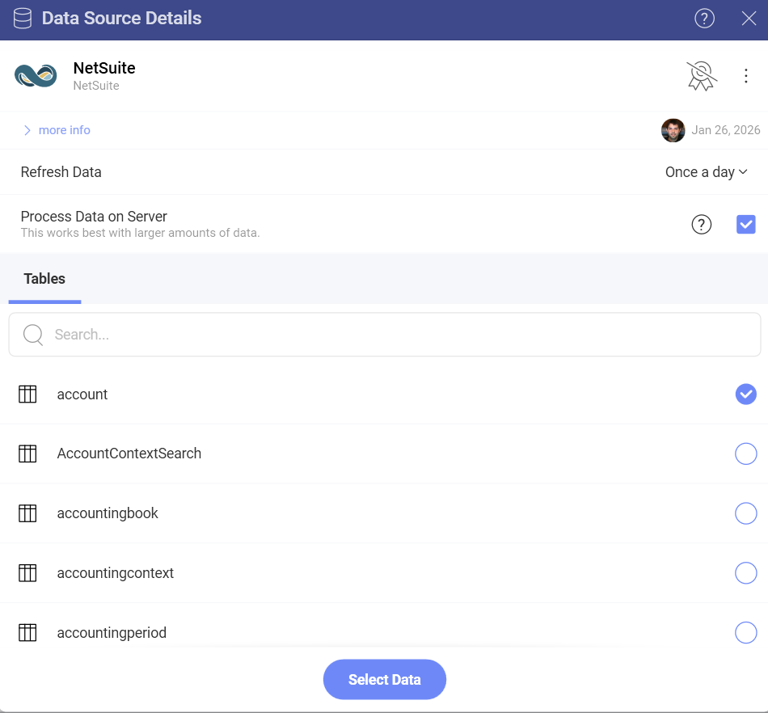
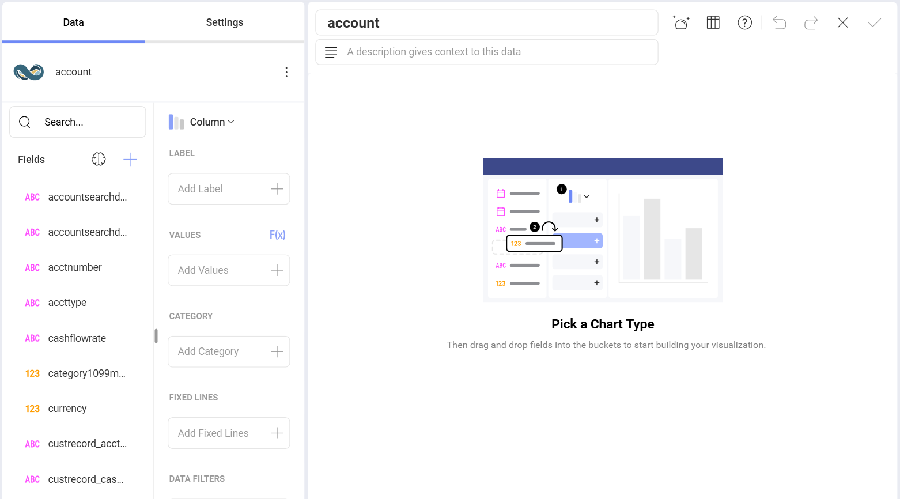

# NetSuite

With the NetSuite data source connector in Slingshot, you can create dashboards to visualize and analyze your business operations and financial performance in real time. Track key metrics, streamline reporting, and gain actionable insights from your NetSuite data.

## Prerequisites 

### Role permissions 

Each NetSuite role should have the appropriate permissions to ensure a successful connection:

- Reports(): Required for SuiteAnalytics Workbook

- Setup(): Required for Logging in using OAuth 2.0 Access Tokens, REST Web Services, and Custom Fields

>[!Note] 
>Tables require addiotional permissions. For example, to access the *Account* table you need to have **Lists()** permissions.

### OAuth 2.0

In order to connect to NetSuite in Slingshot, you need to first set up OAuth 2.0 in NetSuite (if you haven’t already).  

To do that, you need to: 

1. Login to <a href="https://system.netsuite.com/pages/customerlogin.jsp?" target="blank" rel="noopener">NetSuite</a>.

2. Go to **Setup** > **Integration** > **Manage Integrations**.

3. **Create** a new integration record. While creating the new integration you can enter a name for your application as well as give it a description. 

4. On the Authentication subtab, you will need to configure the following settings:

- **OAuth 2.0**: From the options provided, choose **Authorization Code Grant**.

 - **Scopes**: From the provided options, choose **RESTlets** and **REST Web Services**.

- **User Credentials**: Here enable the **User Credentials**.

5. Once you have configured the settings, you will need to register https://my.slingshotapp.io/callback/generic_oauth as the Redirect URL. 

6. You will see your **Client ID** and **Client Secret**. Copy and store them securely. If they get lost, you will need to reset them.

For more information about how to setup a OAuth 2.0 in NetSuite, you can read <a href="https://docs.oracle.com/en/cloud/saas/netsuite/ns-online-help/section_157771733782.html#procedure_157838925981" target="blank" rel="noopener">this</a> article.

## Connecting to NetSuite

To configure a NetSuite data source, you will need to:

1.	Click/tap on the **+ Dashboard** button in a dashboard list.

2. Choose **Blank Dashboard**. 

3.	Click on the **+Data Source** button in the upper right corner.

4.	Select **NetSuite** from the *Data Sources* list.

5.	You will be prompted to enter the following information:

1. **Account ID**: Your NetSuite account identifier. This can be found in your NetSuite URL (for example, if your NetSuite URL is `https://1234567.app.netsuite.com`, your Account ID is `1234567`).

2. **Credentials**: After selecting *Credentials*, you will need to authenticate using OAuth 2.0:

   - Authenticate Url (prefilled): This is the web address that users need to use in order to authenticate themselves.

   - Token Url (prefilled): The format of the token Url is similar to the one of the Authenticate URI.

   - Client ID (required): This is the identifier for your app. Its format is a random combination of symbols.
   
   - Client Secret (required): It is used as an additional protection. Its format is a random combination of symbols.
   
   - Logout Url (Optional): This is the Url used for logging out a user’s authenticated session.
   
   - Scope (Optional): These are values that are used to request additional levels of access.
   
   - Resource (Optional): Here you need to input the URL to the service, which hosts the protected data.
   
   - Additional Parameters (Optional): These are extra fields you can include for your authentication process.
   
   - Alias of the data source: This is the data source name that will be displayed in the list of accounts. You can always change it.

3. When you are ready, click/tap on **Add**.

4. You will be redirected to the *NetSuite* page where you can enter your login details.

5. You will be prompted to give permissions to the Slingshot app. Click/tap on **Continue** to connect your NetSuite account to Slingshot.

## Setting up Your Data

After connecting to NetSuite, you can:

1.	Add an account.

2.	Add the **Data Source**. Before adding the data source, you can change the Account name, add a description, see if the data source is certified (available to *[Enterprise](../../../slingshot-enterprise-subscription.md)* users), and edit the details. Adding appropriate descriptions helps all users navigate through long lists and find the data sources they are searching for.

3. **Select a table**: Choose the table that contains the data you want to analyze.

## Working with the Visualization Editor

Once you have chosen a table, you will be taken to the <a href="https://www.slingshotapp.io/en/help/docs/analytics/data-visualizations/visualization-editor" target="blank" rel="noopener">Visualization Editor</a>. Here you can build a dashboard while using the fields within the table.

>[!Note] By default, you will see the *Column* chart. You can select it in order to choose another chart type. 

When you are ready with the Visualization Editor, you can save the dashboard in *My Analytics* ⇒ *My Dashboards*, your organization, a specific workspace or a project.

### Common Connection Issues

**Problem**: "Account ID cannot be null or empty"

**Solution**: 

Verify that your NetSuite Account ID is correctly entered. Check your NetSuite URL to confirm the account identifier.

**Problem**: OAuth authentication fails

**Solution**: 

- Ensure the integration record is enabled in NetSuite

- Verify that the callback URL is correctly configured

- Check that your NetSuite user has the required permissions

**Problem**: Cannot access expected data

**Solution**:

- Verify your NetSuite role has access to the required records

- Check that the relevant NetSuite features are enabled

- Ensure proper record-level permissions are configured
