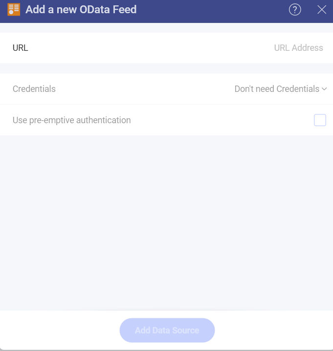
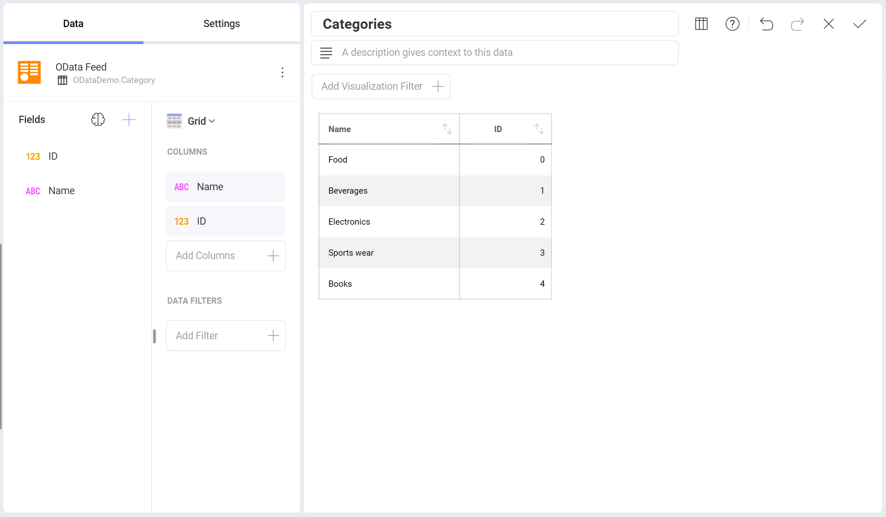
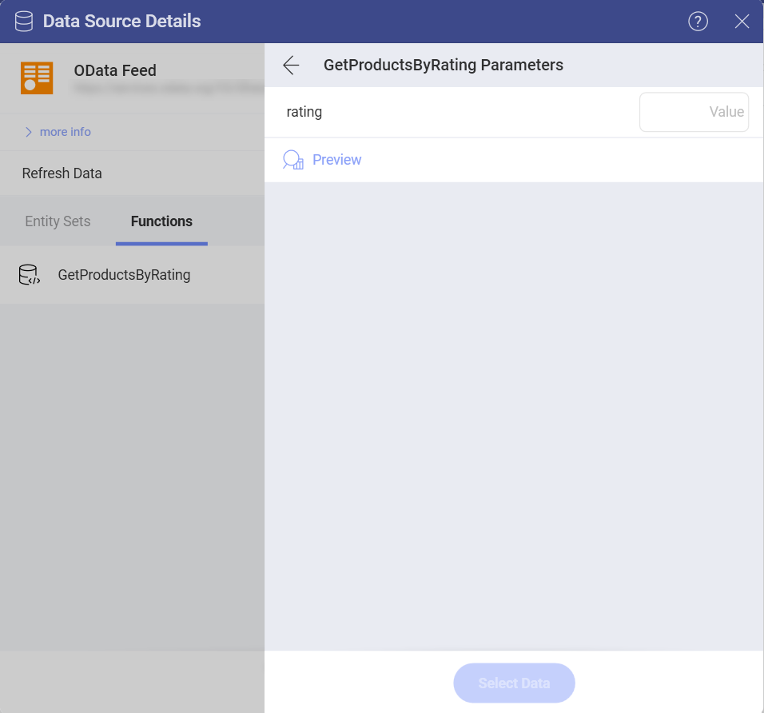
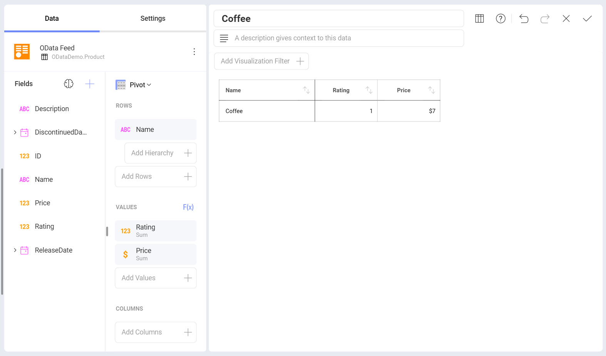

# OData Feed

## Connecting to OData Feed

To configure an OData Service data source, you will need to enter the
following information:

1.  **URL**: the URL where the service is located (for example, <http://services.odata.org/Northwind/Northwind.svc> for the Northwind OData Test Service).

2.  **Credentials**: after selecting *Credentials*, you will be able to
    enter the credentials for your OData Service or choose existing ones,
    if applicable.
    
      - **Username**: the user account for the OData Service or the name of the domain, if
        applicable.

      - **Password**: the password to access the OData Service, if
        applicable.
      
      - **Alias**: Your data source name will be displayed in the list of accounts in the previous dialog. By default, Analytics names it *OData Feed*. You can change it to your preference.

Once ready, select **Add Data Source**.

To set up an *OAuth 2 / OIDC account* for a protected OData Service data
source, please read [this topic](~/docs/analytics/datasources/OAuth-2-OIDC-User-Authentication.md).

## Open Type Columns

Analytics supports OData feeds with dynamic <a href="https://docs.microsoft.com/en-us/aspnet/web-api/overview/odata-support-in-aspnet-web-api/odata-v4/use-open-types-in-odata-v4" target="_blank">*open type*</a>
columns. After any changes to the dynamic OData feed, you only need to
refresh the dashboard, and the new data will be picked up.

The following example uses
[one](https://services.odata.org/V3/OData/\(S\(bwrmr2ccg0nex5gmubqxjkkz\)\)/OData.svc/)
of the dynamic OData samples. A visualization was created initially,
which had two fields (**ID** and **Name**) with four categories.

A new record with a new Property was added to the Category section through <a href="https://www.odata.org/getting-started/learning-odata-on-postman/" target="_blank">Postman</a>.
After the changes, the dashboard was refreshed to display the new
record.

For more information on Open Types in OData, refer to <a href="https://docs.microsoft.com/en-us/aspnet/web-api/overview/odata-support-in-aspnet-web-api/odata-v4/use-open-types-in-odata-v4" target="_blank">this article</a>.

## Working with Functions

Any functions you have configured to be exposed by an OData service will
appear in the **Visualization Data** menu for your data source under the
**Functions** tab.

Depending on your function, you might need to enter one or more values
to get your data. The V3 OData sample includes the following sample
function, where you have to enter a **rating** value to get results.

Once ready, the *Visualization Editor* will load the fields in the data
source which meet the function condition.

For more information on OData functions, please refer to <a href="https://docs.microsoft.com/en-us/aspnet/web-api/overview/odata-support-in-aspnet-web-api/odata-v4/odata-actions-and-functions" target="_blank">this article</a>.
