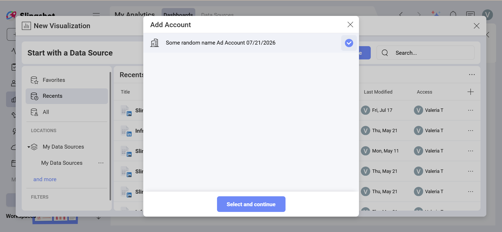

# Reddit Ads

The *Reddit Ads* data source connector in *Analytics* allows you to bring your Reddit advertising data to Slingshot. Use your *Ad account* data to create insightful dashboards and measure your business' advertising performance on Reddit.

## Prerequisites

Before you try using the *Reddit Ads* data source in Analytics, make sure that:

- You have a <a href="https://ads.reddit.com/" target="_blank" rel="noopener">Reddit Ads</a> account.

- You have at least one *Ad account* that you have access to and that has campaign data to analyze.

- Your Reddit account has permission to view the reporting data for the *Ad account* you want to connect.

## Adding a New Reddit Ads Data Source Account

If you have already added your Reddit Ads data source to the *Data Sources* list, you can skip this part and continue with [Setting Up Your Data](#setting-up-your-data).

To add a *Reddit Ads* data source to your list, follow the steps described below:

1.	Click on the **+Dashboard** button under the **My Analytics** section.

2.	Click on the **+Data Source** button.

3.	Select *Reddit Ads* that is under **Social Media** in the **Data Sources** list.

4. You will be prompted to log in with your *Reddit* account and authorize *Analytics* to access your advertising data.

    >[!NOTE]
    >You need to have at least one *Ad account* associated with the Reddit account you are trying to connect in *Slingshot*.

5. In the next dialog, you will be presented with one or more Reddit Ad Accounts to choose from. Select the account that you want to analyze and click/tap on **Select and Continue**.

6. In the last dialog that opens, you can change the Ad Account name, add an appropriate description, see if the data source is certified (available to *Enterprise* users), and edit the details. Adding appropriate descriptions helps all users navigate through long lists and find the data sources they are searching for. Select **Add Data Source** to finish the process.

You will see your new Reddit Ad account connection added to your recently used Data Sources.

## Setting Up Your Data

From the *Data Sources* list, select the Reddit Ad account you want to connect. You will see the *Data Source details* dialog, which allows you to review and set up your data.

Here you will find the following data source details:

- Type and Name

- Description

- [Certification](../../../certifications.md)

- Who added the data source and when

- Who last modified it and when

- Who (users and workspaces) has access to it

- How often the data is refreshed. To change the time period, select the drop-down menu on the right.

When ready, click/tap on **Select Data** to continue to the *Visualization Editor*.

## Working in the Visualization Editor

Once your data source has been added, you will be taken to the *Visualization Editor*.

By default, the *Column* visualization will be selected. You can click/tap on it in order to choose another chart type from the drop-down menu.

When you are ready with the visualization editor, you can save the dashboard in **My Analytics** ⇒ **My Dashboards**, a specific workspace or a project.

If you want to find more information about the data sources, you can head [here](../../datasources/overview.md).
