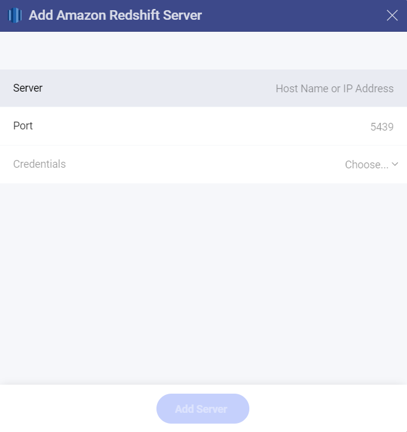
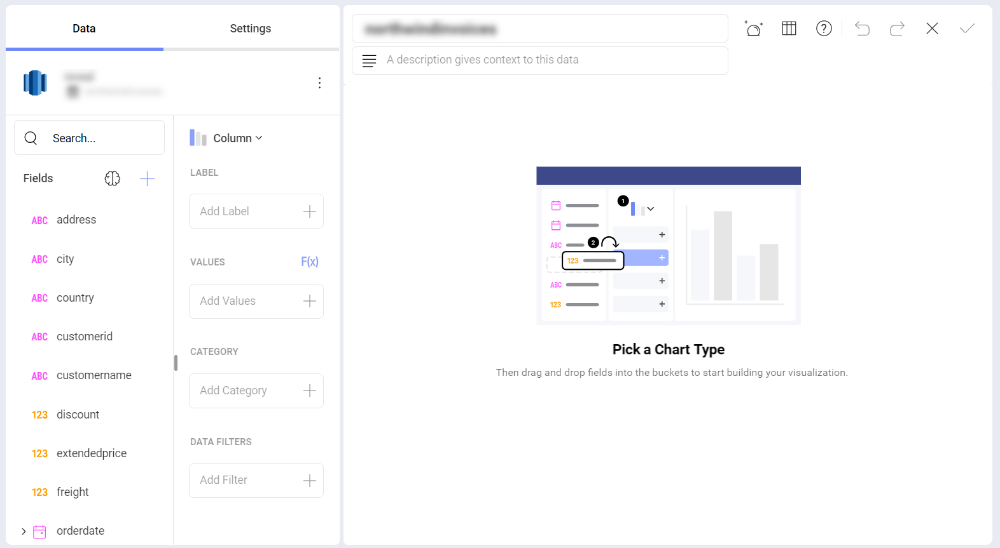

# Amazon Redshift

## Connecting to Amazon Redshift
To configure an Amazon Redshift data source, you will need to enter the following information:

1.  **Default name** of the data source: Your data source name will be displayed in the list of accounts in the previous dialog. By default, Slingshot names it *Amazon Redshift*. You can change it to your preference. 

2.  [**Server**](#connecting-to-amazon-redshift): the computer name or IP address assigned to the computer on which the server is running.

3.  **Port**: if applicable, the server port details. If no information is entered, Reveal will connect to the port in the hint text (5432) by default.

4.  **Credentials**: after selecting *Credentials*, you will be able to
    enter the credentials for your *Redshift* server or select existing
    ones if applicable.

      - **Username**: the user account for the *Redshift* server or the name of the domain.

      - **Password**: the password to access the *Redshift* server.

      - **Alias**: the name for your data source account. It will be
        displayed in the list of accounts in the previous dialog.

## How to find your Server Information

You can find your server by following the steps below. Please note that
the commands should be executed on the server.

| WINDOWS                                                                                                         | LINUX                                                                                                         | MAC                                                                  |
| --------------------------------------------------------------------------------------------------------------- | ------------------------------------------------------------------------------------------------------------- | -------------------------------------------------------------------- |
| 1\. Open the File Explorer.                                                                                     | 1\. Open a Terminal.                                                                                          | 1\. Open System Preferences.                                         |
| 2\. Right Click on My Computer \> Properties.                                                                   | 2\. Type in **$hostname**                                                                                     | 2\. Navigate to the Sharing Section.                                 |
| Your Hostname will appear as "Computer Name" under the *Computer name, domain and workgroups settings* section. | Your Hostname will appear along with your DNS domain name. Make sure you only include **Hostname** in Reveal. | Your Hostname will be listed under the "Computer Name" field on top. |

You can find your *IP address* by following the steps below. Please note
that the commands should be executed on the server.

| WINDOWS                              | LINUX                             | MAC                                                           |
| ------------------------------------ | --------------------------------- | ------------------------------------------------------------- |
| 1\. Open a Command Prompt.           | 1\. Open a Terminal.              | 1\. Launch your Network app.                                  |
| 2\. Type in **ipconfig**             | 2\. Type in **$ /bin/ifconfig**   | 2\. Select your connection.                                   |
| **IPv4 Address** is your IP address. | **Inet addr** is your IP address. | The **IP Address** field will have the necessary information. |

## Setting Up Your Data

With Slingshot, you can retrieve *Redshift* data from entire tables, but you can also select a particular <a href="https://docs.aws.amazon.com/redshift/latest/dg/r_CREATE_VIEW.html/" target="_blank">
view</a> that returns a subset of data from a table or a set of tables instead.

## Working in the Visualization Editor

Once your data source has been added, you will be taken to the Visualization Editor. 

By default, the *Column* visualization will be selected. You can click/tap on it in order to choose another chart type from the drop-down menu. 

When you are ready with the visualization editor, you can save the dashboard in **My Analytics** ⇒ **My Dashboards**, a specific workspace or a project by clicking/tapping on the checkmark in the upper right corner. 

If you want to find more information about the data sources, you can head [here](../../datasources/overview.md). 