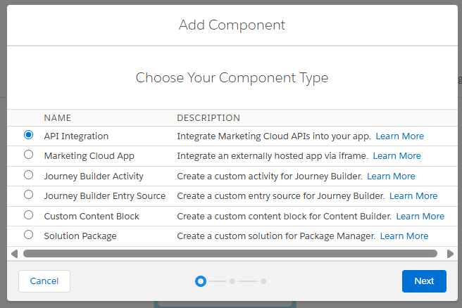
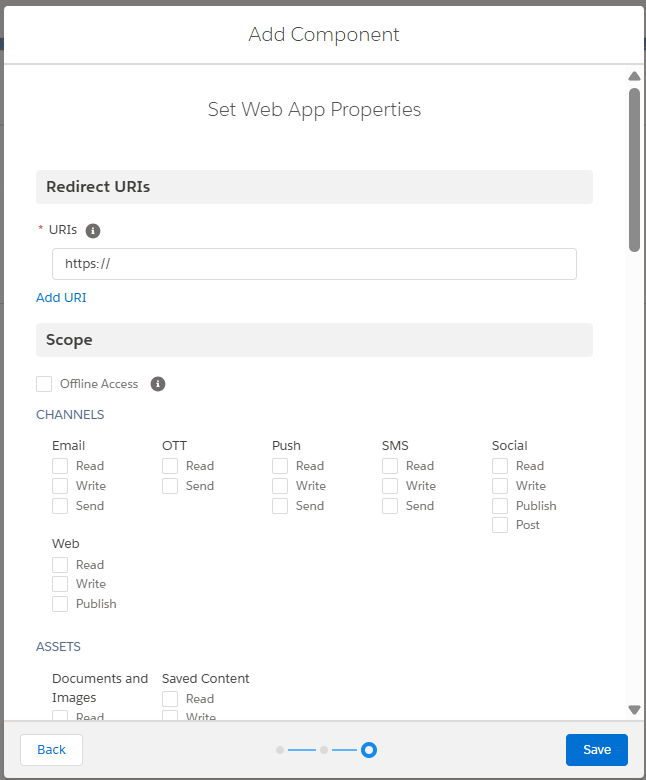
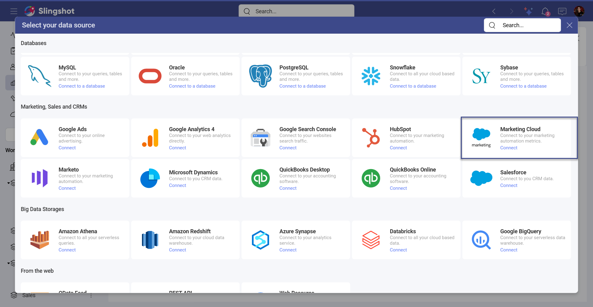
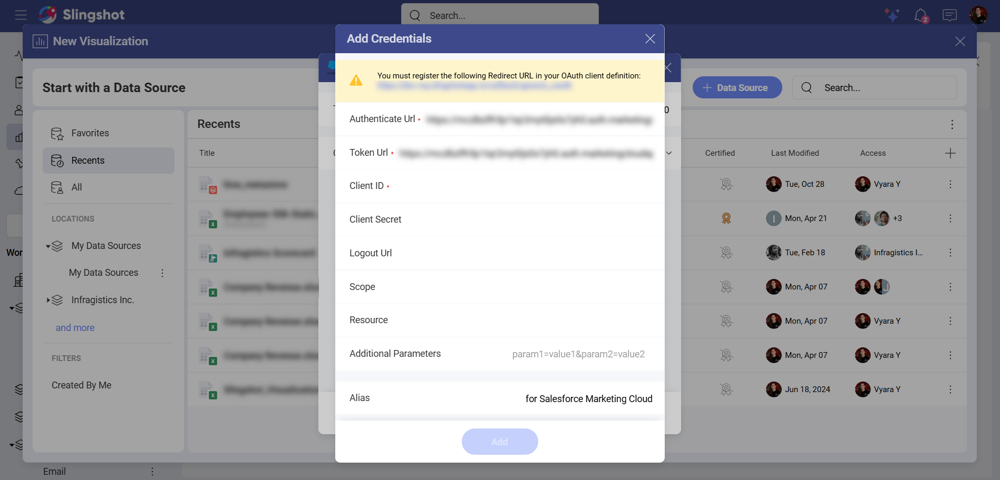
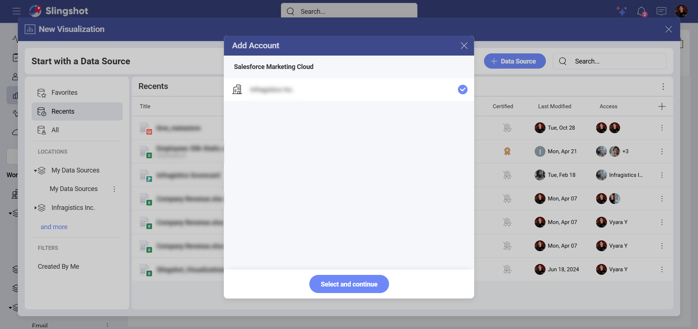
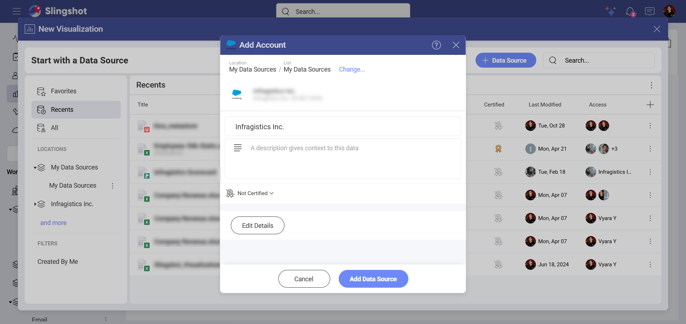
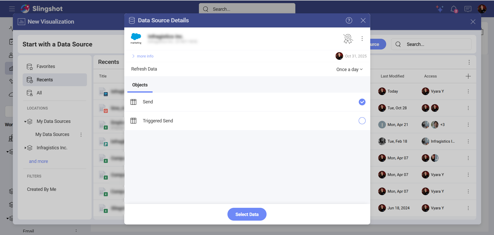
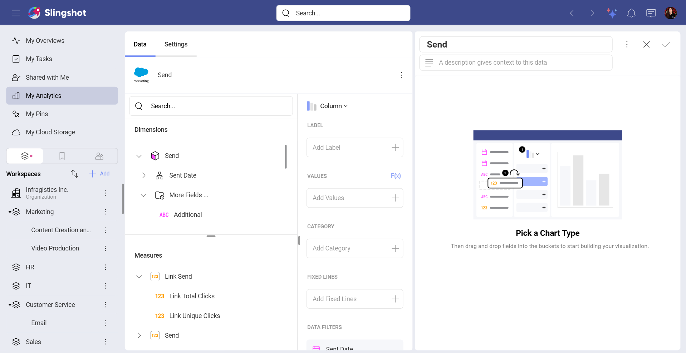

# Salesforce Marketing Cloud

With the Salesforce Marketing Cloud data source connector in Slingshot, you can create dashboards to track the success of your marketing campaigns. Get insightful data about how well you are connecting with your customers.

## Prerequisites 

In order to connect to Salesforce Marketing Cloud in Slingshot, you need to first set up OAuth in Salesforce Marketing Cloud (if you haven’t already).  

To do that, you need to: 

1. Login to <a href="https://mc.exacttarget.com/cloud/login.html" target="blank" rel="noopener">Salesforce Marketing Cloud (SFMC)</a>.

2. Open **Settings/Setup**. 

3. Go to **Platform Tools > Apps > Installed Packages**.

4. **Create** a new package. 

Once you have created a new package, you need to: 

1. Choose **API Integration** from the list of component types. 

2. Choose **Web App** from the list of integration types.

3. You will see a dialog where you can set up the following properties: 

- *Redirect URIs*: Here you can register https://my.slingshotapp.io/callback/generic_oauth as a redirect URI. 

- *Scope*: Here you can select all the **Read** scopes you need to perform reviews.

4. Click/tap on **Save** to store the properties. 

5. You will see your **Client ID** and **Client Secret**. Copy and store them securely as you won’t be able to view the secret again. 

16. Open the **Access** tab. 

7. Add users in order to give them permissions to the package. 

8. Once you have created the component, you can use the values to connect your account to Slingshot. 

>[!Note] 
> You can find your tenant ID in the Authentication Base URI. For example, in this URI "https://abcdef.auth.marketingcloudapis.com" the Tenant ID is abcdef. 

## Connecting to Salesforce Marketing Cloud

>[!Note]
> Only Salesforce Marketing Cloud users with viewing permissions can add a data source account in Slingshot. <a href="https://help.salesforce.com/s/articleView?id=mktg.mc_overview_roles.htm&type=5" target="blank" rel="noopener">Here</a> you can find more information about the different roles in Salesforce Marketing Cloud.

To connect to Salesforce Marketing Cloud, you need to:

1.	Click/tap on the  **+ Dashboard** button in a dashboard list.

2. Choose **Blank Dashboard**. 

3.	Click on the **+Data Source** button in the upper right corner.

4.	Select **Salesforce Marketing Cloud** from the *Data Sources* list.

5.	You will be prompted to enter the following information:

-	*Tenant Subdomain*: This is your ID for your Salesforce Marketing Cloud account. 

-	*Credentials*:

     -	Authenticate URL: This is the web address that users need to use in order to authenticate themselves.

	 - Token URL: The format of the token URL is similar to the one of the Authenticate URL.

	 - Client ID: This is the identifier for your app. Its format is a random combination of symbols.

	 - Client Secret (Optional): It is used as an additional protection. Its format is a random combination of symbols.

	 - Logout URL (Optional): This is the URL used for logging out a user’s authenticated session.

	 - Scope (Optional): These are values that are used to request additional levels of access.

	 - Resource (Optional): Here you need to input the URL to the service, which hosts the protected data.

	 - Additional Parameters (Optional): These are extra fields you can include for your authentication process.

	 - Alias of the data source: This is the data source name that will be displayed in the list of accounts. You can always change it.

## Setting up Your Data

Once you have connected to the Salesforce Marketing Cloud data source, you can:

1.	Add an account.

2.	Add the **Data Source**. Before adding the data source, you can change the Account name, add an appropriate description, see if the data source is certified (available to *Enterprise* users), and edit the details. Adding appropriate descriptions helps all users navigate through long lists and find the data sources they are searching for.

3.	Choose an object.

## Working in the Visualization Editor

Once your data source has been added, you will be taken to the <a href="https://www.slingshotapp.io/en/help/docs/analytics/data-visualizations/visualization-editor" target="blank" rel="noopener">Visualization Editor</a>. Here you can build a dashboard while using the fields within the object.

The Salesforce Marketing Cloud data is organized in two main categories:

-	*Dimensions* (depicted by a cube icon with a pink side): Dimensions are structures used to categorize data that can be measured. Elements in a dimension can be organized by:

     -	Hierarchies – When elements in a dimension are organized by hierarchy, you can use the whole hierarchy or part of it, starting from an element at any lower level. 

    -	Attributes – Elements are organized in single-level hierarchies.

-	*Measures* (depicted by [123] icon): Measures consist of numeric data.

>[!Note] By default, you will see the *Column* chart. You can select it in order to choose another chart type. 

When you are ready with the visualization editor, you can save the dashboard in *My Analytics* ⇒ *My Dashboards*, a specific workspace or a project.
