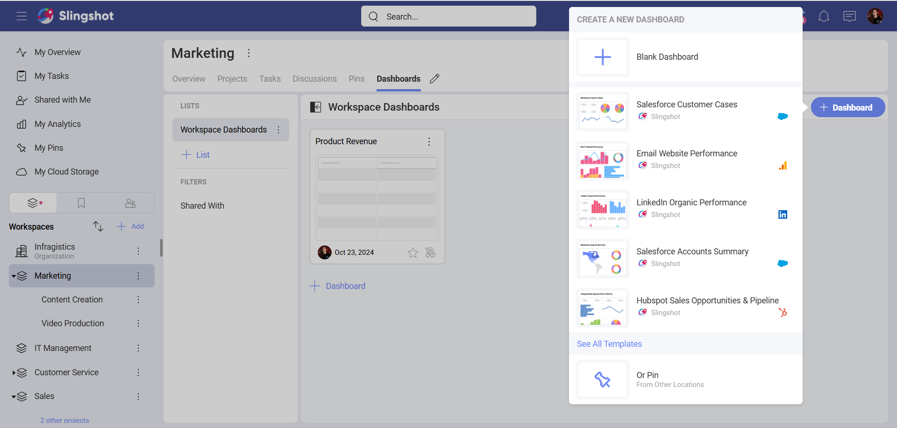
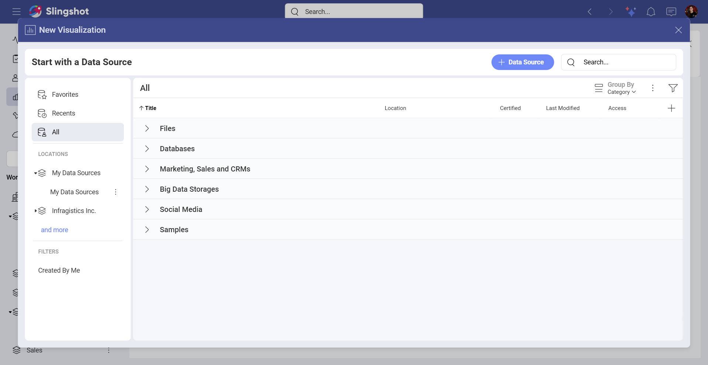

# TikTok Organic

With the TikTok Organic data source connector in Slingshot, you can build visualizations based on unpaid TikTok performance data.

## Connecting to TikTok Organic

To connect the TikTok Organic data source, follow the steps below:

1. Click/tap on the **+ Dashboard** button in a dashboard list.

2. Choose **Blank Dashboard**.

3. Click on the **+Data Source** button.

4. Select **TikTok Organic** that is under *Social Media* in the *Data Sources* list.

5. You will be prompted to log in with your **TikTok profile**.

## Setting Up Your Data

After connecting to *TikTok Organic*, you will need to:

1. Add an account. You will be presented with one or more TikTok Organic accounts to choose from. Select the account that you want to analyze and click/tap on **Select and Continue**.

2. Add the **Data Source**. Before adding the data source, you can change the account name, add an appropriate description, see if the data source is certified (available to *Enterprise* users), and edit the details.

3. Choose a table.

## Working in the Visualization Editor

Once you have chosen a table, you will be taken to the *Visualization Editor*. Here you can build a dashboard while using the data within your table.

By default, you will see the *Column* chart. You can select it in order to choose another chart type.

When you are ready with the *Visualization Editor*, you can save the dashboard in *My Analytics* ⇒ *My Dashboards*, a specific workspace, or a project.

## Related Articles

- [Data Sources Overview](~/docs/analytics/datasources/overview.md)
