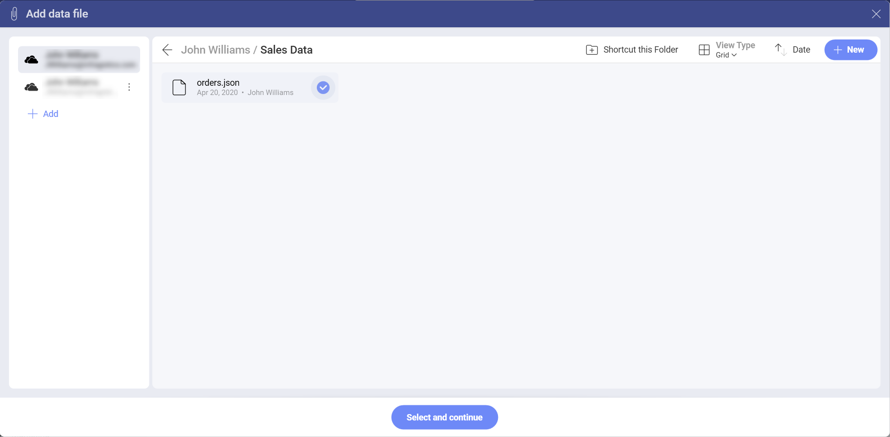
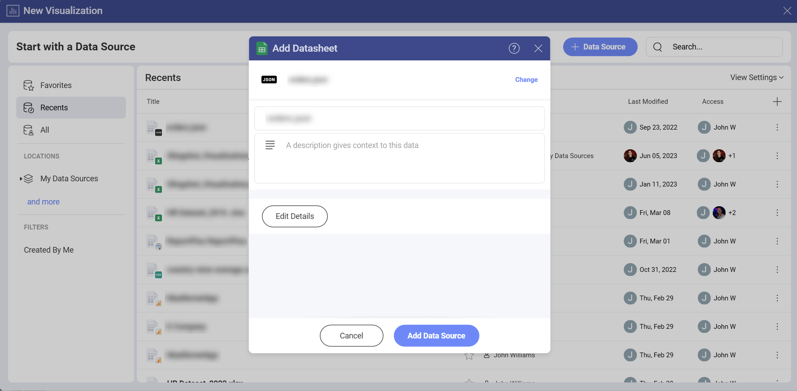
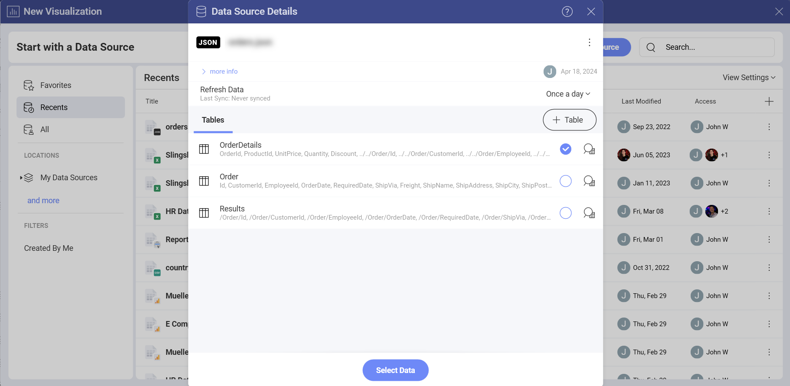
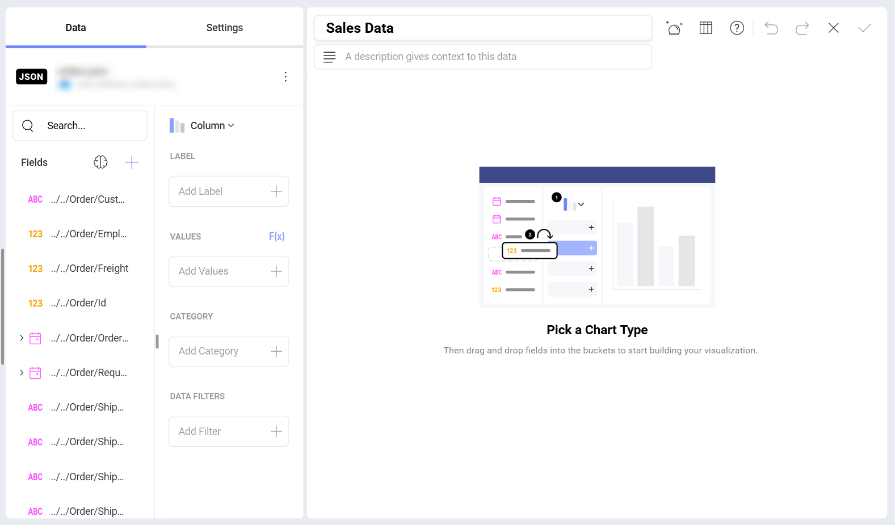
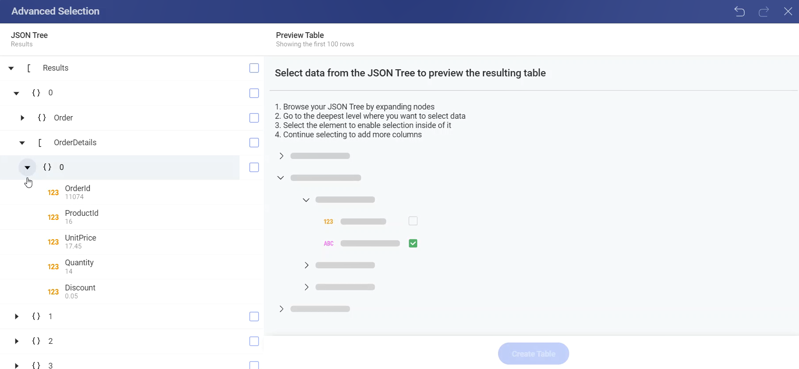
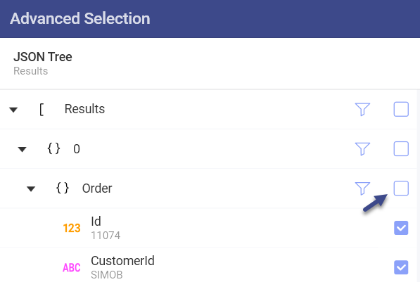
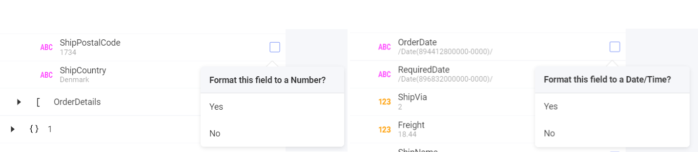
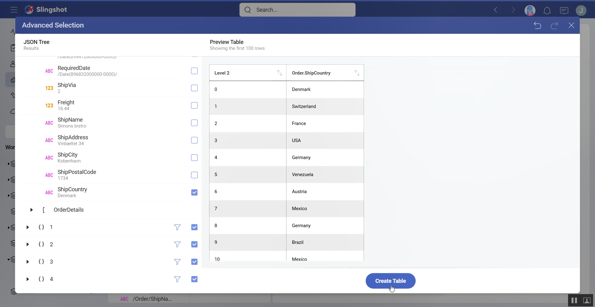

# Working With JSON Files

The JSON format is fully supported in Slingshot as your visualizations can
consume data from any JSON file.

After reading your JSON file format, you will be presented you with possible
data structures you may want to use. In addition, there is an
[**Advanced Selection**](#advanced-selection-mode) mode where you can
choose a custom data structure.

## JSON Format Information

JSON (**J**ava**S**cript **O**bject **N**otation) is a self-describing
lightweight format for storing and exchanging data.

Format highlights:

  - JSON, as a format, can be used to **represent different
    structures of data**.

  - Data is always arranged as **name/value pairs, separated by
    commas**.

  - Data types' notation includes: curly braces **{} for objects** and
    **square brackets \[\] for arrays**.

## Loading a JSON file

Follow these steps to create a new visualization that consumes data from
your JSON file:

1.  **Make your file available**.

    Upload the JSON file to one of your storage providers, so you can
    later access it from Slingshot. You can choose between the following
    available options: Dropbox, OneDrive, Box, Google Drive, and
    SharePoint.

2.  **Locate your file**.

    2.1.  Choose the storage provider with the file and provide your login credentials.

    2.2.  Navigate the provider and select your JSON file.

    

     2.3 Click/tap on **Add Data Source** in order to choose a location for it and save it. You can edit the details of the file, if needed.

     

3.  **Choose the data structure you want**.

    Once you've added the file to your list of data sources, you will be presented with a list of possible
    data structures for you to choose from.

    

    If the list does not include the data structure you want, use the
    [**Advanced Selection**](#advanced-selection-mode) mode where you
    can choose a custom data structure.

4.  **Click/tap on Select Data**.

    Once you selected the data structure, click/tap on the *Select Data*
    button to continue to the *Visualization Editor*. Here you can shape your dashboard.

    

## Advanced Selection Mode

JSON files can be used to represent different data structures.
Because of this, Slingshot allows you to choose a custom data structure for
you to work with. After selecting the data columns you want to work
with, you can build your visualization upon them. To do that, you need to:

1.  **Open the Advanced Selection mode**.

    Click/tap on **+ Table** in order to get access to the *Advanced Selection*
    screen.

    

2.  **Navigate the JSON Tree**.

    Expand the nodes and select the deepest level where you want to
    select the data from.

    

3.  **Select the tree elements and fields you want**.

    You need to select a tree element (object **[ ]** or array **{ }**)
    to enable child selection.

    |                                                                             |                                                                                                                                           |
    | --------------------------------------------------------------------------- | ----------------------------------------------------------------------------------------------------------------------------------------- |
    |  | After selecting one or more children, you can unselect the parent elements (Objects and Arrays) to leave them out of your data structure. |

4.  (*Optional*) **Format text fields to Date/Time or Number**.

    When selecting a field, Slingshot reads its values, autodetects the
    optimal format, and presents a dialog where you can choose what to
    do.

    

5.  **Click/tap on Create Table**.

    Once you've selected your custom data structure, click/tap on *Create Table* to continue to the *Visualization Editor*.
    
    

