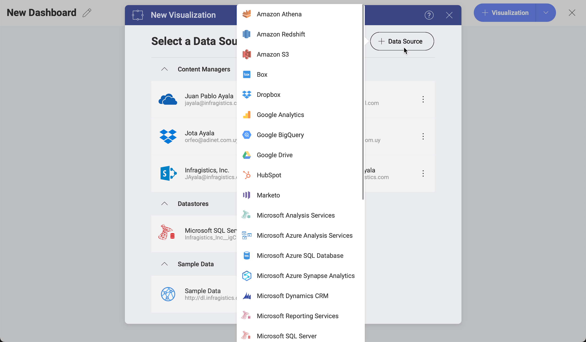
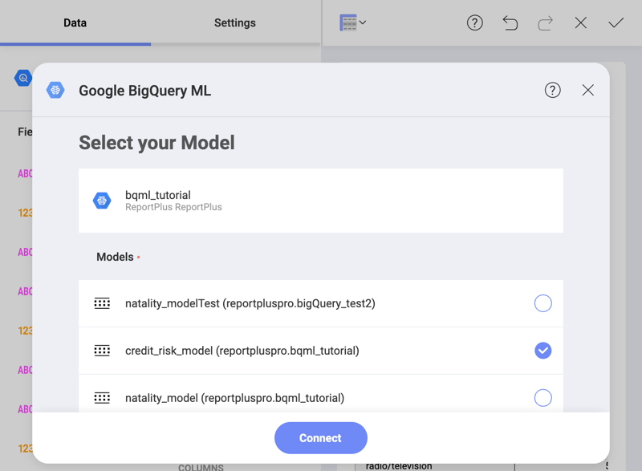

## Analytics Overview

Slingshot comes with a business intelligence solution integrated, one that puts the power in your hands to work with data analytics. 
You can quickly create and edit dashboards, easily query and filter data sources, build meaningful visualization over data and effortlessly share your work with other Slingshot users. 

### Feature Highlights

|  |  |
|:-|:-|
| <h4>Securely Connect to your Data and Build Powerful Data Visualizations </h4>  Connect to the most popular data sources without setting anything up on the server. With an intuitive drag and drop interface, Slingshot makes it simple to create dashboards within minutes. Choose from more than 20 different visualizations to present your data and tell your story the best way. |  |
| <h4>Customize your Data Visualizations </h4>  Sort, filter and aggregate your data as you wish! Each chart type provides you with different settings to design your visualizations the way you want. |  |
| <h4>Interact with your Dashboards</h4>  Once your dashboard is created, interact with your visualizations with drill-down support, or even the ability to change visualization on the fly. Create and share annotated images of your visualizations for deeper insights. |  |
| <h4>Leverage Advanced Predictive Analysis</h4>  Get even more insight from your visualizations with advanced predictive analysis, using statistical functions. You can use the Time series forecast, Linear regression, and Detect outliers to make predictions, recognize and evaluate trends, or discover outliers in your data series. |  |
| <h4>Get Better Insights with Machine Learning</h4>  Use your trained models' data from BigQuery or Azure Machine Learning Studio in Slingshot. In just three steps, choose your data source, build a visualization, and use the integration to connect to a trained machine learning model. |  |