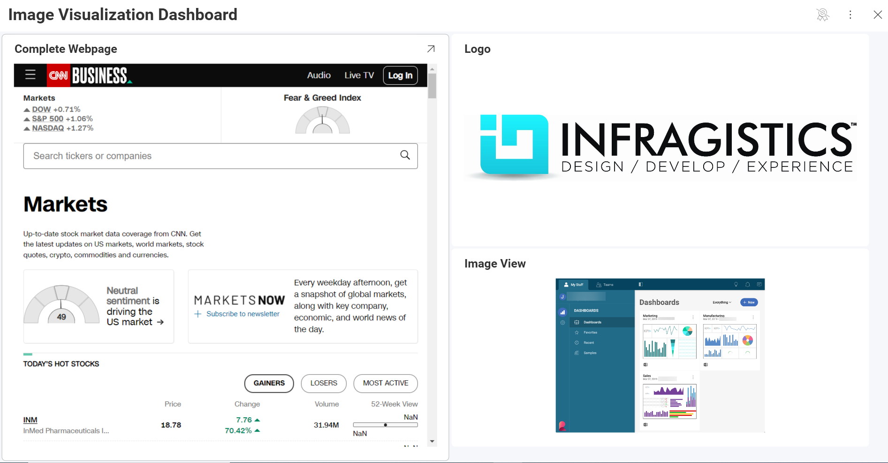
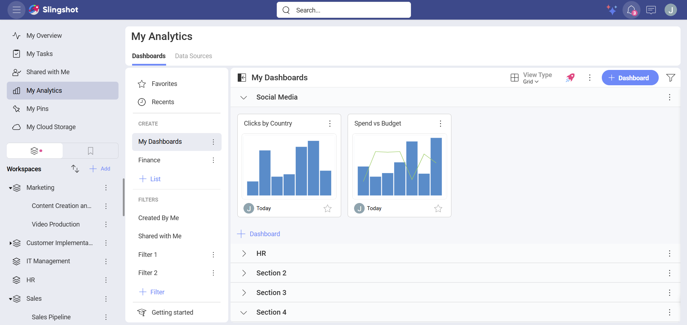
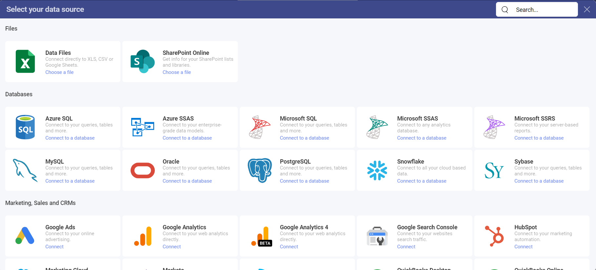
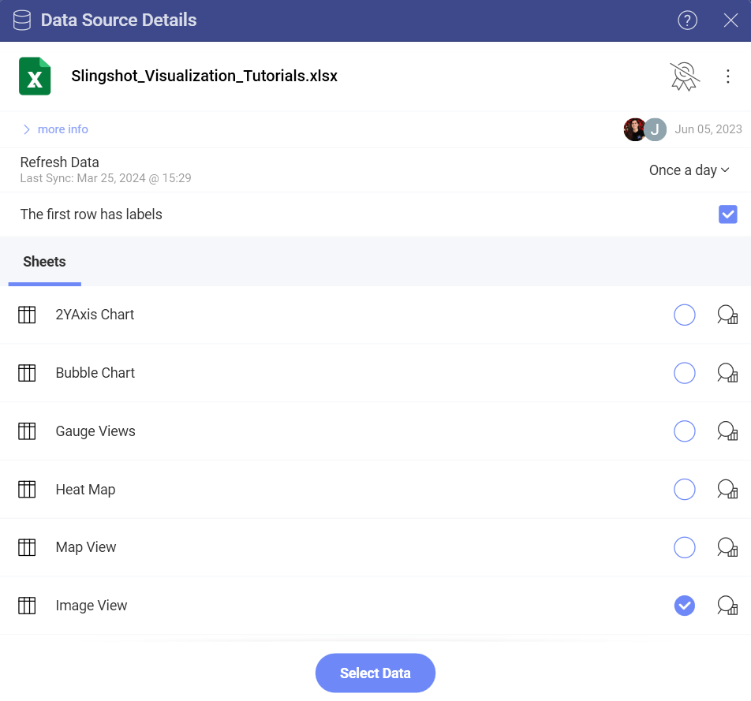
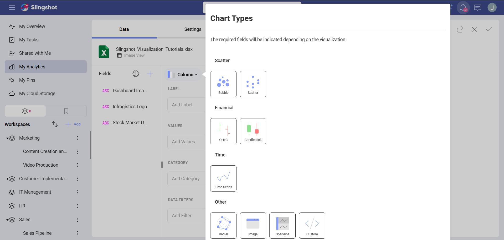
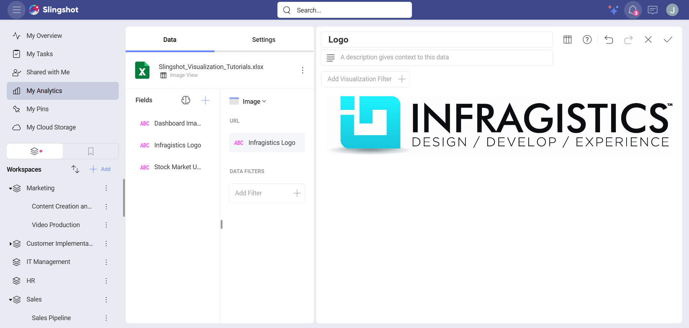

# Creating an Image Chart

In this tutorial you will learn how to create an *Image* visualization
using a sample spreadsheet.

## Key Concepts

As mentioned in the Data Visualization section, the Image Chart displays information in an embedded browser by making
a request to a URL and displaying the results. The data source,
therefore, will need to:

  - Include a link to a web resource to be displayed in the widget.

  - Include it **in the first row of the data set**.

## Sample Data Source

For this tutorial, you will use the *Image Chart* sheet in the [Slingshot Visualization Tutorials](https://download.infragistics.com/slingshot/samples/Slingshot_Visualization_Tutorials.xlsx).

1. Depending on where you want to save the dashboard, you can open a dashboard list in **My Analytics**, a workspace or a project. You can always move the dashboard to another location later on.

2. Click/tap on the **+ Dashboard** button.

      

 3. A dialog will open, containing a list of already added data source. The Visualization Tutorial file will be there as a data source if you have already used it. In case you haven't added the file, you can click/tap on **+Data Source** ⇒ **Data Files** ⇒ **+New** ⇒ **Upload** ⇒ Select the file ⇒ Click/tap on **Select and Continue** to include it in the list.

    

 4. Once the data source is configured, select the *Image View* sheet.                                

    

 5. By default, the visualization type will be set to **Column**. Select the **Image** option.      

       
                                                      
 6. Drag any of the available fields into **URL**.        

                                                          
